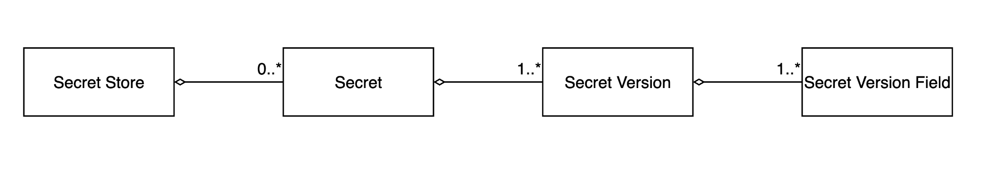
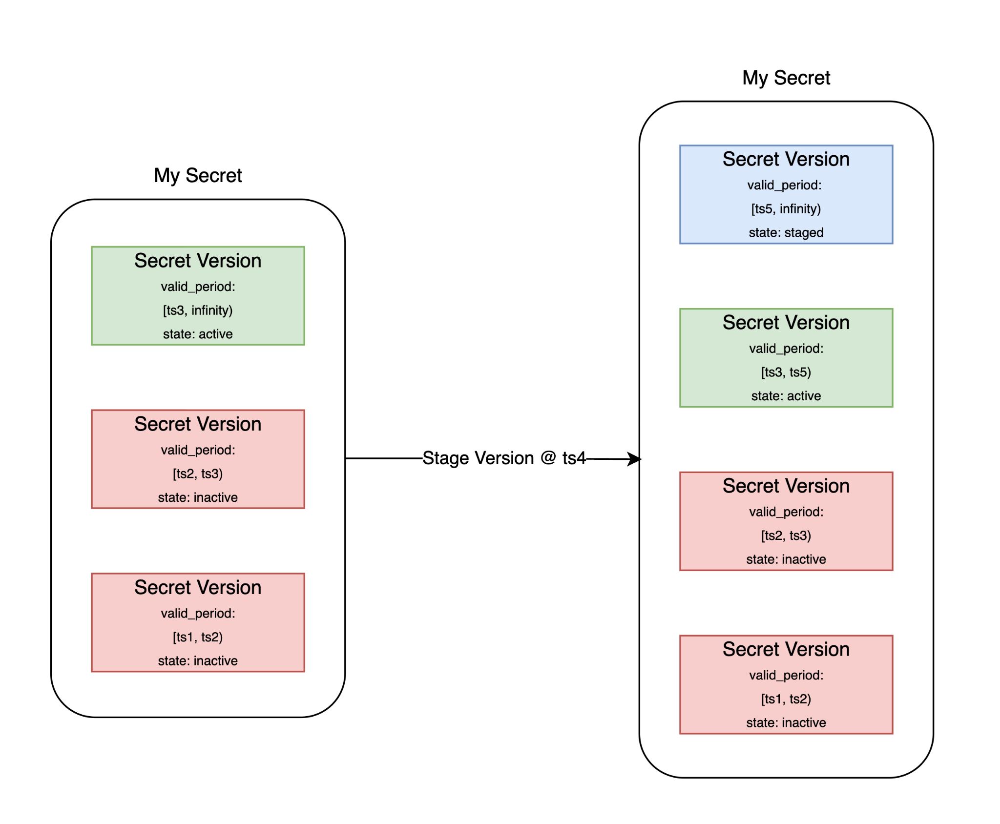
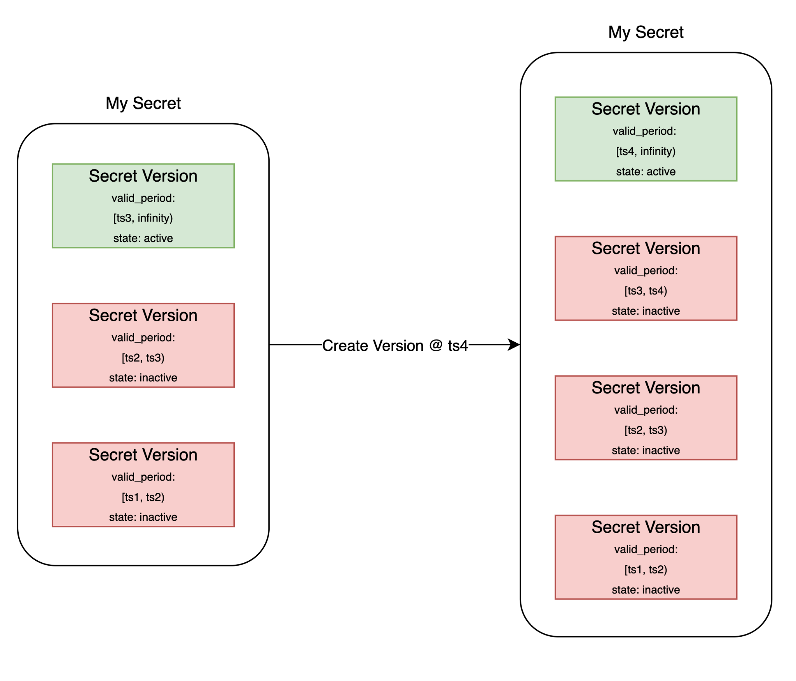
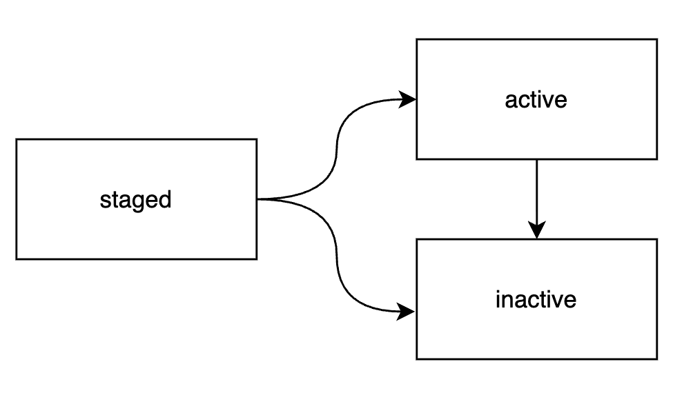
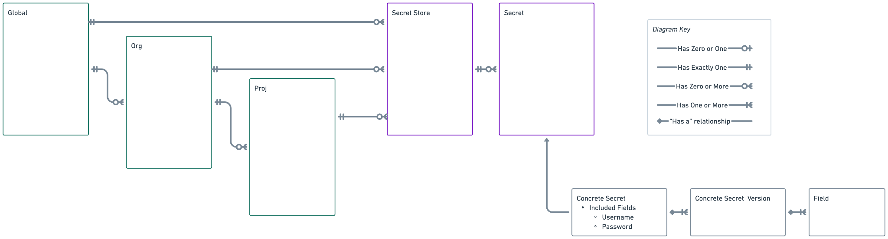
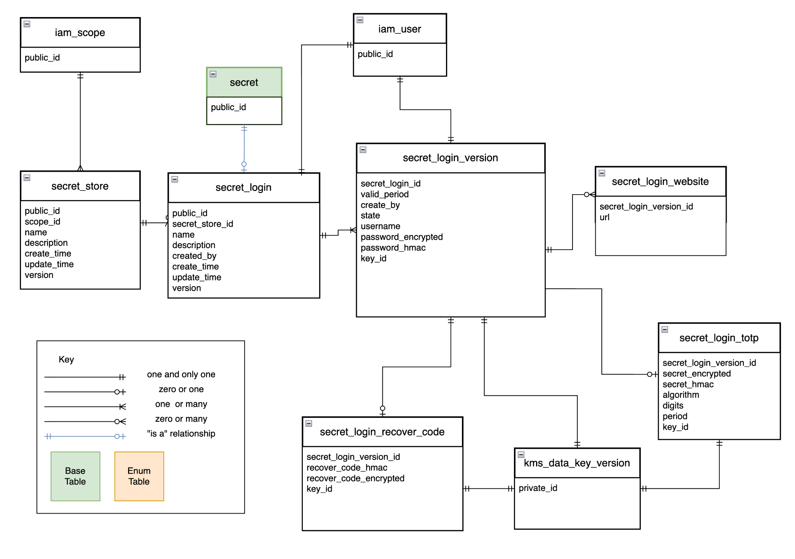

| **[RFC] VLT-???: Vault Next: Static Secret Store** |  |
| --- | --- |
| **Summary:** RFC for Vault Next Static Secrets |  |
|  |  |
| **Created**: Aug 26, 2025 | **Status**: **WIP** \| In-Review \| Approved \| Obsolete |
|  |  |
| **Product**: Vault | **Owner**: guy.grigsby@hashicorp.com |
| **Contributors**: gabi.viana@hashicorp.com, jeff@hashicorp.com, jlambert@hashicorp.com, emoncuso@hashicorp.com, mgaffney@hashicorp.com, vinny.mannello@hashicorp.com, mike.palmiotto@hashicorp.com, aharness@hashicorp.com | **Approvers**: N/A |
|  |  |
| **NOTE**: This [document](https://hermes.hashicorp.services/document/1u7WcgRPPkxWBU-Mv1aBMdRLhZi6P1jIw4QWxk-BgqKM?draft=true) is managed by [Hermes](https://hermes.hashicorp.services) and this header will be periodically overwritten using document metadata. |  |

| - I have submitted a [Patent Screening Questionnaire](https://forms.gle/kFxe1DfGNiH8YoS9A) [ [FAQ](https://drive.google.com/file/d/1dOYj0yBW3CTysoD1tcHOhduzw1EZPi4H/view) ] [ right click checkbox to check ]   *Screening form is required for all Product-Development RFC’s* |
| --- |

This RFC proposes a design for the Vault Next replacement for the existing k/v engine. The service is called “Secrets.” It is a strongly typed system that maintains much of the flexibility of the current k/v implementation with the added benefits that concrete types bring. The proposed type system is also extensible.

## Background

Here we discuss reasons to change how we manage secrets in Vault. For background on the Vault Next project as a whole please see the [meta RFC](https://docs.google.com/document/d/1mcbtb3B1T8_R_pV-Nex2y_IhrGF77OOG3CqfZLEhflw/edit?usp=sharing).

In this background we refer to Vault as it exists now (in 2025) as Vault Current. In addition, we use the term “secret." In this background section, when we say “secret”, we are referring to a private static value stored in Vault Current, also known as key/value or k/v. Later in the RFC we will define ”secret” explicitly in a new Vault Next context.

There are multiple reasons why building a new Secrets Service from scratch is beneficial. Some reasons include technical challenges in Vault Current which are documented in detail in [Vault Challenges](https://docs.google.com/document/d/1zyPD4SqQoYrUQQL1wDHR9GHe7BWrem8ddkthxhUGM9Y/edit?usp=sharing). Other reasons arise from Vault’s design progression which aimed to support as many use cases as possible. These challenges have been discussed in depth in Vault, [Vault Next](https://docs.google.com/document/d/1mcbtb3B1T8_R_pV-Nex2y_IhrGF77OOG3CqfZLEhflw/edit?usp=sharing) and [Calistoga](https://ibm-my.sharepoint.com/:w:/p/jeff_m/IQAGMV0lAmQ0S4-xDk8duSXlAZcgnpD3zQ-AjWXY_eA_4jA?e=Fn4RG9) documents so I will not rehash them all here. All these documents and challenges, however, point toward an important overarching theme.

**Vault Current is a collection of powerful tools, but customers want an enabler for their workflows.**

Vault Current has been compared to a database. Customers can use it to store and retrieve k/v pairs. The problem with this view is that it’s not a compelling use case. In fact, we repeatedly watch customers churn if that's the only way they use Vault. Vault is so much more than a database, but it can be difficult to show that without a focus on compelling workflows. By enabling user workflows rather than individual steps in a workflow, Vault Next becomes an integrated solution rather than a single feature.

Take the following example:

A user stores AWS AIM credentials in the Vault Current kvv2 engine and builds various workflows that use those credentials. As their organization matures, the user decides she wants to rotate those credentials at a set cadence. In Vault Current, the user is forced to migrate that secret to the AWS secrets engine, thereby breaking existing workflows. Application developers are forced to migrate their workflows to use the new credentials which adds risk to the business. Building Vault Next with these types of workflows in mind will allow us to transform the way our customers see Vault’s value. **TODO weave workflow narrative throughout.**

## Proposal

We propose an enhancement for k/v in Vault Next called Vault Secrets. In Vault Next, secrets will be typed resources and provide a superset of capability from Vault Current's kv and kvv2 secret engines.. The [domain and API for Boundary](https://developer.hashicorp.com/boundary/docs/domain-model) were referenced heavily while designing this service. This may be called out specifically when appropriate.

### Static vs Dynamic

A **static secret** is a secret that does not change. A user/automation creates a secret, enters the secret data and it remains as is until changed by a user/automation.

A **dynamic secret** is a secret that is generated. A dynamic secret is accompanied by a lease and that lease has a lifetime(TTL). In some cases, the lease may be renewed, but once the TTL has passed the secret is no longer valid.

This RFC lays out how static secrets will fit into a new paradigm in Vault Next. This paradigm has been architected in such a way that it *could* support dynamic and auto-rotated secrets as well, but that has yet to be discussed in depth. During work on this RFC, exploration has been done in the form of a possible domain for a specific [Postgres dynamic secret](https://ibm-my.sharepoint.com/:w:/r/personal/guy_grigsby_ibm_com/Documents/Dynamic%20Secrets%20Brainstorming.docx?d=w8d15623da66f440195d322b168d2547b&csf=1&web=1&e=7Jjivy).

## Domain

In this section we define the domain for the Secret Service.

Fig 1.0.1 Basic diagram showing relationships between domain objects

#### A Note on Encryption

The proposed service will encrypt only secret data at rest. Secret data will be encrypted in the domain prior to being stored. Any encryption the database employs will be in addition to the domain level encryption. All data will be encrypted in transit via the gRPC calls. Each concrete type will define which data is sensitive. For the untyped JSON secret type, we will encrypt all the data. Encryption will be handled by the KMS service provided as part of the Shared Runtime. These encryption practices have been informed by Vault Current because Vault Current encrypts everything in storage for the kv engines. This makes it difficult to search because a whole object must be read and decrypted in memory. By encrypting only information deemed secret, we can act on some of the stored information without the additional operation.

#### Factories and Repositories

Creation and retrieval of resources is done with factories and repositories. Most factory and repository methods will take an options object that aligns with the common options pattern in Go. The Boundary codebase has examples of repository usage (e.g. [static credentials repository](https://github.com/hashicorp/boundary/blob/main/internal/credential/static/repository_credential.go#L35)). Factory objects will create and validate in memory resources whereas repositories will provide data layer access to save and retrieve resources.

#### Domain Services

Maintaining with the tenets of domain driven design, we will use domain services to perform complex actions that require multiple domain object types. This allows us to perform complicated interactions between objects without coupling that behavior to a single type. Domain services take the form of exported package level functions. Filenames for these package level functions must begin with the prefix service_. See the [Boundary codebase](https://github.com/hashicorp/boundary-enterprise/blob/6135ea399a2659ba411e5babbbf50aad252c9b70/internal/auth/oidc/service_token_request.go) for examples.

#### Deleting Resources

This RFC assumes soft deletes will be a requirement. The [EaaS RFC for Vault Next](https://docs.google.com/document/d/1Na_Tlq7Twlv8k-S6oG8qGReu5y9C77qsStXR5ZE-GGg/edit?tab=t.0#bookmark=id.rfe0vmwp8ax4) calls out a mechanism for scheduling deletes using the Shared Runtime’s job system. We can implement a similar flow for both Secret Stores and Secrets when the time comes for static secrets. Dynamic secrets on the other hand, will require the concept of a soft delete from launch because we will need a way to revoke leases even after a secret has been deleted.

### Secret Store

A Secret Store is the domain object under which all Secrets are stored. A Secret Store is an entity. References to Secret stores will be acquired via a repository object. A Secret Store has no limit on the number of Secrets that can be stored. The life of a secret is tied to the life of the Secret Store in which it is contained. All Secrets in a Secret Store will be deleted when a Secret Store is deleted and any soft delete grace period has elapsed. A Secret Store is an RBAC boundary. A Secret Store may or may not be a policy boundary. A Secret Store is owned by one and only one scope. That scope must be either an organization or a project. A Secret Store must be deleted before the containing scope can be deleted. More information about why Secret Stores are useful can be found [here](https://ibm-my.sharepoint.com/:w:/r/personal/guy_grigsby_ibm_com/Documents/Stores.docx?d=w43b5c867b3f24410821f30f2aa76dc06&csf=1&web=1&e=bEBStR).

#### Attributes

- **Scope ID** - An immutable reference to the owning scope.
- **PublicID** - A generated immutable globally unique identifier for the collection. Secret Store IDs will be prefixed with ss_ and followed by a 10 digit number (Ex: ss_1234567890).
- **Name** - A mutable user-defined name for the collection.
- **Description** - A mutable user-defined textual summary for the Secret Store.
- **State** - A system mutable attribute to communicate if the secret store is available or scheduled for deletion.
- **Version** - A field for optimistic locking. Only mutable by the system.

#### Actions

Secret Stores support these actions.

- Read
- Create
- Update
- Delete

#### Secret Store Factory

The Secret Store Factory is responsible for the creation and persistence of a new, valid Secret Store entity. Its primary concern is guaranteeing that the new object has all invariants satisfied upon creation, which includes:

- Generating a globally unique and correctly prefixed ID.
- Setting the Scope ID to ensure the Secret Store is correctly owned by a valid scope.
- Applying any default policy IDs or settings.
- Persisting the Store in the RDBMS

Actions

- CreateSecretStore(SecretStore) - Creates and Persists a new Secret Store.
- NewSecretStore(parentScope, name, description) - Creates a new in-memory secret store.

#### Secret Store Repository

The Secret Store Repository provides a collection-like interface for accessing and persisting Secret Store aggregate roots. It abstracts away the details of the underlying storage (the RDBMS).

- CreateSecretStore(SecretStore) - Persists the provided Secret Store.
- FindByID(ID) - Retrieves a specific Secret Store by its unique ID.
- ListByScopeID(Scope ID) - Retrieves all Secret Stores owned by a specific scope.
- UpdateSecretStore(SecretStore) - Persists the SecretStore itself. Does not persist any Secrets within the SecretStore.
- DeleteSecretStore(ID) - Deletes a Secret Store by ID.

### Abstract Secret

An Abstract Secret represents shared behaviour among all secrets. It has a Postgres base table and Go interface.

#### Abstract Secret Interface

- GetStoreID() string - Gets the Parent Store ID
- GetPublicID() string - Gets the public id of this secret

#### Abstract Secret Postgres Base Table Attributes

- public_id

### Login Credential Secret

A Login Credential Secret represents a set of values used to login to a website or service. It is an entity. A Login Credential Secret contains one or more Login Credential Secret Versions. A Login Credential Secret must be owned by one and only one Secret Store. A Secret Store may have any number of instances of Login Credential Secrets. A Login Credential Secret is an RBAC boundary. Deleting a Login Credential Secret deletes all Secret Versions owned by it. A Login Secret is an aggregate root whose aggregate boundary encompasses all its Secret Versions.

#### Login Credential Secret Attributes

- **PublicID** - A generated immutable globally unique identifier for the collection. Secret Store IDs will be prefixed with ss_ and followed by a 10 digit number (Ex: seclogcred_1234567890).
- **Name** - A mutable user-defined title for the Secret
- **Description** - A mutable user-defined summary for the Secret
- **Secret Store ID** - An immutable reference to the owning Secret Store
- **State** - A system mutable attribute to communicate if the secret is available or scheduled for deletion.
- **Version** - A field for optimistic locking. Only mutable by the system.
- **Max Version Count** - (default: 10, min: 1, max: **??**) The maximum number of total secret versions, including the active version, to store to prevent unbounded growth of secret versions. Think of the secret versions as being stored in a ring buffer with n entries. This value must be greater than 2 to stage a Login Credential. If this value is set to 1, the active Login Secret Version is overwritten each time a new version is created.

### Actions

- GetStoreID() string - Gets the Parent Store ID
- NewLoginCredentialSecretVersion(username, password, totp, website) - Creates a new Login Credential Secret Version with new values and makes the new version the current version.
- StageLoginCredentialSecretVersion(username, password, totp, website, activeDate) - Creates a new Login Credential Secret Version with new values. The new version will become active at the provided date.
- GetResourceVersion() - Reads the version field used for optimistic locking.
- GetMaxVersionCount() - Returns the maximum number of Login Secret Versions this Secret can keep .
- GetStagedVersion() - Reads the current staged login credential secret version.
- GetActiveVersion() - Reads the current active login credential secret version.
- ReadVersion(t) - Reads the login credential secret version that was active at time t.

#### Login Credential Secret Factory

The Login Credential Secret Factory is responsible for the complex and atomic creation of a new in-memory Secret aggregate root. Each Secret type has its own equivalent factory functions and the abstract secret type does not have any factory functions. The Factory ensures that:

- A unique and correctly typed ID is generated.
- The initial Login Credential Secret Version is created with valid field data (using the Secret Version Factory).
- The timerange for the Login Credential Secret Version temporal constraint is set from now to infinity.
- Any type specific initialization is performed.

Actions

- NewLoginCredentialSecret(*UsernamePasswordSecret, …Option)(*UsernamePasswordSecret, error): Creates a new in-memory login credential secret given the provided inputs.

#### Login Credential Secret Repository

The Login Credential Secret Repository provides methods to retrieve and persist the Secret aggregate root. Each Secret type has its own repository functions and the abstract secret type does not have any repository functions. Since the Secret is an aggregate root, external clients will use this Repository to fetch the Secret and implicitly manage its contained entities (Secret Versions).

Actions

- FindByID(ID): Retrieves a specific Secret aggregate by its unique ID.
- FindBySecretStoreID(Secret Store ID): Retrieves all Secrets owned by a specific Secret Store.
- UpdateSecret(Secret): Persists the Secret and all changes made to its contained Secret Versions in a single transaction.
- DeleteSecret(SecretID): Deletes a secret.
- CreateLoginCredentialSecret(*LoginCredentialSecret): Persists an in-memory secret.

### Login Credential Secret Version

A Login Credential Secret Version is a Secret Version that is owned by a Login Credential Secret. A Login Credential Secret Version is an Entity. A Login Credential Secret Version is owned by one and only one Login Credential Secret. A Login Credential Secret may have any number of Login Credential Secret Versions. If a Login Credential Secret is deleted so are all its Secret Versions. A Login Credential Secret Version can be accessed individually within a Login Credential Secret for advanced use cases, but in most cases, operations on the PrimaryVersion will be accessed via a convenience method on the Login Credential Secret itself. A Login Credential Secret Version entity must only be accessed by the Login Credential Secret containing it. A Login Credential Secret must not maintain any reference to Login Credential Secret Version Fields and no other object outside of a Login Credential Secret is allowed to maintain a reference to a Login Credential Secret Version. A Login Credential Secret Version ID is of the format secverlogcred_1234567890. A Login Credential Version has the following Secret Version Fields:

| **Field Name** | **Field Type** | **Required** |
| --- | --- | --- |
| Password | EncryptedText | yes |
| Username | TextField | yes |
| URL | URLField | no |
| TOTP | TOTPField | no |

#### Version Lifecycle Strategy

Core Concept: Staged Secrets for Credential Rotation

The versioning strategy supports graceful credential rotation where a new version, or more, can coexist with the current primary version during a cutover window, rather than requiring an instantaneous switch. This is done by including staged versions.

States

| **State** | **Purpose** | **valid_period** |
| --- | --- | --- |
| primary | The default version consumers receive | Required (non-null) |
| staged | Being prepared for cutover; credentials may already be usable | Optional (may be null) |
| inactive | Retired; kept for audit/history | Required (non-null; discarded versions use empty range) |

Only one primary version may exist per secret at any time. Multiple staged and inactive versions are allowed.

**Two Independent Axes**

1. State = the version's role (which one consumers get by default)

2. valid_period = when the credentials are actually usable

These are independent. A staged version with valid_period @> now() has usable credentials but isn't the default — both primary and staged can be simultaneously usable during rotation.

**Cutover Flow**

- Create a staged version (optionally with null valid_period if waiting on an external system like AWS propagation).
- Set valid_period once the external system confirms the credentials are live.
- Both versions are usable simultaneously — consumers using the primary version continue working while the new credentials are validated.
- Promote the staged version to primary in a single transaction: the old primary's valid_period upper bound is truncated to now(), its state becomes inactive, and the staged version's state becomes primary.
- The exclusion constraint guarantees atomicity — the old version must be demoted before or within the same transaction as promotion.

**Discarding Staged Versions**

If a staged version is abandoned:

- Period started (lower(valid_period) <= now()): truncate upper bound to now(), set state to inactive.
- Period is null or in the future: set valid_period to 'empty'::tstzrange, set state to inactive. The empty range is non-null (satisfying the check constraint) but signals "never usable."

**Version Pruning (Ring Buffer)**

Each secret has a max_versions column (default 10, must be positive). An after-insert trigger enforces the limit:

- Counts all versions (primary + staged + inactive).
- Only prunes inactive versions, ordered by upper(valid_period) asc nulls first — discarded versions (empty range, null upper bound) are pruned first, then the oldest by expiration.
- Never prunes primary or staged versions. If the count exceeds max_versions but no inactive versions exist, nothing is deleted.

**Key Design Decisions**

- Promotion is explicit and application-driven, not automatic. The application calls promote in a transaction. valid_period governs usability, not promotion.

#### Restoring Secret Versions

We must provide the capability to transition an inactive Login Credentials Secret Version back to an active state. Internally, this will be accomplished by creating a new secret version with the same data as the inactive secret.

Fig 1.3.2 Login Credential Secret Version Versioning Strategy: Stage Version

Fig 1.3.3 Login Credential Secret Version Versioning Strategy: Create Version

#### Login Credential Secret Version Attributes

- **Secret Login  ID** - An immutable reference to the owning Secret
- **PrivateID** - A generated immutable globally unique identifier for the resource. Secret Version IDs will have unique prefixes based on type. Login Credential Secret version prefix is seclogcredver.
- **CreatedBy** - the user that created the secret
- **Valid Period **- The temporal validity constraint for this version. Only one version may be active at a time.
- **State** - The state of the secret version

Login Credential Secret Version States

- active - the version is active and is valid.
- staged - the version is staged to be active. It is not active yet, but will be after when the valid period begins.
- inactive - the version is no longer in use.

Fig 1.3.5 Login Credential Secret Version State Transitions

#### Login Credential Secret Version Actions

- ReadPassword() - Read the password field
- ReadUsername() - Read the username field
- ReadURL() - Read the URL field
- ReadTOTP() - Read the TOTP field
- ReadPasskey() - Read the Passkey field
- ReadSecret() - Read all Fields in the form of a Login Credential Secret Version

#### Factory for Secret Version

Each Secret Version Factory is a typed internal component of a concrete Secret aggregate and is only responsible for the correct in-memory construction of a new concrete Secret Version entity. Because Secret Versions are immutable, this factory is used for all updates to all fields within a secret. It ensures that:

- A unique and correctly typed ID is generated.
- The immutable Secret ID is correctly set to reference its owning Secret.
- The version-specific field values (Attributes) are validated and stored.

### Secret Version Field

A Secret Version Field is the object in which actual user provided data is stored. All fields are immutable. A Secret Version Field is a Value Object. A Secret Version Field is owned by one and only one Secret Version. A Secret Version must have one or more Secret Version Fields. A Secret Version Field is immutable and all attributes must be populated on creation. Mutability should be handled at the Secret Version level by creating a new Secret Version. Deleting a Secret Version deletes all Secret Version Fields contained therein. Not all Secret Version Fields listed below are a part of a concrete Secret Version Type yet. They are provided for extensibility. More Secret Version FIelds should be added as needed.

#### Field Types vs Validators

Secret Field Versions will eventually have [validators](https://docs.google.com/document/d/1xKTkAFSm4O4ukhp81kJX1empo09x_YImZNpw1M5FO7Q/edit?usp=sharing) that can be applied. Secret Version Field types and validators were chosen over encapsulated attributes because both Secret Version Fields and validators are composable and reusable. A Secret Version Field Type should be created for a new use case whereas a validator should be created when rules for a specific use case need to be enforced.

There can clearly be overlap between a Secret Version Field type and a validator. For example, why is there an email field type when a validator can check for the existence of an email?

The general answer is that if we can perform any specific action based on the data type, then it should be a Secret Version Field. In our example, an email address can be the recipient of an email message, thus it is its own type.

#### Field Attributes

- **SecretVersionID** - An immutable reference to the owning Secret Version
- **PublicID** - A generated immutable globally unique identifier for the resource. Secret Version FIeld IDs will have unique prefixes based on type.
- **Name** - An immutable user defined title of the value contained in the resource
- **Description** - A mutable user defined summary for the resource
- State -

#### Field Types

- **TextField: **string - A Secret Version Field to be used for arbitrary non-sensitive values.
- **URIField: **string - A Secret Version Field to be used to store a URI as defined by [RFC3986 for Universal Resource Identifiers: Generic Syntax](https://datatracker.ietf.org/doc/html/rfc3986#section-1.1).
- **EmailField: **string - A Secret Version Field to be used to store an email address in accordance with [RFC2822 for Internet Message Format](https://datatracker.ietf.org/doc/html/rfc2822#section-3.4.1).
- **DateField: **time.Time - A Secret Version Field to be used to store a date. Format translation will be available on input and retrieval.
- **EncryptedText:** []byte - Encrypted - A Secret Version Field to be used for an arbitrary secret string.
- **TOTPField**: TOTP (New Type) - Encrypted - A Secret Version Field to be used for time based one-time-password codes.

**Additional Attributes:**

  - Seed Value - Required
  - Algorithm - Required
  - Start Time in Unix time format(T0) - Optional (Default 0)
  - Time step in seconds (X) - Optional (Default 30)
- **PrivateKeyField: **PK (New Type) - Encrypted - A Secret Version Field to be used for a private key. **Additional Attributes**:
  - Key Type (RSA, Ed-DSA, MLDSA, ECDSA) Required
  - Format - Explicit or Inferred optional
- **PublicKeyField**: PubK (New Type) - A Secret Version Field to store a public key. **Additional Attributes:**
  - Key Type (RSA, Ed-DSA, MLDSA, ECDSA)
  - Format - Explicit or Inferred optional
- **JSONField**:string - Encrypted - A Secret Version Field to be used for an opaque encrypted value.

### Secret Version Field Factory

The Secret Version Field Factory is a private factory only accessible by a Secret Version or part of the Secret Version Factory.

Fig 1.4.1 Basic Hierarchy for Secrets domain objects

## API

Secret Store has basic CRUDL operations and Secret has CRUDL operations in addition to custom verbs. Pagination for list endpoints is described in a [general API pattern RFC](https://docs.google.com/document/d/1Nw6LSk8ro3mNksfyRy8ktCQCLFjS2c3meuD-jiN1IsY/edit?usp=sharing).

### Secret Store Service

#### Create

POST /v1/secret-stores?scope_id=p_1234567890

Request Body

{

  "scope_id": "p_1234567890",

  "name": "My Favorite Secret Store",

  "description": "Secret store containing secrets for my favorite project",

}



Parameters

scope_id - Required: the containing scope

name - Optional: a name for this secret store. Must be unique within the containing scope

description - Optional: Human readable description of this secret store

Response Body

{

  "scope_id": "p_1234567890",

  "id": "ss_1234567890",

  "name": "My Favorite Secret Store",

  "description": "Secret store containing secrets for my favorite project",

  "version": 1,

  "creation": "2026-01-09T12:09:53-07:00",

  "updated": "2026-01-09T12:09:53-07:00"

}



#### Update

PATCH /v1/secret-stores/ss_1234567890

Only include fields to be updated

Request Body

{

  "scope_id": "p_0987654321",

  "name": "My New Favorite Secret Store",

  "description": "Secret store containing secrets for another project",

}



Parameters

name - Optional: a name for this secret store. Must be unique within the containing scope

description - Optional: Human readable description of this secret store

Response Body

{

  "scope_id": "p_0987654321",

  "id": "ss_1234567890",

  "name": "My New Favorite Secret Store",

  "description": "Secret store containing secrets for another project",

  "version": 2,

  "creation": "2026-01-09T12:09:53-07:00",

  "updated": "2026-01-09T16:00:01-07:00"

}



#### Read

GET /v1/secret-stores/ss_1234567890

Response Body

{

  "scope_id": "p_0987654321",

  "id": "ss_1234567890",

  "name": "My New Favorite Secret Store",

  "description": "Secret store containing secrets for another project",

  "version": 2,

  "creation": "2026-01-09T12:09:53-07:00",

  "updated": "2026-01-09T16:00:01-07:00"

}



#### Delete

DELETE /v1/secret-stores/ss_1234567890

Response

HTTP 1.1 204 No Content

#### List

GET /v1/secret-stores

Response Body

[{

  "scope_id": "p_0987654321",

  "id": "ss_1234567890",

  "name": "My New Favorite Secret Store",

  "description": "Secret store containing secrets for another project",

  "version": 2,

  "creation": "2026-01-09T12:09:53-07:00",

  "updated": "2026-01-09T16:00:01-07:00"

}]



### Secret Service

#### Create

POST /v1/secrets

Request Body

{

  "start_valid_period": "now",

  "secret_store_id": "ss_1234567890",

  "name": "My Login Credential Secret",

  "description": "A Login Credential secret for an application",

  "type":"login",

  "attributes": {

    "start_valid_period": "20260226T151139Z",

    "username": "guygrigsby",

    "password": "password123",

    "url": ["https://example.com"],

    "totp": {

      "seed": "JBSWY3DPEHPK3PXP",

      "algorithm": "SHA1",

      "start_time": 0,

      "time_step": 30

    }

  }

}



Parameters

scope_id - Required: the containing scope

name - Optional: a name for this secret. Must be unique within the containing scope

description - Optional: Human readable description of this secret

type - Required: The type of secret to create

attributes: Type specific

  start_valid_time - Optional (default: now)

  username - Required

  password - Required

  url - Optional: an array of URLs

  totp - Optional: object

    seed - Required for totp: secret shared seed value

    algorithm - Required for totp: algorithm to use

    start_time - Optional (default: 0) start time in Unix time

    time_step - Optional (default: 30) interval in seconds

Response Body

{

  "start_valid_period": "2026-02-25T16:03:10Z",

  "secret_store_id": "ss_1234567890",

  "id": "seclogcred_1234567890",

  "name": "My Login Credential Secret",

  "description": "A Login Credential secret for an application",

  "version": 1,

  "creation": "2026-01-09T12:09:53-07:00",

  "updated": "2026-01-09T16:00:01-07:00",

  "type":"login",

  "username": "guygrigsby",

  "password": "<hmac_password>",

  "url": "https://example.com",

  "totp": {

    "seed": "<hmac_seed>",

    "algorithm": "SHA1",

    "start_time": 0,

    "time_step": 30

  }

}



#### Update

PATCH /v1/secrets/seclogcred_1234567890

Only include fields to be updated

Request Body

{

  "An updated Login Credential secret for an application",

  "attributes": {

    "start_valid_period": "20260226T151139Z",

    "password": "newpassword123",

  }

}



Parameters

name - Optional: a name for this secret. Must be unique within the containing scope

description - Optional: Human readable description of this secret

type - Required: The type of secret to create

attributes: Type specific

  start_valid_time - Optional (default: now)

  username - Required

  password - Required

  url - Optional: an array of URLs

  totp - Optional: object

    seed - Required for totp: secret shared seed value

    algorithm - Required for totp: algorithm to use

    start_time - Optional (default: 0) start time in Unix time

    time_step - Optional (default: 30) interval in seconds

Response Body

{

  "secret_store_id": "ss_1234567890",

  "id": "seclogcred_1234567890",

  "name": "My Login Credential Secret",

  "description": "An updated Login Credential secret for an application",

  "version": 2,

  "creation": "2026-01-09T12:09:53-07:00",

  "updated": "2026-01-09T16:18:23-07:00",

  "type":"login",

  "username": "guygrigsby",

  "password": "<HMAC>",

  "url": "https://example.com",

  "domain": "my-domain",

  "totp": {

    "seed": "<hmac_seed>",

    "algorithm": "SHA1",

    "start_time": 0,

    "time_step": 30

  }

}



#### Read

GET /v1/secrets/seclogcred_1234567890

Response Body

{

  "secret_store_id": "ss_1234567890",

  "id": "seclogcred_1234567890",

  "name": "My Login Credential Secret",

  "description": "An updated Login Credential secret for an application",

  "version": 2,

  "creation": "2026-01-09T12:09:53-07:00",

  "updated": "2026-01-09T16:18:23-07:00",

  "type":"login",

  "username": "guygrigsby",

  "password": "<hmac_password>",

  "url": "https://example.com",

  "totp": {

    "seed": "<hmec_seed>",

    "algorithm": "SHA1",

    "start_time": 0,

    "time_step": 30

  }

}



#### List

GET /v1/secrets

Response Body

[{

  "secret_store_id": "ss_1234567890",

  "id": "seclogcred_1234567890",

  "name": "My Login Credential Secret",

  "description": "An updated Login Credential secret for an application",

  "version": 2,

  "creation": "2026-01-09T12:09:53-07:00",

  "updated": "2026-01-09T16:18:23-07:00",

  "type":"login"

}]

{

  "response_type": "<delta|complete>",

  "list_token": "<opaque-token>",

  "sort_by": "created_time",

  "sort_dir": "desc",

  "est_item_count": 1000,

  "items": [

    {

      "id": "seclogcred_1234567890",

      "secret_store_id": "ss_1234567890",

    },

    {

      "id": "seclogcred_0987654321",

      "secret_store_id": "ss_1234567890",

    }

  ]

}



#### Delete

DELETE /v1/secrets/seclogcred_1234567890

Response

HTTP 1.1 204 No Content

#### Read-Secret

GET /v1/secrets/{id}:read-secret

Response Body

{

  "secret_store_id": "ss_1234567890",

  "id": "seclogcred_1234567890",

  "name": "My Login Credential Secret",

  "description": "A Login Credential secret for an application",

  "version": 3,

  "creation": "2026-01-09T12:09:53-07:00",

  "updated": "2026-01-09T16:18:23-07:00",

  "type":"login",

  "username": "guygrigsby",

  "password": "password123",

  "url": "https://example.com",

  "totp": {

    "seed": "JBSWY3DPEHPK3PXP",

    "algorithm": "SHA1",

    "start_time": 0,

    "time_step": 30

  }

}

#### 

#### List Secret Versions

GET /v1/secrets/{id}:list-versions

Response Body

{

  "response_type": "<delta|complete>",

  "list_token": "<opaque-token>",

  "sort_by": "created_time",

  "sort_dir": "desc",

  "est_item_count": 1000,

  "items": [

    {

      "id": "seclogcredver_1234567890",

      "secret_id": "seclogcred_1234567890"

    },

    {

      "id": "seclogcredver_2234567890",

      "secret_id": "seclogcred_1234567890"

    }

  ]

}



### [Secret Version ](https://docs.google.com/document/d/1xKTkAFSm4O4ukhp81kJX1empo09x_YImZNpw1M5FO7Q/edit?tab=t.0)[Field Validators RFC](https://docs.google.com/document/d/1xKTkAFSm4O4ukhp81kJX1empo09x_YImZNpw1M5FO7Q/edit?tab=t.0)

### [Drafts (Transactions) RFC](https://docs.google.com/document/d/1V39d2j1i4T6F8ydkXpjUj5XbOwjDf9DeVwRtKt9-1rs/edit?tab=t.0)

## Data Model

#### New Tables

A complete DDL can be found on the [second tab of this document](file:///export/hda3/borglet/local_ram_fs_dirs/220.prod-us.changeling-worker-libreoffice.apps-docs-changeling-worker-libreoffice.5493112952802.549eedb1e9d07f8c/ramdisk/dire52e609d2d3b60727a99225290333546/%3Ftab=t.hjgnw91tl07p#bookmark=id.1ghnn7kz5zeo).

#### Secret Store

- **secret_store** is a table that contains a secret store per row. Each row is owned by a scope.

#### Secret

- **secret** is a base table that contains a row for every secret
- **secret_login** is a table for concrete login secret type secrets

#### Secret Version

- **secret_login_version** is a secret version table for website secret versions

#### Secret Version Field

- **secret_login_website** is a table that contains url fields.
- **secret_login_totp** is a table that contains time based one time passwords.
- **secret_login_recover_code** is a table for totp recovery codes. One record per code.
- **kms_data_key_version** is a table that contains DEKs.

## Abandoned Ideas

#### K/V Style Secrets

In early discussion we abandoned the idea of keeping a K/V type engine. The existing implementation is not typed and some of our goals require strong typing. The following features are not possible/very difficult with no types.

- Secret Validators
- Output formatting

#### Alternative Design

We started with a different design that we abandoned because it was more complex and the complexity didn’t provide any benefit. The abandoned design diagram can be found in [whimsical](https://whimsical.com/vault-v2-secrets-Vjdj1xRJ62QmpNCP9ZCeRB@8ADn3nfZACae4QqMmK2sPDRw1W95jyXQkwr9).

## Footnotes

- Domain Driven Design: Tackling Complexity in the Heart of Software by Eric Evans

## Related RFCs

[Vault Next: Static Secret Types](https://docs.google.com/document/d/1nYXBRnKf_EVFl1uP-TUBvbp_9a8nqOHdQ0T7FGl5tO8/edit?usp=sharing)

[Vault Next: Drafts](https://docs.google.com/document/d/1V39d2j1i4T6F8ydkXpjUj5XbOwjDf9DeVwRtKt9-1rs/edit?usp=sharing)

[Vault Next: Bundles](https://docs.google.com/document/d/1On0WitIJASJgoND_B6-xUD8xhotMPlwXiYFW4_3zqhM/edit?usp=sharing)

[Vault Next: Secret Version Field Validators](https://docs.google.com/document/d/1xKTkAFSm4O4ukhp81kJX1empo09x_YImZNpw1M5FO7Q/edit?usp=sharing)

[Vault Next: Secret Store API Guidelines](https://docs.google.com/document/d/1Nw6LSk8ro3mNksfyRy8ktCQCLFjS2c3meuD-jiN1IsY/edit?usp=sharing)

## Appendix

[Dynamic Secrets Domain Brainstorming](https://ibm-my.sharepoint.com/:w:/r/personal/guy_grigsby_ibm_com/Documents/Dynamic%20Secrets%20Brainstorming.docx?d=w8d15623da66f440195d322b168d2547b&csf=1&web=1&e=7Jjivy)

[Mock Terraform HCL for Secrets](https://docs.google.com/document/d/1WIF0a_n0THUU778bK753u6xeTmquxApQWvM95he8f7Q/edit?tab=t.0)

[Vault Next ID prefixes](https://docs.google.com/document/d/1N8bnvJlsSzhBHvlI4tZ6dXfKV97IhT4Q_84aRxpUmJI/edit?tab=t.0)z

[Vault Next Meta RFC](https://docs.google.com/document/d/1mcbtb3B1T8_R_pV-Nex2y_IhrGF77OOG3CqfZLEhflw/edit?tab=t.0)

[Vault Next Cryptography as a Service RFC](https://docs.google.com/document/d/1Na_Tlq7Twlv8k-S6oG8qGReu5y9C77qsStXR5ZE-GGg/edit?tab=t.0)

Vault Next PKI RFC

[American Express k/v use cases](https://docs.google.com/document/d/1m-BnLFh54PidNv-vyVtfNABrkgT-JQs1MSLVTqIKKhU/edit?tab=t.2xl4b5d6gj17#heading=h.j69j816inq6f)

[Challenges from Meredith](https://docs.google.com/document/d/18CJAWEcK98EahEamWToNHzXd6fiGVi-uFh92hXapV-Q/edit?tab=t.0)
