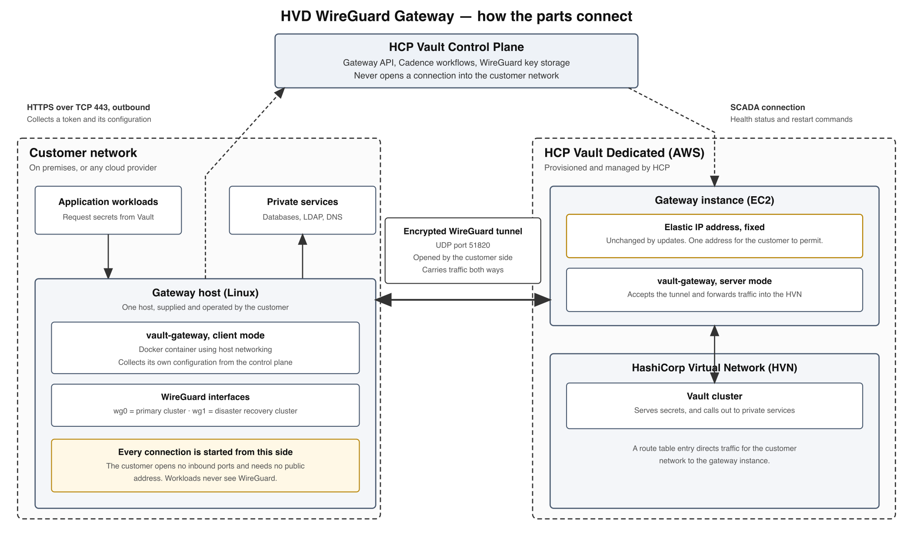

HCP Vault Dedicated WireGuard Gateway

Understanding The Feature, Assessing the blockers, And What I Recommend

Abhijeet Lokhande (HashiCorp APJ SA Specialist)

Table of Contents

# Part 1 — About This Document

A list of connectivity blockers has been raised against the HCP Vault Dedicated WireGuard Gateway. The blockers describe situations in which a customer's network would prevent the gateway from working.

This document does three things. It explains what the feature is and what problem it solves, so that the assessment can be followed without reading the design documents first. It gives a verdict on each blocker. It sets out what I recommend doing about them.

# Part 2 — The Feature And The Problem It Solves

## 2.1 The Problem

HVD runs Vault clusters inside HashiCorp's own cloud account. Customer applications have to reach those clusters, and the Vault cluster often has to reach back into the customer's network. It reaches back because several Vault features work by connecting outwards: Generating a temporary database username and password requires Vault to connect to that database, and authenticating a user against a directory requires Vault to connect to that directory.

Today there are two ways to connect the two sides.

The first is the public internet. The Vault cluster is given a public address, and the customer restricts who may reach it using a list of permitted source addresses. This works everywhere but places Vault on the public internet.

The second is cloud provider peering. Amazon Web Services customers can use Transit Gateway or Virtual Private Cloud peering, and Microsoft Azure customers can use Virtual Network peering. This keeps traffic off the public internet, but it only exists for those two providers.

That leaves a gap. A customer whose workloads run in Google Cloud, in another provider, or in their own data centre has no private option. The design document states this directly: The existing models "only support AWS and Azure for private peering, excluding other cloud service providers and on-premises networks."

## 2.2 The Proposal

The gateway fills that gap with a site-to-site virtual private network built on WireGuard. WireGuard is an [open-source VPN protocol](https://www.wireguard.com/protocol/). It is not tied to any cloud provider, so the same approach works from a data centre, from Google Cloud, or from anywhere else with an internet connection.

Two pieces of software are involved, and they are the same program run in two modes.

On the HCP side, HCP provisions a small virtual machine next to the customer's Vault cluster and runs the program in server mode. This machine has a fixed public address.

On the customer side, the customer runs the program in client mode as a container on one Linux host in their own network. This host connects outwards to the HCP machine and establishes the encrypted tunnel.

Once the tunnel is up, both networks can reach each other through it. Customer applications reach Vault, and Vault reaches customer databases and directories.

## 2.3 How The Parts Fit Together

The points worth noting on that picture are these.

**The customer never accepts an incoming connection.** The client opens the tunnel outwards. It also collects its own configuration outwards, over ordinary HTTPS on port 443. The customer needs no public address and opens no inbound firewall rule. This is stated in the design document and is consistent with the code.

**Application workloads are not modified.** They do not know WireGuard is involved. Traffic reaches the gateway host because the customer adds one route entry pointing at it, in a cloud route table or on a router. The gateway host forwards it onwards.

**The public address does not change.** It is an AWS Elastic IP address, created by a Terraform module that is separate from the one that creates the virtual machine, so it survives replacement of that machine. *Verified: The address is created in* *cadence/terraform/wireguard_gateway/infra/aws/apply/v1/main.tf:98, and attached to the current machine by a separate module at* *cadence/terraform/wireguard_gateway/traffic/aws/apply/v1/main.tf:40.* This matters because a customer who can only permit named destinations has one address to permit, once.

**The control plane manages, it does not connect in.** The HCP Vault control plane holds the keys, runs the provisioning workflows and serves the configuration API. It reaches the HCP-side machine over SCADA, which is HCP's internal message broker for reaching managed instances. SCADA here is a HashiCorp component name and is unrelated to industrial control systems; the point was raised in the design review and is worth stating in the document itself.

## 2.4 Customer Prerequisites

| Requirement | Comments |
|----|----|
| One Linux host, kernel version 5.8 or later, 8 GB memory, 20 GB storage | The kernel requirement excludes Red Hat Enterprise Linux 8, which ships kernel 4.18, and other long-lived distributions. See section 7.3. |
| Ability to run a container with host networking and the NET_ADMIN and SYS_MODULE capabilities | Some managed container platforms prohibit this. See section 7.3. |
| Outbound HTTPS on port 443 to the HCP platform | Ordinary. Works through a proxy server. |
| Public DNS resolution, DNS being the Domain Name System | Ordinary. |
| Outbound UDP on port 51820 to the gateway address, UDP being the User Datagram Protocol | This is the requirement that most of the blocker list is about. |
| Network reachability from the gateway host to the services Vault needs | Ordinary. |
| A route entry directing traffic for the Vault network to the gateway host | Ordinary. |

## 2.5 Current Limitations

One gateway per Vault network and one peer per gateway. AWS only on the HCP side. High availability is not supported. Disaster recovery is supported. Performance replication is not. Management is through the application programming interface only, with no user interface yet.

# Part 3 — Nature Of The Blockers

## 3.1 Origin Of The List

The blocker list groups roughly twenty items into four sections: Security platforms that inspect or redirect internet traffic, deep packet inspection, network address translation problems, and corporate firewall rules.

## 3.2 Scope Observation

Most of the list describes WireGuard running on a managed end-user device, such as a laptop with a security agent installed. Products like Zscaler Client Connector, Netskope Client and Palo Alto GlobalProtect are agents of that kind. They capture all traffic leaving the device before it reaches the network.

The gateway is not that. It is a server appliance on one Linux host that makes outbound connections to a single fixed address. End-user security agents are not normally installed on Linux servers in a data centre or a cloud network. **Recommendation.**

This distinction matters, because when the list is reassessed against the actual design, a significant part of it either already works or does not arise. The category still matters in one form: A customer may route the egress traffic of their servers through the same security platform, usually by a tunnel from their network edge or by a connector virtual machine. That case is real and is assessed in section 5.1.

# Part 4 — What The Design Already Handles

The properties below are confirmed in source. They explain why much of the blocker list does not apply. None of them is currently written down for customers or for the field.

## 4.1 Server Does Not Pin The Customer Address

The server-side WireGuard configuration contains no *Endpoint* line for the peer. It defines the public key, the preshared key, the permitted addresses and the keepalive interval, and nothing else. *Verified:* *cadence/activity/wg-gateway/templates/wg0.conf.tmpl.*

WireGuard therefore learns the customer's address from each authenticated handshake and updates it whenever it changes. This is what allows the tunnel to survive a customer address that is shared, unpredictable or translated by an intermediary.

## 4.2 Customer Address Is Optional

The *endpoint_ip* column on the peer table permits null values, the Go model treats it as optional, and neither the internal nor the public API requires it. *Verified:* *models/migrations/20260723074223_vault_gateway_tables.up.sql;* *models/gateway_peer.go:25;* *validateCreateGatewayPeerInternalRequest* *at* *service/private/service_gateway_internal.go:941, which checks the customer network range and the tunnel range but not the address. The public service defines only a delete validator.*

When no peer supplies an address, the security group rule for UDP 51820 on the HCP gateway falls back to permitting any source:

*if len(cidrBlocks) == 0 {*\
*return \[\]string{"0.0.0.0/0"}*\
*}*

*Verified:* *cadence/workflow/wg-gateway/deploy/workflow.go:636.*

Taken together, sections 4.1 and 4.2 mean that a customer behind address translation can be onboarded today by creating the peer without an address. This is not documented anywhere, and the design document still states that the field is required.

Section 6 discusses whether the open rule is an acceptable default.

## 4.3 Client Sends Keepalives

The client sets the keepalive interval to 25 seconds. *Verified:* *pkg/configfetcher/fetcher.go:257.*

This keeps translation and firewall session state alive along the path, so an idle tunnel is not silently discarded.

## 4.4 Routing And Forwarding Are Correct

All interface work is delegated to the *wg-sdk* library. Its startup sequence creates the interface, applies the peer settings, brings the interface up, adds a kernel route for each permitted address range, and then adds firewall rules permitting forwarding on that interface. Forwarding is enabled by default and the gateway does not switch it off. *Verified: Sequence at* *wg/config.go:305-391; route creation at* *config.go:357-363; forwarding rules at* *config.go:377-380; the default value* *forwarding: true* *at* *wg/client.go:211. The gateway creates its client with only a configuration directory and mode (pkg/wireguard/manager.go:33,* *pkg/configfetcher/fetcher.go:87).*

The library also chooses the correct source address by asking the kernel which route would be used to reach the peer. That is the right behaviour on a host with more than one network interface, and it supersedes a concern recorded in the internal engineering summary about an older and less reliable method. *Verified:* *wg/config.go:349-355.*

## 4.5 No Address Translation

There is no masquerade rule anywhere in either repository. The library provides a function to create one, and nothing calls it. *Verified: A search across both branches returns no masquerade rule;* *wg/firewall.go:38* *defines the function and it has no callers.*

Source addresses are therefore preserved in both directions. This satisfies the requirement recorded in the design decisions that Vault audit logs show the real client address. It also means that one of the diagrams in the design document is incorrect where it shows the source address being replaced; the written text in the same document, which says the database must permit the Vault network range, is the accurate version.

## 4.6 Control Plane Works Through A Proxy

The client creates its HTTP clients without specifying a transport, which means Go uses its default transport. That default reads the *HTTP_PROXY*, *HTTPS_PROXY* and *NO_PROXY* environment variables. *Verified:* *pkg/configfetcher/auth.go:64,* *pkg/configfetcher/fetcher.go:97,* *pkg/sentinel/poller.go:45.*

This means the token request, the configuration fetch and the disaster recovery signal check all work in a network where outbound HTTPS is only permitted through a proxy server. Only the tunnel itself cannot use a proxy, because a proxy server carries TCP connections and the tunnel uses UDP.

# Part 5 — Blocker Assessment

The verdicts used are:

- **Already handled.** Works today with no change.
- **Not applicable.** Does not arise with this design.
- **Customer configuration.** Resolved by a firewall or policy rule at the customer, with no change to the product.
- **Small change.** Resolved by a contained engineering change.
- **Needs a second transport.** Requires the capability described in Part 7.

## 5.1 Security Platforms

These platforms are often described together as zero trust network access, security service edge or secure access service edge. What matters for this assessment is not the label but how a customer's traffic reaches the platform, because that determines whether UDP can pass at all.

| How traffic reaches the platform | Can UDP pass? |
|----|----|
| A tunnel from the customer's network edge, using Generic Routing Encapsulation or IPsec | Yes. The platform's firewall component handles all ports and protocols, and permits them if policy allows. **Vendor behaviour.** |
| A connector virtual machine inside the customer's cloud network | Yes, for the same reason. **Vendor behaviour.** |
| An agent on the end-user device | Not relevant. These are not normally installed on data centre Linux servers. **Recommendation.** |
| A proxy server only, configured directly or by a proxy auto-configuration file | No. A proxy server establishes TCP connections and has no mechanism for UDP. This follows from the definition of the [HTTP CONNECT method](https://www.rfc-editor.org/rfc/rfc9110#name-connect) (RFC 9110, section 9.3.6). |

| Blocker | Verdict | What is required |
|----|----|----|
| Zscaler Internet Access, reached by tunnel or connector | Customer configuration | A firewall rule permitting the destination gateway address on UDP 51820 outbound, placed above any rule that blocks the virtual private network application category. See the Cloud Firewall and Traffic Forwarding topics in the [Zscaler Internet Access documentation](https://help.zscaler.com/zia). |
| Zscaler Internet Access, proxy only | Needs a second transport | No UDP path exists. |
| Netskope Client | Customer configuration | An exclusion for the gateway address, configured under steering exceptions in the [Netskope documentation](https://docs.netskope.com/). The blocker document already identifies this resolution. |
| Palo Alto Prisma Access | Customer configuration | A security policy rule permitting the destination. In practice this becomes the application identification question in section 5.2. |
| Cloudflare WARP for Teams | Not applicable | The stated reason, that two WireGuard instances conflict, does not hold. Multiple WireGuard interfaces coexist normally, and the gateway's permitted address list contains only the Vault network and the tunnel address, so it does not take over the default route. *Verified: The permitted list is built at* *cadence/activity/wg-gateway/activity_generate_wireguard_config.go:205.* One real issue remains: The interface name *wg0* is fixed and would clash with an existing WireGuard interface on the same host. *Verified:* *pkg/wireguardruntime/runtime.go:23* *and a fixed call to* *BringUp("wg0")* *in* *cmd/vault-gateway/client.go.* |
| Cisco Umbrella | Not applicable, or customer configuration | Enforcement at the DNS layer does not affect UDP sent to a numeric address. If the customer also tunnels traffic to Umbrella's gateway, the position matches Zscaler. **Vendor behaviour.** |
| Microsoft Tunnel | Not applicable | A VPN gateway for managed end-user devices. It is not part of a Linux server's outbound path. **Vendor behaviour.** |

## 5.2 Deep Packet Inspection

Deep packet inspection means examining the content of network traffic rather than only its addresses and ports. WireGuard has a [fixed, recognizable handshake](https://www.wireguard.com/protocol/), and the major firewall vendors identify it as a named application — it is listed in Palo Alto Networks' [Applipedia](https://applipedia.paloaltonetworks.com/) and in Fortinet's [application control signatures](https://www.fortiguard.com/appcontrol). Many organisations block the virtual private network category by default. **Vendor behaviour.**

The five items in this section, covering Palo Alto, Fortinet, Check Point, Cisco and security service edge signature sets, all have the same two resolutions.

**Customer configuration.** A rule permitting the specific destination address, placed above the category block. Rule order matters, because a destination rule placed below a category block never takes effect.

**Needs a second transport,** where the customer's policy cannot accommodate an exception. A transport using ordinary TLS on TCP port 443 presents as a normal HTTPS session to a named host, because that is what it would be.

A third option exists and I do not recommend it. Protocol obfuscation changes the shape of the handshake so that signatures no longer match it. The best-known implementation is AmneziaWG, a fork of WireGuard that inserts junk packets and alters the packet headers, described in its [documentation](https://docs.amnezia.org/documentation/amnezia-wg/) with source at [github.com/amnezia-vpn/amneziawg-go](https://github.com/amnezia-vpn/amneziawg-go). I advise against it for three reasons. It would mean maintaining a fork of WireGuard outside its normal review process. Concealing traffic from a customer's own security controls is difficult to justify for a security product, and would be damaging if discovered. It also does nothing for customers whose outbound traffic is restricted to a proxy server. **Recommendation.**

The blocker document raises a separate point in this section: That an intrusion detection system may add the address pair to a block list, which would also drop unrelated HTTPS traffic between those two addresses. The effect is limited by the existing design, because each gateway has its own address, distinct from the HCP API address. Only the tunnel would be affected. This needs recording in the documentation; it needs no change to the product. *Verified: The address is created per gateway at* *infra/aws/apply/v1/main.tf:98.*

## 5.3 Network Address Translation

Network address translation, usually shortened to NAT, is the technique by which many private addresses share one public address. The large-scale form used by internet providers is defined in [RFC 6598](https://www.rfc-editor.org/rfc/rfc6598), which also reserves the 100.64.0.0/10 range this design uses for tunnel addressing. The problems listed in this section arise when two computers, both behind translation, try to connect directly to each other.

The gateway does not work that way. The customer side always starts the connection, the HCP side has a fixed public address, and the HCP side never needs to start a connection to the customer. The design document states this: Customer gateways "do not need to accept inbound connections."

| Blocker | Verdict | Basis |
|----|----|----|
| Symmetric NAT | Already handled | This form of translation assigns a different outbound port for each destination. Because there is only one destination, that makes no difference. The server learns the address and port from the handshake, as described in section 4.1. |
| Carrier-grade NAT | Already handled | No inbound connection is needed. Create the peer without an address and the firewall rule permits any source, as described in section 4.2. |
| Double NAT | Already handled | Same reasoning. All connections are outbound. |
| NAT session timeout | Already handled | Keepalives every 25 seconds, as described in section 4.3. One case remains: A firewall whose idle timeout is shorter than 25 seconds. Making the interval configurable would be a small change. |
| Asymmetric routing | Already handled | There is one fixed destination address and one path. |

Five of the roughly twenty items in the blocker list fall in this section, and none of them requires work.

## 5.4 Corporate Firewall Rules

| Blocker | Verdict | What is required |
|----|----|----|
| UDP port 51820 blocked | Small change | Offer an alternative port. The listening port on the HCP side is already a parameter with 51820 as its default. *Verified:* *activity_generate_wireguard_config.go:210-213.* What is fixed is the address string returned to the client, assembled in two places, *verified at* *service/private/service_http_gateway_client_configs.go:194* *and* *:241*, and the port numbers in the Terraform firewall rule, *verified at* *infra/aws/apply/v1/main.tf:52-53*. UDP port 4500 is the most useful alternative, because it is the standard port for [IPsec traversing address translation](https://www.rfc-editor.org/rfc/rfc3948) (RFC 3948) and is frequently permitted already. |
| All non-standard UDP blocked | Needs a second transport | Choosing a different port does not help. |
| Networks that permit only listed destinations | Customer configuration, with a process change | The fixed address is already the right design, as described in section 2.3. The practical difficulty is that the address does not exist until the gateway has been provisioned, so the customer cannot begin a firewall change request beforehand. Two options: Reserve a pool of addresses per region and publish them, which is common practice for software-as-a-service products; or return the address as soon as the first Terraform module has run, which the existing workflow order already makes possible because that module runs before the virtual machine is created. |
| FortiGate | Customer configuration | The blocker document describes configuring a FortiGate to host a WireGuard server, which needs a virtual address and port forwarding. That is not this design; the gateway only makes outbound connections. What is needed is an application control exception, as in section 5.2. |

# Part 6 — Security Impact Of The Recommendations

## 6.1 What Is Being Requested

Every recommendation in Part 5 asks for the same narrow thing: Permit outbound traffic from one host, to one address, on one port. None of them asks the customer to disable inspection generally, to switch off an application category, to permit a range of addresses, to permit inbound connections, or to weaken TLS inspection across the board. Placing a specific permit rule above a broad category block is ordinary firewall practice and leaves the category block in force for everything else.

## 6.2 Residual Risk

There is one, and it should be stated plainly. An encrypted tunnel is by design opaque to the customer's inspection tools. A security team that blocks the virtual private network category is blocking exactly this, and their reasoning is sound: A tunnel that leaves the network can carry anything.

Two facts limit that risk, and both are verifiable rather than assurances.

**The tunnel cannot reach the internet.** WireGuard only accepts and sends traffic for the address ranges listed in its configuration. Here those are the Vault network range and the tunnel address itself, on both sides. Traffic entering the tunnel can therefore only reach the Vault network. It is not a general purpose outbound path. *Verified: The HCP-side list is built at* *activity_generate_wireguard_config.go:205* *as the peer tunnel address plus the customer network range; the customer-side list comes from the configuration API and contains the gateway address and the Vault network range, assembled at* *service/private/service_http_gateway_client_configs.go.*

**The customer decides what can use it.** Traffic only reaches the gateway host because the customer added a route entry. They control which parts of their network have one.

## 6.3 The Open Firewall Rule

Section 4.2 notes that the firewall rule on the HCP gateway falls back to permitting any source when no customer address is supplied. This is on HCP's infrastructure, not the customer's, so it does not weaken anything the customer controls. It is nonetheless a decision that should be taken deliberately rather than inherited by accident.

The case for it: WireGuard does not reply to traffic that does not carry a valid handshake, so the open port exposes no service that can be discovered or interrogated. This is how public WireGuard servers are normally deployed. For comparison, the Vault cluster's own API port is already open to any source when public addresses are enabled and no address list is configured. *Verified:* *PublicIPRule* *in* *cadence/workflow/security_group_rules.go.*

The case against it: An open UDP port can still be sent traffic, which consumes some resource, and any future defect in the WireGuard implementation would be reachable from the internet rather than from one address.

**Recommendation.** Restrict by customer address where the customer has a stable outbound address, and use the open rule only where they do not. Record the reasoning in the design document so that the behaviour is a choice rather than a surprise.

## 6.4 Summary

No recommendation in Part 5 asks a customer to weaken a control broadly. The exception requested is narrow and specific. The honest caveat to give a security team is that the tunnel is opaque to inspection by design, and the honest mitigation is that its reach is restricted by configuration to the Vault network alone.

# Part 7 — The Missing Capability

## 7.1 The Gap

Every blocker above that cannot be resolved by a firewall rule comes back to one point. The product supports exactly one transport: WireGuard over UDP port 51820. There is no fallback.

*Verified: The internal engineering summary states "zero alternative transport in code. Entire stack is WireGuard UDP/51820 only." The code agrees: The client builds a single peer configuration with a single address at* *pkg/configfetcher/fetcher.go:246-261, and there is no retry against an alternative.*

While that remains true, the customer's firewall policy is a dependency of the product.

## 7.2 Recommendation

Introduce a sequence of transports that the client tries in order and reports on.

| Order | Transport | Addresses |
|----|----|----|
| 1 | UDP port 51820 | The default. Best performance. |
| 2 | UDP port 4500, or UDP port 443 | Networks that filter by port. Port 4500 has the advantage of falling inside IPsec policy that many organisations already permit. |
| 3 | TCP port 443 with TLS | Networks that block UDP entirely, networks that identify and block WireGuard by application, and networks that permit outbound traffic only through a proxy server. |

The third option is the one that removes the dependency on the customer's network policy. A practical implementation carries WireGuard's packets inside a TLS connection, leaving WireGuard's cryptography and state machine unchanged. Because the connection is ordinary TLS to a named host, it is compatible with inspection rather than evasive, and because it is a TCP connection it can be established through a proxy server.

This approach is used by comparable products. Tailscale falls back to [relay servers on TCP port 443](https://tailscale.com/kb/1232/derp-servers). [HashiCorp Boundary](https://developer.hashicorp.com/boundary) and the [Terraform Cloud agent](https://developer.hashicorp.com/terraform/cloud-docs/agents) are both built on outbound TCP port 443 from the start. The same options were raised during the design review of this feature.

Some cost should be stated honestly. Carrying one reliable connection inside another degrades under packet loss, which makes the third option slower than the first. For Vault's traffic, which is small request and response exchanges, this is acceptable. It should be treated as a fallback, not an equal alternative. **Recommendation.**

## 7.3 Why Decide Now

Each option has effects on the API and the database that cost little while the feature is unreleased and require a versioned change afterwards.

The configuration response returns a single address string and would need to return a list of candidates. The Terraform firewall rule permits a single port. The peer and deployment records do not record which transport is in use, which support staff would need in order to explain a difference in performance. The health response does not report it either. The gateway database schema is currently a single migration file. *Verified:* *models/migrations/* *contains one gateway migration.*

## 7.4 Reducing Other Requirements

The same reasoning applies to the rest of the requirement list in section 2.4. Each entry excludes some population of customers, and three can be reduced with contained work. **Recommendation.**

| Requirement | Who it excludes | Possible reduction |
|----|----|----|
| Kernel 5.8 or later | Red Hat Enterprise Linux 8, which ships kernel 4.18 per [Red Hat's kernel version list](https://access.redhat.com/articles/3078), along with CentOS 7 and Ubuntu 18.04 | Include the [userspace implementation of WireGuard](https://git.zx2c4.com/wireguard-go/about/) as a fallback. This would also remove the need for the SYS_MODULE capability, which exists only to load the kernel module. |
| Container with host networking and elevated capabilities | Platforms that prohibit privileged containers, including [OpenShift security context constraints](https://docs.openshift.com/container-platform/latest/authentication/managing-security-context-constraints.html) and the restricted [Kubernetes pod security standards](https://kubernetes.io/docs/concepts/security/pod-security-standards/) | Provide a system package that runs under systemd. The HCP-side machine image already runs the same program this way, so the additional work is small. |
| Outbound UDP port 51820 | Covered in section 7.2 | The transport sequence. |
| Reachability of the disaster recovery signal files in Amazon S3 | Customers who permit only listed destinations | This requirement is absent from the design document's list of customer requirements, so disaster recovery would silently never trigger for such a customer. Documenting it is sufficient. |

# Part 8 — Defects That Resemble Blockers

These are defects rather than blockers. Each produces a symptom that looks like a network problem, so each is likely to consume time during a customer trial.

## 8.1 Fixed Packet Size, No Path Discovery

The maximum transmission unit, or MTU, is the largest packet size a network path will carry. The HCP side sets it to 1420 and the customer side leaves it unset, which means the kernel default for a WireGuard interface. There is no rule anywhere in either repository that adjusts the TCP segment size to match the path. *Verified: The HCP default at* *activity_generate_wireguard_config.go:215-217; the library treats an unset value as the system default at* *internal/parser/parser.go:31; no segment size rule was found.*

A value of 1420 assumes an unobstructed path. Where the customer's traffic is carried inside a further tunnel, for example when it is forwarded to a security platform using Generic Routing Encapsulation or IPsec, less space is available. **Vendor behaviour:** Generic Routing Encapsulation adds about 24 bytes and IPsec roughly 50 to 75 depending on the cipher.

The symptom is that the tunnel establishes normally, the handshake succeeds, counters increase and small requests succeed, while larger responses never arrive.

**Recommendation.** Measure the path before deployment using *ping -M do* with decreasing sizes, which is the manual form of [path maximum transmission unit discovery](https://www.rfc-editor.org/rfc/rfc1191) (RFC 1191). Set 1280 where the path carries an additional tunnel. Add a maximum transmission unit field to the configuration API. Add segment size adjustment on both gateways.

## 8.2 Preshared Key Rotation Not Applied

The function that decides whether a newly fetched configuration differs from the current one compares the private key, the number of peers, and each peer's public key and address. It does not compare the preshared key, the permitted address ranges, or the interface address. *Verified:* *configsEqual* *at* *pkg/configfetcher/fetcher.go:263-282, called at* *:188* *and* *:201; the caller skips both the write and the interface restart at* *cmd/vault-gateway/client.go:190-192.*

If the control plane rotates the preshared key, the client keeps using the old one and handshakes fail, while the refresh loop reports every five minutes that the configuration is unchanged. The client recovers only when the container restarts, because startup writes the configuration unconditionally. The same defect means a change to the permitted address ranges, such as an updated customer network range, is never applied.

This conflicts with the recorded decision that key rotation would be automatic. The fix is to compare the whole configuration.

## 8.3 Customer Range Missing From Cluster Firewall

The Vault cluster's firewall rules are built from fixed private ranges, the customer's address list, an open rule, and the ranges of replicated clusters. No path adds a gateway peer's network range. *Verified:* *cadence/workflow/security_group_rules.go; the parameter structure contains a field for replicated ranges and no equivalent for the gateway.*

Because source addresses are preserved, as described in section 4.5, traffic arrives at Vault carrying the customer's own address. It is accepted only if that address falls inside the fixed private ranges, or the open rule applies, or the address appears in the customer's address list. A customer who has configured an address list would find that the tunnel establishes but Vault does not answer.

Related: The code refers to gateway ingress rules in two comments and the migration mentions them, but no such table exists and the setup collection marks those API endpoints as deprecated. *Verified: The migration creates three tables only, and the only ingress rule code in the branch is the pre-existing cluster code.*

## 8.4 Health Verdict Not Acted Upon

The data plane computes a health verdict and returns it. The control plane logs it and continues. It is not checked before a new deployment is promoted, and the periodic monitor logs it and returns without taking action. *Verified:* *cadence/workflow/wg-gateway/deploy/workflow.go:484* *and* *cadence/workflow/wg-gateway/monitor/workflow.go:90* *are the only two places the value is used, and both only log it.*

The data plane also implements a command to restart the WireGuard interface, and the control plane never calls it. *Verified: Implemented at* *pkg/gateway/service/gateway.go:89; no caller exists in the control plane repository.*

The consequence is that a gateway whose tunnel is not working will still be promoted and will remain in service, with a log line as the only signal. The design document describes the architecture as self-healing; at present nothing acts on the health result. This should either be wired up or the description corrected.

Two related notes. The verdict requires an ICMP echo, commonly called a ping, to succeed against the peer's tunnel address, so a host that drops ICMP will always report unhealthy. *Verified:* *pkg/gateway/service/gateway.go:75-78* *and* *pkg/wireguard/health.go:103-108.* And a separate reachability check that dials the health port is defined but never called. *Verified:* *cadence/activity/wg-gateway/activity_gateway_health_check.go:59* *has no callers.*

## 8.5 Address Range Reduced To One Address

The function that converts a peer address into a firewall range accepts a range and then discards the mask, producing a single address. *Verified:* *endpointIPToCIDR* *at* *cadence/workflow/wg-gateway/deploy/workflow.go:642.*

A customer with several outbound addresses would see the tunnel work intermittently. Given section 4.2, the simpler guidance is to leave the field empty.

## 8.6 Failover Judged By Status Code Only

The client treats any HTTP 200 response as an instruction to fail over. *Verified:* *pkg/sentinel/poller.go:139.* The signal file itself is empty, so there is no content that could be checked. *Verified: An empty body is written at* *cadence/activity/signaling/write_dr_healthcheck_file.go:183.*

Behind an intercepting proxy that returns a block page with status 200, the client would fail over when it should not. Behind one that blocks the request, failover would never happen. A practical change on the client side is to also request a second address that should always be refused, and to ignore the signal if that one succeeds as well.

## 8.7 IP Forwarding Not Enabled

The library provides a function to enable IP forwarding, and neither the startup sequence nor the gateway calls it. *Verified:* *wg/routes.go:89-98, and the startup sequence at* *wg/config.go:305-391.* The HCP-side machine image sets it during the image build and then verifies it. *Verified: The setting is written to* */etc/sysctl.conf* *at* *packer-gateway/scripts/setup-wireguard-prereqs:53, and asserted at* *packer-gateway/files/global/goss/goss.yaml:18.* On the customer side it works because the Docker daemon enables it on the host, as described in Docker's [packet filtering documentation](https://docs.docker.com/engine/network/packet-filtering-firewalls/). **Vendor behaviour.**

It would not work where the program runs outside Docker, or where the setting is reset by host policy. Calling the function at startup, or documenting the requirement, resolves it.

## 8.8 Forwarding Failure Only Logged

If the call that adds forwarding rules fails, the startup sequence records a warning and continues. *Verified:* *wg/config.go:377-380.* The interface would report itself healthy while forwarded traffic is discarded.

## 8.9 Image Rotation Does Not Match Decision

The recorded decision is to replace the base operating system image every 20 days against a 30-day requirement. The implemented workflow runs every five minutes, uses a threshold expressed in minutes with a default of 10, and acts only when a newer image is available. *Verified: Schedule at* *cadence/workflow/wg-gateway/periodicupdate/workflow.go:47, the default at* *:31, the age check at* *:104-116, and an early return when the image is unchanged.*

The threshold is therefore a minimum age before adopting a new image, not a rotation interval. If the version setting is never changed, no rotation happens. Both design documents describe this setting as a frequency defaulting to 20 days, which does not match the code in its unit, its default or its meaning.

## 8.10 Two Run Paths In The Machine Image

The HCP-side machine image ships two systemd units that both start the gateway, and they are mutually exclusive.

*vault-gateway.service* runs the program directly on the host. This is the unit that provisioning enables: The cloud-init commands generated by the deploy workflow enable *vector-dataplane.path*, *vector-dataplane.service* and *vault-gateway.service*, and do not mention the other unit. *Verified: The unit at* *packer-gateway/files/global/etc/systemd/system/vault-gateway.service; the enable commands at* *cadence/workflow/wg-gateway/deploy/workflow.go:322-324.*

*wireguard.service* runs the gateway as a Docker container instead, with host networking and the NET_ADMIN and SYS_MODULE capabilities. It is not enabled during the image build, which only reloads systemd rather than enabling either unit, and provisioning does not enable it either. *Verified: The unit at* *packer-gateway/files/global/etc/systemd/system/wireguard.service; the image build scripts contain only* *systemctl daemon-reload, at* *packer-gateway/scripts/main:36* *and* *:54.*

The active path is therefore the host binary, which matches the recorded decision to run WireGuard directly on the host rather than in a container. The container path is present but dormant. Three things follow.

First, a comment inside *wireguard.service* states that *vault-gateway.service* "is no longer needed", while provisioning enables exactly that unit and not this one. One of the two is out of date, and it is not clear from the code which is intended.

Second, the dormant unit pulls its container image from a personal Docker Hub account rather than an organisational registry, and the reference is written into a production machine image. *Verified: The* *docker pull* *and* *docker run* *lines in* *packer-gateway/files/global/etc/systemd/system/wireguard.service.* This should be removed or repointed at a HashiCorp-controlled registry before release, whether or not the unit is ever enabled. The same observation applies to the customer-side container image named in the setup guide.

Third, the health service described in section 8.11 inspects this dormant path, not the active one.

**Recommendation.** Decide which deployment model is intended, remove the other from the image, and align the comments and the provisioning commands with that decision.

## 8.11 Health Service On Every Vault Node

The feature adds a WireGuard health service to the Vault host manager, the agent that runs on Vault cluster nodes. It is registered unconditionally, alongside the other host manager services, with no gating by node type or cluster configuration. *Verified:* *"wireguard": wireguard.Service* *added to the service map at* *pkg/server/services.go:45; registration at* *pkg/server/service/wireguard/service.go:16.*

That service inspects a systemd unit named *wireguard.service* and a Docker container named *hcp-vault-gateway-server*, which are the dormant container path from section 8.10 and do not exist on a Vault cluster node. *Verified: The constants at* *pkg/wireguardruntime/runtime.go:21-23.*

It will not crash, because the inspector treats a missing kernel module or insufficient permissions as expected conditions. *Verified:* *isExpectedStartupErr* *at* *pkg/wireguardruntime/runtime.go:136.* It will, however, report a status for components that are not present on that host, which is misleading for anyone reading it.

**Recommendation.** Gate the registration so that the service is only present where the gateway actually runs, and point it at whichever deployment model section 8.10 settles on.

## 8.12 Client Configures Only The First Peer

The configuration API returns a list of peers for each cluster, but the client reads only the first entry when writing its configuration and when checking for changes. *Verified:* *primary.Peers\[0\]* *and* *dr.Peers\[0\]* *in* *WriteConfigs* *and* *ConfigChanged* *at* *pkg/configfetcher/fetcher.go:154,* *:160,* *:187* *and* *:200.*

The design records a decision to support one peer initially, so this is consistent with the intent. It is worth recording that the limit is enforced in the client code and not only in the design: If a second peer were added through the API, the client would ignore it without reporting an error.

# Part 9 — Documentation Corrections

| Document | Statement | Correction |
|----|----|----|
| Design document, routing diagram | The source address is replaced with the gateway's address | No address translation is performed. See section 4.5. The written text in the same document, that the database must permit the Vault network range, is correct. |
| Design document, client settings | Token refresh defaults to two hours | The client refreshes every five minutes against a ten-minute token lifetime, which is correct behaviour. *Verified:* *cmd/vault-gateway/client.go:23* *and* *service/private/gateway_token.go:26.* The document is wrong. |
| Design document, client settings | *HCP_AUTH_URL* is not listed | It is required and used. *Verified:* *cmd/vault-gateway/client.go:70.* |
| Design document, peer API | Creating a peer requires the customer address | It is optional. See section 4.2. |
| Design document, gateway API | Creating a gateway requires at least one peer | The validation does not require one. *Verified:* *service/private/service_gateway_internal.go:917.* |
| Design document, networking | The fixed gateway tunnel address is 100.64.0.1/32 | The value in the code is 100.64.0.1/20. *Verified:* *hcpconst/wireguard.go:29.* |
| Design document, networking | Tunnel addressing uses the 100.64.0.0/10 range | Tunnel ranges are supplied by the caller and validated only as well-formed ranges, with no check that they fall inside it. The document's own example uses 10.10.0.0/30. *Verified: Validation at* *service/private/service_gateway_internal.go:955; the internal engineering summary confirms no automatic allocation exists.* |
| Both design documents | The update threshold defaults to 20 days | See section 8.9. |
| Design document | The architecture is self-healing | Nothing currently acts on the health result. See section 8.4. |
| Internal engineering summary, section 6 | The client writes a configuration file containing firewall and routing commands | No such code exists. The client builds a configuration structure and passes it to the library. See section 4.4. |
| Setup guide, step 11 | Add the gateway's tunnel address to the database's access file | This reflects the test arrangement, where the database runs on the gateway host itself. For a separate database host the address would be the Vault node's, inside the Vault network range. |

# Part 10 — Recommended Sequence

## 10.1 Immediate, No Engineering Required

1.  Publish the guidance that peers for customers behind address translation or a security platform should be created without the customer address. This resolves the whole address translation section of the blocker list and is not written down anywhere today.

<!-- -->

2.  Prepare a standard firewall exception request for customers: One destination address, UDP port 51820, outbound only, with a note that the rule must be placed above any category block, and with the points from Part 6 available for their security team.

<!-- -->

3.  Add the disaster recovery signal addresses to the documented customer requirements.

<!-- -->

4.  Apply the corrections in Part 9.

## 10.2 Short Term

1.  Compare the whole configuration so that preshared key rotation is applied (8.2).

<!-- -->

2.  Add the customer network range to the Vault cluster firewall rules (8.3).

<!-- -->

3.  Act on the health verdict, or correct the description (8.4).

<!-- -->

4.  Make the maximum transmission unit configurable, default to 1280 where the path carries another tunnel, and add segment size adjustment (8.1).

<!-- -->

5.  Support an alternative UDP port, with 4500 as the first candidate (5.4).

<!-- -->

6.  Correct the periodic update logic so that it performs the agreed rotation (8.9).

<!-- -->

7.  Honour a supplied address range rather than reducing it to one address (8.5).

<!-- -->

8.  Replace the personal container registry reference in the machine image with a HashiCorp-controlled registry, and do the same for the customer-side image (8.10).

<!-- -->

9.  Decide which of the two deployment models is intended, remove the other from the machine image, and align the comments and provisioning commands with that decision (8.10).

<!-- -->

10. Gate the WireGuard health service so that it is registered only where the gateway runs, rather than on every Vault node (8.11).

## 10.3 Medium Term

1.  Build the transport sequence ending in TCP port 443 (Part 7). This is the only item that removes the product's dependence on the customer's network policy.

<!-- -->

2.  Add a connectivity check to the client program as a new subcommand, alongside the existing server and client modes. It should require no privileges and no provisioned HCP resources, so that a customer can run it on a candidate gateway host before anything is created. It should report four things: which transport reaches the gateway address, testing UDP 51820, UDP 4500, UDP 443 and TCP 443 in turn; the measured maximum transmission unit of the path; whether outbound HTTPS is passing through a proxy server, and whether that proxy is intercepting TLS; and whether the disaster recovery signal endpoints are reachable. It should also confirm the host itself is suitable, by checking the kernel version, the availability of the WireGuard module, and whether IP forwarding is enabled.

> This serves three purposes. Before deployment it establishes whether a customer's network is suitable, and names the firewall rules that are missing, rather than that being discovered after a gateway has been provisioned. During support it distinguishes a network restriction from a product defect, which matters because the issues in sections 8.1 and 8.3 both produce symptoms resembling a firewall problem. Before the private beta it also provides the measurements needed to size the population affected by section 7.1, which is the information the transport decision is currently waiting on.
>
> Two dependencies should be noted. The check needs an address to test against, and the gateway address does not exist until a gateway has been provisioned, so this requires either a published address per region or one supplied by the operator. And this is distinct from the existing test connectivity workflow, which runs from the Vault host manager towards the customer after a tunnel exists; the two are complementary.
>
> A note on order. The connectivity check is worth building before the transport work. internal engineering summary records that the transport decision is waiting on research into how many target customers have restrictive outbound policies. A connectivity check produces that information directly and is useful whatever is decided.

# Appendix A — Abbreviations

| Term | Meaning |
|----|----|
| ADR | Architectural decision record |
| AMI | Amazon Machine Image |
| API | Application programming interface |
| AWS | Amazon Web Services |
| CGNAT | Carrier-grade network address translation |
| CIDR | Classless inter-domain routing, the notation for an address range |
| DNS | Domain Name System |
| DPI | Deep packet inspection |
| DR | Disaster recovery |
| EIP | Elastic IP address, a fixed public address in AWS |
| ENI | Elastic network interface, a virtual network card in AWS |
| GRE | Generic Routing Encapsulation |
| HCP | HashiCorp Cloud Platform |
| HVD | HCP Vault Dedicated |
| HVN | HashiCorp Virtual Network, the private network holding a Vault cluster |
| ICMP | Internet Control Message Protocol, used by ping |
| IDS | Intrusion detection system |
| IPsec | Internet Protocol Security, a VPN protocol family |
| JWT | JSON Web Token |
| LDAP | Lightweight Directory Access Protocol |
| MSS | Maximum segment size |
| MTU | Maximum transmission unit |
| NAT | Network address translation |
| NGFW | Next-generation firewall |
| PAC | Proxy auto-configuration |
| PMTU | Path maximum transmission unit |
| PSK | Preshared key |
| RFC | Request for comments, and in HashiCorp usage a design document |
| SASE | Secure access service edge |
| SCADA | The HashiCorp component that reaches managed instances. Unrelated to industrial control systems. |
| SSE | Security service edge |
| TCP | Transmission Control Protocol |
| TLS | Transport Layer Security |
| UDP | User Datagram Protocol |
| VPC | Virtual Private Cloud |
| VPN | Virtual private network |
| ZTNA | Zero trust network access |

# Appendix B — References

These support the points marked **Vendor behaviour**. Vendor documentation is reorganised from time to time, so if a link has moved, the topic name is given so that it can be found again.

## WireGuard

- Protocol description, including the fixed handshake that makes it identifiable: <https://www.wireguard.com/protocol/>
- Known limitations, including behaviour behind address translation: <https://www.wireguard.com/known-limitations/>
- Userspace implementation, relevant to section 7.4: <https://git.zx2c4.com/wireguard-go/about/>
- AmneziaWG, the obfuscating fork discussed and not recommended in section 5.2: <https://docs.amnezia.org/documentation/amnezia-wg/> and <https://github.com/amnezia-vpn/amneziawg-go>

## Security Platforms

- Zscaler Internet Access documentation. Topics: "Cloud Firewall" for non-web traffic control, and "Traffic Forwarding" for the tunnel, connector and proxy options in section 5.1: <https://help.zscaler.com/zia>
- Netskope documentation. Topic: Steering configuration and exceptions: <https://docs.netskope.com/>
- Palo Alto Networks Applipedia, which lists the WireGuard application signature: <https://applipedia.paloaltonetworks.com/>
- Fortinet application control signatures: <https://www.fortiguard.com/appcontrol>

## Standards

- Carrier-grade NAT and the 100.64.0.0/10 range used for tunnel addressing, RFC 6598: <https://www.rfc-editor.org/rfc/rfc6598>
- IPsec traversing address translation on UDP port 4500, RFC 3948: <https://www.rfc-editor.org/rfc/rfc3948>
- The HTTP CONNECT method, which carries TCP and not UDP, RFC 9110 section 9.3.6: <https://www.rfc-editor.org/rfc/rfc9110#name-connect>
- Path maximum transmission unit discovery, RFC 1191: <https://www.rfc-editor.org/rfc/rfc1191>

## Comparable Products

- Tailscale relay servers on TCP port 443: <https://tailscale.com/kb/1232/derp-servers>
- HashiCorp Boundary, outbound only: <https://developer.hashicorp.com/boundary>
- Terraform Cloud agents, outbound only: <https://developer.hashicorp.com/terraform/cloud-docs/agents>

## Platform Requirements

- Docker packet filtering, relevant to IP forwarding in section 8.7: <https://docs.docker.com/engine/network/packet-filtering-firewalls/>
- Kubernetes pod security standards, relevant to section 7.4: <https://kubernetes.io/docs/concepts/security/pod-security-standards/>
- OpenShift security context constraints, relevant to section 7.4: <https://docs.openshift.com/container-platform/latest/authentication/managing-security-context-constraints.html>
- Red Hat Enterprise Linux kernel versions, relevant to the kernel requirement: <https://access.redhat.com/articles/3078>
