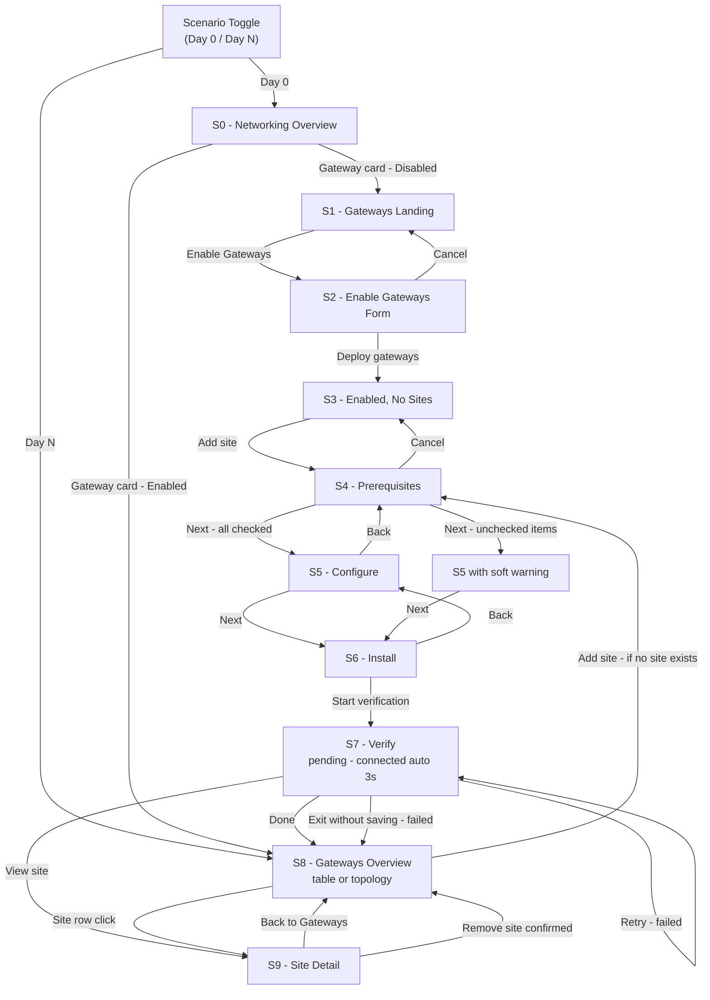

# HCP Vault Dedicated — Gateways V1 Design Spec

**Status:** In Review
**Version:** V1
**Date:** 2026-08
**Author:** Benjamin Howard
**Depends on:**
- [Gateway RFC](./HCPV-HCP-Vault-Dedicated-Gateway.md)
- [Gateway Architecture Flow](./003.26.Gateway-Architecture-Flow.md)
- [HVD Gateway Memo Analysis](./HVD-Gateway-Memo-Analysis.md)

---

## Purpose

This document is the V1 stakeholder alignment artifact for the HCP Vault Dedicated Gateways feature. It defines every screen in scope, every design decision made, every open question still requiring resolution, and all design-driven API and data model requirements identified during design. It is the source of truth for V1 scope and should be read alongside the V1 prototype spec before implementation begins.

---

## V1 Scope Summary

V1 covers the complete Day 0 setup flow and Day N management view for a single gateway site per cluster. The feature enables customers to connect private networks to HCP Vault using encrypted tunnels without cloud-provider-specific peering.

**In scope for V1:**
- Enable gateways flow (S0 → S1 → S2 → S3)
- Add site wizard - 3 steps: Prerequisites, Configure, Install (Docker only)
- Verify connection (S7)
- Gateways overview - table and topology views (S8)
- Site detail with site gateway health, dataplane gateway health, and DR pairing (S9)
- Remove site

**Deferred to V2:**
- Binary deployment option (S4 deployment model selector)
- Multiple peers per gateway
- Customer-side site pairing for HA (open question - see below)

---

## Open Questions

| # | Question | Affects | Current stance | Resolution needed by |
|---|---|---|---|---|
| OQ1 | Is customer-side site pairing a V2 HA requirement, or is HA always HCP-managed via primary/backup dataplane gateways? | S9 High availability card, V2 scope | V1 shows HCP-managed DR only. V2 scope TBD. | Before V2 design begins |
| OQ2 | Does the system provide a client-side startup status signal distinguishing Docker capability failure from UDP 51820 blocked? | S7 failure attribution precision | Design assumes not available in V1. Recommended as design-driven API requirement (see below). | Before V1 engineering kickoff |
| OQ3 | What is the peer limit ceiling beyond V1? | S8 "Add site" affordance, copy | RFC states 1 peer per gateway for current and near-future phases. No hard ceiling documented beyond that. | Before V2 design begins |
| OQ4 | Should the version shown in install instructions be dynamically injected from the LaunchDarkly version flag, or is a placeholder acceptable for V1? | S6 install instructions, S9 slide-over | Placeholder `v1.2.1` used in prototype. Dynamic version recommended for production. | Before V1 launch |
| OQ5 | The RFC describes a single EC2 instance per cluster with no standby. If that instance fails, the Cadence health monitor (polling every 5 minutes) must detect the failure and reprovision a replacement - estimated 7-10 minutes of total tunnel downtime. Does this meet the availability requirement for V1, or does a standby instance need to be added to the RFC before V1 ships? | S8 status model, S9 DR card, DD-007, DD-008, DD-009, DAR-003 | The current design spec's Primary/Backup dataplane model and Degraded status definition are not grounded in the RFC. The RFC's HA row in the limitations table lists HA as "not supported" in both current and future phases. Design recommendation is Option A - Active/Standby with a pre-warmed second EC2 instance and EIP cutover on failure (see DAR-003). This would reduce estimated downtime to ~10-30 seconds. Resolution required before the health model in S8/S9 can be finalized. | Before V1 engineering kickoff |

---

## Design-Driven API Requirements

### DAR-001: Client startup telemetry endpoint

**Context:** S7 Verify attributes tunnel failures to one of three categories - credential error, agent not started / Docker capability missing, or network block (UDP 51820). The CP can distinguish "never authenticated" from "authenticated but never tunneled" using existing REST API signals. However it cannot distinguish between a Docker capability failure (NET_ADMIN / SYS_MODULE missing, WireGuard interface creation failed) and a firewall block (UDP 51820 closed). Both appear identical from the dataplane health check - `ever_connected: false`, no handshake.

**Recommendation:** Add a lightweight startup status reporting call from the Docker client to the CP after WireGuard interface initialization. A simple POST with a status field - `interface_created: true/false` and an optional `error` string - would close this gap. This does not require a new auth flow; it can use the existing gateway JWT.

**Impact if not built:** S7 failure attribution for the "never tunneled" case must be presented as a combined diagnostic. Copy must cover both possibilities - "verify UDP 51820 is open AND verify NET_ADMIN and SYS_MODULE capabilities are available" - rather than pointing to one specific cause. This increases operator time-to-resolution and support ticket volume for failed installations.

**Impact if built:** S7 can surface a precise failure reason per the `interface_created` signal, reducing operator time-to-resolution significantly.

---

### DAR-003: Active/Standby dataplane gateway - RFC architecture change required

**Context:** The RFC provisions a single EC2 instance per cluster. If that instance fails, the Cadence health monitor (polling every 5 minutes via a scheduled workflow) detects the failure and triggers reprovisioning via the existing Deploy workflow. Total estimated downtime: 7-10 minutes (up to 5-minute detection lag + ~60-90 seconds instance boot + SCADA verification + EIP cutover). The current design spec's Primary/Backup model and Degraded status definition (DD-007, DD-008, DD-009) require a standby instance to exist. That instance does not exist in the current RFC.

**Recommendation - Option A: Active/Standby with pre-warmed second EC2 instance**

Provision a second EC2 instance per cluster at gateway creation time. The standby runs the same AMI, the same WireGuard config, and maintains a SCADA connection to the CP. Only the active instance holds the EIP. The CP health monitor promotes the standby by executing the existing Traffic module (EIP reassignment) when the active instance fails a health check.

**Implementation steps for RFC update:**

1. **Terraform module change - Instance module:** Provision two ENIs and two EC2 instances per deployment record instead of one. Tag one `role=active`, one `role=standby`. Both boot with identical cloud-init configs.
2. **Traffic module change:** EIP association targets the `role=active` ENI. On promotion, reassociate the EIP to the `role=standby` ENI and flip the role tags.
3. **SCADA health monitor change:** Monitor both instances independently. On active instance failure (no SCADA heartbeat within health check window), trigger EIP cutover to standby without waiting for Cadence reprovisioning. Target detection-to-cutover time: under 30 seconds.
4. **Database schema change - `vault_gateway_deployments`:** Add a `role` column (`active` / `standby`) to the deployments table. The composite PK `(gateway_id, number)` already supports multiple deployment records per gateway.
5. **Config refresh:** The client fetches its WireGuard config from `GET /client-configs`. The endpoint IP in the config is the EIP, which persists across the cutover. No client-side change is required — the customer gateway re-handshakes automatically via the 25-second keepalive after the EIP moves.
6. **Standby replenishment:** After a failover promotes the standby to active, the CP immediately provisions a new standby instance to restore the active/standby pair. This reuses the existing Deploy workflow.

**Estimated downtime with Option A:** ~10-30 seconds (SCADA detection window + EIP reassignment + WireGuard re-handshake via keepalive).

**UI implications:** DD-007 (Degraded = standby unreachable), DD-008 (Primary/Backup health signals in S8/S9), and DD-009 (DR card showing primary/backup pair) are all valid as designed, conditional on this RFC change being accepted. If this change is not accepted, those three design decisions must be revised to reflect a single-gateway model.

**Blocked by:** OQ5 resolution. Engineering confirmation that the `vault_gateway_deployments` schema and Terraform module structure support dual-instance provisioning.

---

### DAR-002: Multiple CIDRs per peer - schema review required

**Context:** The RFC schema shows `cidr_block` as `VARCHAR(50)` on `vault_gateway_peers`. The V1 design supports multiple CIDRs per site (one per line in S5 textarea). Real customer networks have multiple subnets and restricting to a single CIDR would force users to create multiple sites for the same physical network.

**Recommendation:** Engineering to confirm whether `cidr_block` can be widened to a `TEXT` or array type, or whether a child table (`vault_gateway_peer_cidrs`) is the correct approach. This must be resolved before S5 Configure form finalizes.

---

## Design Decisions

> These are locked calls. Each records the decision, the rationale, and what is explicitly not being designed.

| # | Decision | Call | Rationale | What we are not doing |
|---|---|---|---|---|
| DD-001 | Terminology: WireGuard in UI copy | "Encrypted tunnel" replaces "WireGuard tunnel" in all user-facing copy. WireGuard interface names (wg0, wg1) removed from architecture diagrams. | IBM legal approval for WireGuard trademark is still open. Designing to a technology name that may change is a rework risk. | Not using WireGuard-specific terminology anywhere in prototype copy until legal clears it. |
| DD-002 | Terminology: peer vs site | "Site" is the user-facing label. "Peer" stays as backend/API language only. | "Site" maps to the operator's mental model - they are connecting a network site, not a technical peer. | Not exposing peer IDs or peer language in any UI surface. |
| DD-003 | Deployment model scope | Docker only in V1. Binary deferred to V2. S4 becomes a prerequisites screen rather than a deployment model selector. | RFC client setup section covers Docker only. Binary has no corresponding RFC specification. K8s explicitly out of scope per prior memo. | Not designing Binary or K8s setup flows until V2. |
| DD-004 | S4 prerequisites - advisory not blocking | Requirements shown as an advisory checklist. Soft warning if user proceeds with unchecked items. Next is not hard-gated. | The UI cannot technically verify kernel version, Docker capabilities, or firewall rules. A hard gate provides false assurance - it gates on an honor system. A soft warning preserves operator autonomy while making risk visible. Experienced operators who have already provisioned requirements should not be blocked. | Not hard-gating progression on self-reported prerequisites. |
| DD-005 | S4 prerequisites - checklist with documentation anchors | Requirements listed inline as checkboxes. "Learn more" links open relevant documentation in a new tab for items requiring detail. | Inline checklist keeps the operator in context without requiring a context switch for the basics. Documentation links are available for operators who need them without being mandatory for all. Link-only approach would create a context switch with no confirmation. Full prose would be heavy and skip-read. | Not replacing the checklist with a documentation link only. Not making documentation links mandatory. |
| DD-006 | CIDR relationship: S2 routing table and S5 site CIDRs | S5 "Network site CIDRs" offers selection from existing S2 routing table entries with auto-population. Multiple CIDRs per site supported via textarea (one per line). | S2 defines the dataplane VPC routing table. S5 defines the peer's AllowedIPs for a specific site. For traffic to flow, a site's CIDRs must have a corresponding S2 routing table entry. Auto-population enforces this relationship, reduces manual re-entry, and prevents silent routing failures. Multiple CIDRs per site reflect real network topology - restricting to one CIDR would force unnecessary site proliferation. | Not collapsing S2 and S5 into a single step. They serve different system purposes at different levels - gateway-wide routing vs per-site peer configuration. |
| DD-007 | Degraded status definition | Degraded = backup dataplane gateway unreachable while active tunnel is still working. | This is the most operationally actionable definition. "Your tunnel is working but you have no safety net" is a clear, specific signal that tells the operator exactly what to do. Blurring degraded into "connection is unstable" overlaps with Not connected and loses precision. | Not defining degraded as primary gateway struggling or as a general instability state. |
| DD-008 | Health model: two distinct signals | Top-level status badge reflects combined site gateway + primary dataplane gateway health. Backup dataplane gateway health is shown inside S9 site detail only. | The operator's first question at the overview level is "is my connection working right now." Primary/backup dataplane detail is "what happens if things go wrong" - relevant context but not the primary operational signal. Surfacing backup health at the overview level adds noise for healthy sites. | Not showing backup gateway health in S8 table. Not rolling backup health into the top-level status badge. |
| DD-009 | HA card - V1 scope | HA card in S9 shows HCP-managed primary/backup dataplane gateway pair with their individual health. Copy makes clear failover is automatic and HCP-managed. Customer-side site pairing removed from V1. | RFC DR failover is automatic via sentinel poller - the customer does not configure pairing. The original paired DR site design implied user-driven configuration that has no RFC backing. | Not designing a customer-side site pairing flow for V1. Open question OQ1 tracks whether this is needed for V2. |
| DD-014 | Dataplane gateway availability - Active/Standby model recommended | The design spec's Primary/Backup dataplane model (DD-007, DD-008, DD-009) assumes a standby instance exists. The current RFC does not provision one. This decision documents the gap and the recommended resolution. Three options were evaluated: (A) Active/Standby - second pre-warmed EC2 instance, EIP cutover on failure (~10-30s downtime); (B) Active/Active - multiple EC2 instances behind an NLB (~0s downtime but WireGuard statefulness makes this impractical without sticky sessions); (C) Faster self-healing - event-driven detection on the existing single-instance model (~1-2min downtime). Option A is recommended. The EIP cutover mechanism is already validated in the RFC's blue-green update path. The standby instance eliminates the 60-90 second reprovisioning window and the 5-minute Cadence polling lag. WireGuard re-handshake after EIP cutover takes seconds via the client's existing 25-second keepalive. Option B's NLB approach breaks WireGuard's per-peer handshake model without sticky sessions, which re-introduces a single point of failure. Option C does not meet a near-zero downtime requirement. | DD-007 and DD-008 remain valid as UI decisions conditional on OQ5 resolving in favour of Option A. If OQ5 resolves as accepted downtime risk, DD-007 and DD-008 must be revised to reflect a single-gateway health model with no backup signal. |
| DD-010 | Tunnel life removed | "Extend tunnel life" field removed from S2 (gateway level) and S5 (site level) entirely. | Once a connection is established there is no requirement to extend tunnel life. The field has no corresponding RFC technical backing as a gateway-wide or peer-level setting. | Not replacing tunnel life with another advanced option at this time. |
| DD-011 | Active gateways count removed | "Active gateways: X/Y" count removed from S7, S8, and S9. Replaced with explicit site gateway health and dataplane gateway health indicators. | With 1 peer per gateway in V1, a ratio count is meaningless (always 0/1 or 1/1). The primary/backup dataplane model requires directional health indicators, not a count. | Not showing a gateway count ratio anywhere in V1. |
| DD-012 | S8 table columns | Columns: Site, Status, Site gateway, Dataplane, Last seen, Actions. Version column removed from overview. | Status badge gives combined health at a glance. Site gateway and Dataplane columns give triage direction - is the problem customer-side or HCP-side - without requiring a click through. Version belongs in site detail, not the overview list. | Not showing version in S8 table. |
| DD-013 | WireGuard diagram labels | S1 architecture diagram replaces wg0/wg1 interface labels and "WireGuard tunnel" label with technology-agnostic equivalents. | Consistent with DD-001. Interface names are WireGuard-specific implementation detail not relevant to the operator's mental model. | Not showing protocol-specific interface names in any user-facing diagram. |

---

## Screen Flow — V1



---

## Global State — V1

| Field | Type | Day 0 Default | Purpose |
|---|---|---|---|
| `screen` | `'S0'`-`'S9'` | `'S0'` | Active screen |
| `s7State` | `'pending' \| 'connected' \| 'failed'` | `'pending'` | Verification step sub-state |
| `s8View` | `'table' \| 'topology'` | `'table'` | Gateways list view toggle |
| `s9Site` | `string` | `'nyc-prod'` | Which site to show in site detail |
| `gatewaysEnabled` | `boolean` | `false` | Controls S0 gateway badge and routing |
| `siteAdded` | `boolean` | `false` | Controls Add site affordance - hidden after first site added in V1 |

**Removed from V1 state:**
- `deployModel` - Binary/Docker selector is V2. Docker is the only V1 install path.
- `modal` - S2 is now a full-page form, not a modal.

**Scenario presets:**
- `DAY0` - `gatewaysEnabled: false`, `siteAdded: false`, start screen S0
- `DAYN` - `gatewaysEnabled: true`, `siteAdded: true`, start screen S8

---

## Screen Specifications

---

### S0 - Networking Overview

**Purpose:** Top-level cluster networking dashboard. Entry point to the Gateways feature.

**Stage covered:** Stage 0

| Element | Detail |
|---|---|
| Breadcrumb | cizh-org > default-project > Vault Dedicated > vault-cluster > Cluster networking |
| Gateway card badge | Day 0: `neutral` Disabled / Day N: `success` Enabled - 1 site |
| Gateway card edit action | Day 0 → S1 / Day N → S8 |

**Note:** Badge copy updated from "3 sites" to "1 site" to reflect V1 peer limit.

---

### S1 - Gateways Landing

**Purpose:** Pre-enable landing page. Explains the feature and sets operator expectations before any configuration begins.

**Stage covered:** Stage 1

| Element | Detail |
|---|---|
| Breadcrumb | ... > Cluster networking > Gateways |
| CTA | Enable Gateways → S2 |
| Architecture diagram | Shows: Vault Node → Dataplane Gateway → Encrypted tunnel → Site Gateway → Database. No WireGuard terminology. No interface names. |
| Setup stepper | 3 steps: Enable gateways (active) → Configure routing → Connect your network |
| Explanatory copy | Outbound encrypted tunnels. No inbound ports required. |

---

### S2 - Enable Gateways Form

**Purpose:** Configuration form for deploying dataplane gateways and defining the VPC routing table before gateways go live.

**Stage covered:** Stages 2-3

| Element | Detail |
|---|---|
| Breadcrumb | ... > Gateways > Enable gateways |
| Section A | Deploy dataplane gateways: collapsible AZ list (informational only - us-east-1a/b/c/d). User cannot modify AZ selection. |
| Section B | Set up gateway routing table: radio toggle Text fields / JSON editor. Text mode: network name, CIDRs, AZ zone dropdown, delete button per row. Add network appends blank row. JSON mode: dark code editor with textarea. |
| Footer | Deploy gateways (primary) → S3 / Cancel (secondary) → S1 |

**Removed:** Tunnel life select. Local state `tunnelLife` removed.

**Note:** Networks entered here auto-populate the CIDR field in S5 Configure when the user selects a matching network name.

---

### S3 - Gateways Enabled, No Sites

**Purpose:** Confirmation after gateway enable. Prompts operator to add their first site.

**Stage covered:** Stage 4

| Element | Detail |
|---|---|
| Breadcrumb | ... > Gateways |
| Heading | Gateways + `success` Enabled badge |
| Success alert | "Gateways enabled - Add a site to connect your first private network." |
| Dataplane health strip | 4 AZ chips: us-east-1a/b/c/d each with green Healthy pill |
| Empty state | "No sites configured" - "Add your first gateway site to connect a private network to HCP Vault." - Add site CTA → S4 |

---

### S4 - Add Site: Prerequisites

**Purpose:** First step of the add-site wizard. Confirms the operator has met all requirements before proceeding to configuration. Advisory, not blocking.

**Stage covered:** Stage 5

**Step indicator:** Step 1 of 4 - Prerequisites, Configure, Install, Verify

**Note on step count:** V1 uses 4 steps with Prerequisites as Step 1. V2 replaces Prerequisites with Deployment Model selector, keeping 4 steps. Step indicator component should support a configurable step label array.

| Requirement | Detail | Learn more |
|---|---|---|
| Linux host - kernel ≥ 5.8 | Required for encrypted tunnel interface support | Link to docs |
| Docker runtime | Ability to run a container with elevated privileges | Link to docs |
| Host networking | Container must run with --network host so tunnel traffic originates from the host's real IP | Link to docs |
| NET_ADMIN capability | Required for network interface creation, routing rules, and IP tables | Link to docs |
| SYS_MODULE capability | Required for loading tunnel kernel module if not already loaded on host | Link to docs |
| Compute: 8 GB RAM, 20 GB storage | Minimum host resources | - |
| Outbound HTTPS | To reach HCP platform endpoints for authentication and config fetch | - |
| Outbound UDP 51820 | For tunnel traffic to the dataplane gateway public IP | - |
| Public DNS resolution | To resolve HCP platform endpoints | - |
| HCP service principal | A service principal with gateway permissions created in HCP IAM before proceeding | Link to docs |

**Soft warning:** If the operator clicks Next with unchecked items, an inline `warning` Alert appears: "You have unconfirmed requirements. Proceeding may result in a failed connection at the verification step."

**Footer:** Cancel → S3 / Next → S5

---

### S5 - Add Site: Configure

**Purpose:** Second wizard step. Operator names the site and provides credentials and CIDRs.

**Step indicator:** Step 2 of 4

| Field | Type | Required | Helper text |
|---|---|---|---|
| Site name | Text | Yes | A label for this network site. Used to identify the gateway in routing rules and logs. |
| Service principal client ID | Text (monospace) | Yes | From the HCP service principal created for this gateway. |
| Service principal client secret | Password (monospace) | Yes | Store this value securely. It will not be shown again after setup. |
| Network site CIDRs | Select + textarea | No | Select from existing routing table networks to auto-populate, or enter CIDRs manually. One CIDR per line. These become your routing table entries for this site. |

**Alert:** `neutral` - "Source IP addresses are preserved in Vault audit logs."

**Auto-population:** Network site CIDRs field offers a dropdown of named networks from the S2 routing table. Selecting a network pre-fills the CIDRs. Manual entry remains available.

**Removed:** Tunnel life Disclosure/advanced options section removed entirely.

**Footer:** Back → S4 / Next → S6

---

### S6 - Add Site: Install

**Purpose:** Third wizard step. Provides copy-paste install commands for the gateway agent Docker container.

**Step indicator:** Step 3 of 4

**V1 note:** Docker is the only install method in V1. Binary tab is not shown. Tab component is not rendered - content is presented directly without a tab selector.

**Install content - Docker:**

1. Pull the gateway image
```
docker pull hashicorp/hcp-vault-gateway:[version]
```

2. Run the gateway container
```
docker run -d \
  --name vault-gateway \
  --network host \
  --cap-add NET_ADMIN \
  --cap-add SYS_MODULE \
  -e HCP_ORGANIZATION_ID=[org-id] \
  -e HCP_PROJECT_ID=[project-id] \
  -e HCP_CLUSTER_ID=[cluster-id] \
  -e HCP_CLIENT_ID=[client-id] \
  -e HCP_CLIENT_SECRET=[client-secret] \
  hashicorp/hcp-vault-gateway:[version]
```

Each code block has a Copy button.

**Alert:** `neutral` - "Keep the agent running before proceeding to verification."

**V1 gaps noted:**
- `--network host` and `--cap-add SYS_MODULE` added (were missing from prior prototype)
- `HCP_ORGANIZATION_ID` and `HCP_PROJECT_ID` added (were missing from prior prototype)
- Version tag should be dynamically injected from the gateway version flag (OQ4)

**Footer:** Back → S5 / Start verification → S7

---

### S7 - Add Site: Verify Connection

**Purpose:** Final wizard step. Polls for gateway agent connectivity and shows result.

**Step indicator:** Step 4 of 4

**Sub-states:**

**Pending:**
- Spinning animation
- "Waiting for connection..."
- "Keep the gateway agent running. This page will update automatically when a connection is established."
- Auto-advances to connected after 3 seconds (prototype simulation)
- Facilitator link: "Simulate connection failure"

**Connected:**
- Green checkmark
- "Connected"
- "[site-name] is active and healthy."
- Site gateway: Connected
- Primary dataplane: Active
- Footer: Done → S8 / View site → S9

**Failed:**
- "Connection not established"
- `warning` Alert: "No tunnel detected after 5 minutes."
- Three diagnostic categories:

| Category | Copy | Maps to |
|---|---|---|
| Agent not authenticated | The gateway agent could not authenticate with HCP. Verify your service principal client ID and secret are correct and have gateway permissions. | No token request received by CP |
| Tunnel interface not established | The encrypted tunnel interface may not have started. Verify the container is running with --network host, --cap-add NET_ADMIN, and --cap-add SYS_MODULE. Verify Linux kernel version is 5.8 or higher. | Token issued, config fetched, ever_connected: false - see DAR-001 |
| Network block | The tunnel could not reach the dataplane gateway. Verify outbound UDP port 51820 is open to the dataplane gateway public IP. | Token issued, config fetched, ever_connected: false - indistinguishable from above without DAR-001 |

**Note:** Categories 2 and 3 are currently indistinguishable without DAR-001. Both are shown as separate diagnostic items. When DAR-001 is implemented, category 2 can be surfaced or suppressed based on the `interface_created` signal.

**Footer:** Exit without saving → S8 / Retry verification → S7 (pending)

---

### S8 - Gateways Overview

**Purpose:** Day N management screen. Shows the single gateway site status in table or topology view.

**V1 note:** Add site button/CTA is hidden after the first site is added (`siteAdded: true`). 1 peer per gateway limit is enforced silently - no error message needed if the affordance is not shown.

**Header:** Gateways + `success` Enabled badge + ViewToggle (Table / Topology) + Add site (visible only when `siteAdded: false`)

**Dataplane health strip:** Vault logo tile + "Dataplane Gateways" label + 4 AZ chips with health pills

**Table view columns:**

| Column | Content |
|---|---|
| Site | Site name - link to S9 |
| Status | Combined health badge: Healthy / Degraded / Not connected |
| Site gateway | Connected / Not connected badge |
| Dataplane | Primary: Active badge + Backup: Ready or Down badge |
| Last seen | Relative timestamp or absolute UTC |
| Actions | Edit (no-op V1) / Remove site |

**Demo rows (Day N):**

| Site | Status | Site gateway | Dataplane | Last seen |
|---|---|---|---|---|
| nyc-prod | `success` Healthy | Connected | Primary: Active / Backup: Ready | 2 min ago |
| nj-dr | `warning` Degraded | Connected | Primary: Active / Backup: Down | 2025-07-14 04:59 UTC |
| fl-branch | `offline` Not connected | Not connected | Primary: Active / Backup: Ready | Never |

**Alerts below table:**
- `warning`: "nj-dr is degraded - Backup gateway unreachable. Your tunnel is active but failover protection is unavailable."
- `neutral`: "fl-branch has not connected - The gateway agent has not established a tunnel. Verify the agent is running and outbound UDP 51820 is open."

**Topology view:** Unchanged from current design. Site gateway cards on left, SVG connector lines in centre, dataplane AZ cards on right. Connector line styles: Healthy solid, Degraded dashed amber, Not connected dashed grey with ? indicator.

---

### S9 - Site Detail

**Purpose:** Full detail page for a single gateway site. Shows site gateway health, dataplane gateway health, DR pairing, and agent management.

**Breadcrumb:** ... > Gateways > {site name}

**Conditional alerts:**
- `nj-dr` → `warning`: "Backup gateway unreachable - Your tunnel is active but failover protection is unavailable. Contact HCP support if this persists."
- `fl-branch` → `neutral`: "No tunnel established - The gateway agent has not connected. Verify the agent is running and can reach HCP on outbound UDP 51820."

**Main grid (2 columns):**

**Left - Site gateway card:**

| Field | Value |
|---|---|
| Site name | [site-name] (monospace) |
| Status | Status badge |
| Last seen | Relative or absolute timestamp |
| Network site CIDRs | CIDRs (monospace) |

**Right - 2 stacked cards:**

**Dataplane gateway card:**
- Primary gateway: AZ label + `success` Active badge
- Backup gateway: AZ label + `success` Ready badge (or `warning` Down badge if degraded)
- Copy: "Failover is automatic. If the primary gateway becomes unreachable, your connection will route through the backup."

**Gateway agent card:**
- "The gateway agent runs inside your network. You are responsible for deployment and updates."
- View install instructions (secondary sm) → opens Install slide-over
- View update instructions (secondary sm - no-op V1)
- Version chip: Current: [version] with "New version available" notice (amber) when applicable

**Site topology diagram (below grid):**
```
[Site Gateway]  ──── encrypted tunnel ────  [Dataplane us-east-1a  Active]
                                             [Dataplane us-east-1b  Passive]
```
- Healthy: solid green connector
- Degraded: dashed amber connector
- Not connected: dashed grey connector + ? indicator

**Removed from S9:**
- "Active gateways: X of Y" field - replaced by explicit site gateway card and dataplane gateway card
- "Deployment model" field - Docker only in V1, not worth surfacing as a configuration field
- Paired DR site link - replaced by HCP-managed dataplane primary/backup model

**High availability card - renamed to Disaster Recovery:**

| Field | Value |
|---|---|
| Primary gateway | us-east-1a - `success` Active |
| Backup gateway | us-east-1b - `success` Ready or `warning` Down |
| Failover | Automatic - managed by HCP |

**Note:** Card renamed from "High availability" to "Disaster recovery" to accurately reflect the RFC model. HA (active/active) is not supported in V1. DR (automatic failover to backup) is HCP-managed. See OQ1 for V2 customer-side pairing question.

**Remove site modal:**
- Title: Remove [site]?
- `warning` Alert: "This action will tear down the encrypted tunnel. All traffic routed through this site will stop immediately. This cannot be undone."
- Cancel / Remove site (critical)

**Note:** "WireGuard tunnel" replaced with "encrypted tunnel" per DD-001.

**Install slide-over panel:**
- Header: Install instructions + close button
- Body: Same Docker install content as S6. No tab selector in V1.

---

## V2 Design Notes

The following items are deferred to V2 and should be considered when V2 design begins.

| Item | Description | Dependency |
|---|---|---|
| Binary deployment | S4 becomes a deployment model selector (Binary / Docker RadioCards). S6 adds Binary tab with curl download, gateway.hcl config, and run command. S9 install slide-over adds Binary tab. Step indicator stays at 4 steps. | Engineering confirmation that binary client is available |
| Multiple peers per gateway | S8 becomes a full list management screen with Add site always available. S0 badge shows site count dynamically. | RFC peer limit lifted |
| Customer-side site pairing | If OQ1 resolves to yes, V2 HA card shows user-configured paired site with manual pairing flow. | OQ1 resolution |
| Dynamic version injection | Install instructions in S6 and S9 slide-over pull version from LaunchDarkly flag rather than hardcoded string. | OQ4 resolution |
| Update instructions | S9 "View update instructions" button (currently no-op) receives content and flow. | Engineering update flow defined |

---

## Screen-to-Stage Mapping — V1

| Screen | Name | Stages covered |
|---|---|---|
| S0 | Networking overview | 0 |
| S1 | Gateways landing - disabled | 1 |
| S2 | Enable gateways form | 2-3 |
| S3 | Gateways enabled - no sites | 4 |
| S4 | Add site - prerequisites | 5 |
| S5 | Add site - configure | 6 |
| S6 | Add site - install | 7 |
| S7 | Add site - verify connection | 8-10 |
| S8 | Gateways overview - with sites | 11 |
| S9 | Site detail | 12-13 |
