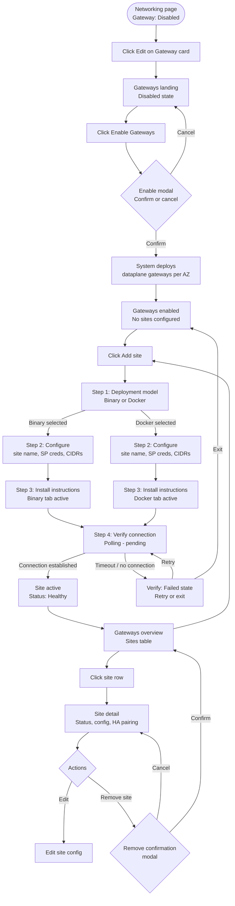

# Gateway Architecture Flow

**Status**: Draft
**Date**: 2026-08
**Author**: Benjamin Howard
**Depends on**:
- [Gateway RFC](./Gateway-RFC.md)
- [HVD Gateway Memo Analysis](./HVD-Gateway-Memo-Analysis.md)
- [HVD Gateway Technical Primer](../07.%20Research/001.26.08.05.HVD-Gateway-Technical-Primer.md)

---

## Purpose

This document is the stakeholder alignment artifact for the Gateway setup flow. It defines every state the system can be in, every decision point a user encounters, and every error branch that must be handled before wireframes are finalized. It is the source of truth for screen scope and transition logic in the prototype.

---

## Full Flow Diagram

---

## Stage-by-Stage Table

| # | Stage | User action | System response | Resulting state | Error / edge conditions |
|---|---|---|---|---|---|
| 0 | Networking overview | Lands on page; sees Gateway card with `Disabled` badge | Renders card with status, description, `Edit →` link | Gateway card: Disabled | None |
| 1 | Gateways landing - disabled | Clicks `Edit →` on Gateway card | Navigates to Gateways page; renders architecture diagram, setup steps, `Enable Gateways` CTA | Gateways page: disabled state | None |
| 2 | Enable modal | Clicks `Enable Gateways` | Modal appears: explains AZ deployment, active/passive HA, irreversibility | Modal open | None |
| 3 | Enable confirm | Clicks `Enable` in modal | System deploys dataplane gateways to each AZ; navigates to Gateways overview | Gateways enabled; no sites | **[Q3]** If AZ deployment fails, error state must attribute failure to the dataplane side, not the user's network |
| 4 | Empty state - no sites | Sees empty state; clicks `Add site` | Navigates to create site flow, Step 1 | Step 1: deployment model selector | None |
| 5 | Step 1: Deployment model | Selects Binary or Docker; clicks `Next` | Records selection; advances to Step 2 | Step 2: configure form | **[Q1]** If only one deployment option is supported at GA, this step collapses to a single path with no selector |
| 6 | Step 2: Configure | Fills site name, service principal credentials, allowed CIDRs; clicks `Next` | Validates fields; advances to Step 3 | Step 3: install instructions | Validation errors: empty required fields, malformed CIDR, duplicate site name. **[Q2]** Source IP alert shown inline regardless of user input - it is a constraint, not a choice |
| 7 | Step 3: Install | Reads instructions; copies commands; runs agent in their environment; clicks `Start verification` | Switches to polling state; starts connection check | Step 4: verify - pending | Tab selection (Binary/Docker) mirrors Step 1 choice. If user selected Docker in Step 1, Docker tab is active by default here |
| 8 | Step 4: Verify - pending | Waits; agent is running in their environment | Polls for tunnel establishment; shows spinner + waiting copy | Pending - no timeout yet | User can leave and return; site remains in `Pending` state until connected or abandoned |
| 9 | Step 4: Verify - connected | System detects tunnel up | Updates to success state: checkmark, site name, `View site` button | Site active: Healthy | None |
| 10 | Step 4: Verify - failed | Timeout or connection error detected | Shows failed state: error copy, failure attribution (Gateway / network / credentials), `Retry` + `Exit` actions | Verify: Failed | **Failure attribution is critical:** error copy must distinguish between agent not started, credential error, and network block. Generic "connection failed" is not acceptable per the Technical Primer |
| 11 | Gateways overview - with sites | Views sites table | Table shows site name, status badge, active/total gateway count, version, last seen, actions | Sites table | `Degraded` status (1/2 gateways active) must be visually distinct from `Healthy` (2/2) - same badge system, different color |
| 12 | Site detail | Clicks site row | Navigates to detail page: description list, HA pairing card, actions | Site detail | HA pairing shows paired DR site if configured. If no DR site, HA card shows `Not configured` with guidance |
| 13 | Remove site | Clicks `Remove site`; confirms in modal | System removes site config; navigates back to Gateways overview | Site removed; overview updated | Destructive - modal must explain consequence: tunnel will be torn down, traffic will stop routing |

---

## Decision Branches

### Branch 1: Deployment model (Step 1)

**Decision:** Binary vs Docker selector

- If Binary: Step 3 shows Binary tab active, curl download + HCL config + run command
- If Docker: Step 3 shows Docker tab active, docker pull + docker run command
- Both tabs remain accessible regardless of selection (user may want to reference the other)

**[Q1 - Open]:** Binary vs Docker - both confirmed for GA? Assumed both in scope. Kill criteria: Engineering confirms binary-only or Docker-only before Step 1 wireframe finalizes.

### Branch 2: Verify - success vs failure (Step 4)

**Decision:** Connection established vs timeout/error

- Success path: transitions to Site active → Gateways overview
- Failure path: failure attribution screen - three possible error types:
  - Agent not running / not started
  - Credential error (service principal rejected)
  - Network block (tunnel attempt reached, blocked by customer firewall)

**[Q2 - Open]:** Failure attribution requires the system to distinguish these cases. If the system cannot distinguish, the UI must offer triage guidance rather than a single generic error. Assumed: system provides error type signal. Kill criteria: Engineering confirms error signal shape before Step 4 wireframe finalizes.

### Branch 3: HA pairing (Site detail)

**Decision:** DR site paired vs not configured

- Paired: HA card shows paired site name, failover status (`Ready` / `Not ready`)
- Not configured: HA card shows empty state with guidance to add a DR site

**[A2 - Assumption]:** HA/DR pairing is shown in the site detail as a configuration state, not as a separate setup flow. Appropriate for PoC stage. GA scope will require a dedicated pairing flow.

---

## Open Questions Affecting Flow

| # | Question | Affects stages | Current design stance | Kill criteria |
|---|---|---|---|---|
| Q1 | Binary vs Docker - both options at GA? | Stage 5 (Step 1), Stage 7 (Step 3) | Design for both; Binary/Docker radio card in Step 1, tabbed install in Step 3 | Engineering confirms single option before Step 1 wireframe |
| Q2 | Source IP preservation - system signals error type on verify failure? | Stage 10 (Verify failed) | Three-category failure attribution assumed | Engineering confirms error signal shape |
| Q3 | Peer limits - what is the documented ceiling? | Stage 11 (Sites table), Stage 12 (Site detail) | Placeholder copy used; no hard limit shown in prototype | Engineering provides ceiling before launch copy finalizes |
| Q4 | HA/DR pairing - automatic detection or explicit configuration? | Stage 12 (Site detail) | Shown as explicit configuration (user pairs DR site manually) | Engineering confirms automatic vs manual pairing model |

---

## Design Decisions

> These are forks taken, not open questions. Each records the call, the rationale, and what is explicitly not being designed.

| Decision | Call | Rationale | What we are not doing |
|---|---|---|---|
| Deployment model scope | Design for Binary + Docker in Step 1; both tabs in Step 3 | Chris Zembower explicitly marked K8s-only as unacceptable in the memo. TF Agent precedent supports both | Not designing K8s-specific setup flows until requirement changes |
| Source IP in UI | Inline Alert in Step 2 (Configure) treats source IP as a hard constraint, not a user choice | Audit log integrity is a hard requirement for enterprise/regulated customers. Designing around it now avoids rework if confirmed mandatory | Not designing a "logical identity only" path until PM/engineering confirms it acceptable |
| Failure attribution | Step 4 (Verify failed) shows three distinct error types, not a generic error | Generic "connection failed" is explicitly called out in the Technical Primer as unacceptable for ops teams | Not deferring failure attribution to a future release |
| HA/DR in prototype | HA pairing shown in site detail as a configured state, not a full setup flow | Prototype is PoC stage; memo confirms HA/DR not required for PoC/Private Beta | Not designing the full HA/DR multi-environment setup flow until GA scope is confirmed |
| WireGuard language | UI uses "encrypted tunnel" not "WireGuard tunnel" | WireGuard IBM legal approval is still open. Designing to a technology name that may change is a rework risk | Not using WireGuard-specific terminology anywhere in prototype copy |
| CSP branching | Single setup flow with no cloud-provider branch | CSP-agnostic is a stated goal; branching by cloud would undermine it and create maintenance overhead | Not designing AWS-specific, Azure-specific, or GCP-specific setup variants |

---

## Screen-to-Stage Mapping

| Screen ID | Screen name | Stages covered |
|---|---|---|
| S0 | Networking overview | 0 |
| S1 | Gateways landing - disabled | 1 |
| S2 | Enable modal | 2-3 |
| S3 | Gateways overview - enabled, no sites | 4 |
| S4 | Create site - deployment model | 5 |
| S5 | Create site - configure | 6 |
| S6 | Create site - install instructions | 7 |
| S7 | Create site - verify connection | 8-10 |
| S8 | Gateways overview - with sites | 11 |
| S9 | Site detail | 12-13 |
