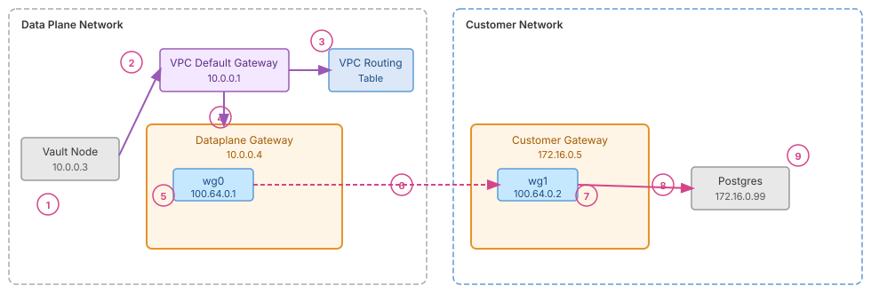

# Gateway RFC

## Customer Setup Steps

The customer must take the following actions:

1. **Enable gateways**
   - This will deploy the dataplane-gateway(s) for the Vault cluster
   - One gateway will be deployed per availability zone, operating in an active/passive configuration for rapid failover
   - Optionally: configure outage coverage by setting the tunnel to remain intact for a certain period of time after an outage is detected

2. **Within their CIDR environment:**
   - Allow public DNS resolution to resolve HCP platform endpoints
   - Ensure outbound HTTPS connectivity to the HCP platform
   - Ensure outbound UDP on port 51820 (Wireguard) to dataplane gateway public IP addresses
   - Set the kernel variable `net.ipv4.ip_forward=1`

3. **Deploy gateways in their environments (sites)**
   - Create service principals for each gateway
   - Configure gateways with "site" identifiers and service principal credentials

4. **Add network CIDRs to the dataplane VPC routing table** as K/V pairs: customer network CIDR and the corresponding dataplane gateway IP address
   - With the Terraform provider, this configuration will be included in the `gateway_config` stanza

5. **Additional configuration** dependent on feature usage (BYO-TLS Cert, BYO-DNS, etc.)

6. **Regularly update the gateways** deployed in their environments

---

## Customer Gateway

The customer gateway is deployed and managed by the customer within their own network. To successfully deploy the gateway, the customer must meet the following requirements:

- **Containers:** Ability to run the Gateway executable as a Docker container with sufficient privileges to create network interfaces and manage IP tables rules.
- **Operating System:** Linux variant with kernel version >= 5.8
- **Hardware:** Lower-end compute instance with 8GB RAM and 20GB of storage.
- **DNS:** Allow public DNS resolution to resolve HCP platform endpoints.
- **HCP Platform Access:** Ensure outbound HTTPS connectivity to the HCP platform.
- **Dataplane Gateway Access:** Ensure outbound UDP on port 51820 (Wireguard) to dataplane gateway public IP addresses.
- Securely manage deployment service principals to prevent unauthorized access.
- Allow connectivity to private workloads based on enabled features. Examples include:
  - **BYO-DNS:** Ensure connectivity to the customer's designated DNS servers.
  - **Dynamic Database Credentials:** Ensure connectivity to target databases.
  - **LDAP Auth Method:** Ensure connectivity to the customer's designated LDAP server.

> It's important to understand that customer gateways do not need to accept inbound connections to connect to HCP or set up a Wireguard tunnel. Instead, customer gateways always initiate the connection to dataplane gateways.

---

## Network to Gateway Routing

To deliver dataplane network traffic to the dataplane gateway, **routes for the customer network are added to the dataplane VPC routing table.** Each route includes **a pair of the customer network CIDR and the dataplane gateway IP address**, ensuring that only matching traffic is sent to the dataplane gateway. If there is no match, the existing routing table entries are used.

---

## Gateway to Gateway Routing

Each gateway operates on a Linux host with three network interfaces:

- **Private network interface:** Connects to hosts within the gateway's private network.
- **Wireguard network interface:** Provides a secure tunnel to the Wireguard interface of the gateway in the opposing network.
- **Public accessible network interface:** Encapsulates the Wireguard tunnel over the public internet.

To route traffic to the opposing network through the Wireguard interface, the gateway acts as a "mini-router." **By setting the kernel variable `net.ipv4.ip_forward=1`, the gateway is allowed to forward packets not meant for itself. A combination of routing rules and IP tables for network address translation are used** so that a packet from Vault headed for a customer's private IP address travels through the Wireguard tunnel and exits from the gateway in the opposing network. The opposing gateway then performs similar steps in reverse to deliver the packet to its final destination.



**Packet flow (numbered steps):**

1. Vault (10.0.0.3) dials the customer's Postgres database (172.16.0.99) to create dynamic database credentials.
2. Postgres (172.16.0.99) is not in the dataplane network (10.0.0.0/16) so the packet is routed to the VPC's default gateway (10.0.0.1) to be routed to the next hop.
3. The default gateway consults the VPC routing table and sees that packets destined for the customer network (172.16.0.0/16) should be forwarded to the dataplane gateway (10.0.0.4).
4. The dataplane gateway is able to accept the packet destined for Postgres (172.16.0.99) even though it (10.0.0.4) is not the final destination because **`net.ipv4.ip_forward`** is enabled.
5. Routing rules on the gateway for the customer address space (172.16.0.0/16) forward the packet through the Wireguard network interface (wg0).
6. The packet traverses the encrypted Wireguard tunnel and exits via wg1 on the other side.
7. IP masquerading (a form of source network address translation) IP tables rules replace the **source address** of the packet (10.0.0.3) with the IP address of the customer gateway (172.16.0.5). This translation means that no network-level routing rules need to be put in place in the customer network.
8. The customer gateway recognizes that it is not the final destination (172.16.0.99) of the packet. Since **`net.ipv4.ip_forward`** is enabled, it forwards the packet to Postgres.
9. Postgres receives the packet and thinks the origin of the connection is from the customer gateway (172.16.0.5) due to IP masquerading from step 7. It does not need to know about the dataplane network or gateway.

---

## Config Files

### Dataplane gateway config

```hcl
# dataplane gateway config file
gateway {
  role           = "dataplane"
  wireguard_port = 51820
  public_ip      = "55.19.2.8"
  cred_file      = "/path/to/hcp/cred_file"
  log_level      = "info"
}
```

### Customer gateway config

```hcl
# customer gateway config file
gateway {
  role      = "customer"
  site      = "nyc"
  cred_file = "/path/to/hcp/cred_file"
  log_level = "info"
}
```

---

## Terraform Provider

To support use of the gateway feature in automated customer workflows, a `gateway_config` will be added to the existing [HCP Vault Terraform Provider](https://registry.terraform.io/providers/hashicorp/hcp/latest/docs/resources/vault_cluster).

```hcl
resource "hcp_vault_cluster" "example" {
  cluster_id = "vault-cluster"
  hvn_id     = hcp_hvn.example.hvn_id

  # ...

  gateway_config {
    enabled = true

    allowed_cidrs = {
      "nyc" = ["192.168.0.0/24", "192.168.10.99/32"]
      "nj"  = ["10.99.0.0/24", "10.99.1.0/24"]
    }
  }
}
```

---

## AuthN/AuthZ to HCP

A gateway authenticates to HCP using a project-level service principal to obtain a JWT token with an explicit TTL. The service principal can have static credentials (`client_id`, `client_secret`) or use Workload Identity Federation (WIF) to avoid the use of long-lived credentials. When using static credentials, customers are responsible for credential rotation. Each service principal has an associated role which identifies whether it is presenting itself as a customer gateway or a dataplane gateway.

In the event of a control plane outage (such as a customer gateway not being able to obtain a valid JWT), some flexibility is warranted to prevent service disruption. Customers can opt-in to leaving the tunnel intact for a period of time that aligns with historical outage durations (e.g. 4-8 hours).

### Customer side

- If **BYO-TLS Certificate** is not enabled, customers can start TLS connections to Vault on port 8200 using Vault's NLB private DNS hostname.
- If **BYO-TLS Certificate** is enabled (e.g., `vault.internal.sbux.com`), customers cannot connect to any dataplane address. Vault is only accessible via its private IP address on port 8200 within the customer's network.

### Dataplane side

- With **BYO-DNS** enabled, Route 53 in the dataplane network can query customer-specified private DNS servers over UDP port 53.
- With certain Vault plugins enabled, Vault can connect directly over the required TCP port (such as for LDAP or databases) to a customer workload's private IP address. For this, customers must add their private network CIDRs to an Allowed CIDRs list.

---

## Gateway Images

Gateway instances running in the dataplane network use a signed AMI image created with Packer. To maintain security and compliance, no image is older than 30 days - images are regularly rebuilt with the latest operating system and security patches. The same process applies to Docker images made available to customers. Customers are responsible for updating their gateway Docker images according to their own security requirements.

---

## High Availability

The goal is to enhance the resilience of the gateway architecture against outages within a region by deploying multiple gateways on each side of the Wireguard tunnel. Ideally, one gateway per availability zone, operating in an active/passive configuration for rapid failover.

A continuous feedback loop monitors each gateway's health and connectivity via the control plane; if a service interruption is detected, a passive gateway is automatically promoted to active status. To ensure deterministic selection, the active gateway is always the one that has been running the longest.
