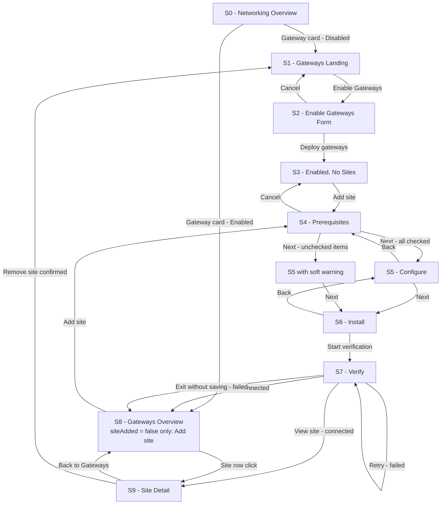
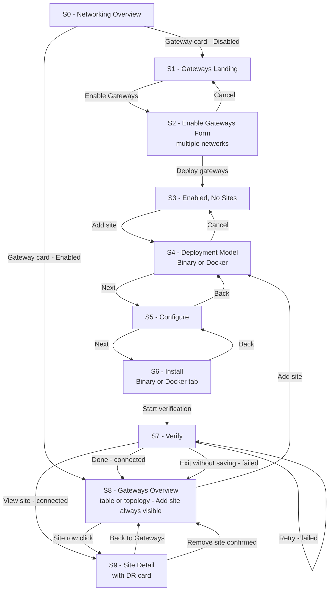
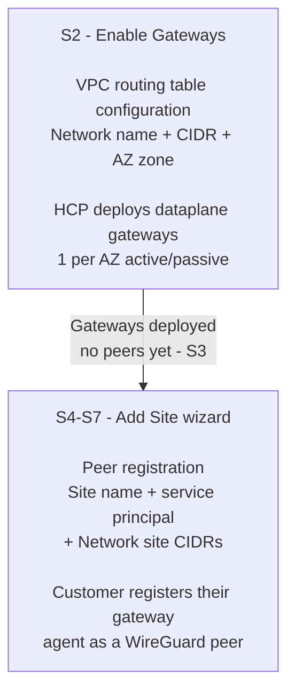

# HVD Gateways Product Design Specs

**Status:** In Review
**Version:** V1 / V2
**Date:** 2026-08
**Author:** Benjamin Howard
**References:**
- [Gateway RFC](../../../02.%20Strategy/HCPV-HCP-Vault-Dedicated-Gateway.md)
- [V1 Gateway Design Spec](./V1-Gateway-Design-Spec.md)
- [UI Overview](./UI_Overview.md)

---

## Purpose

This document is the primary design reference for the HCP Vault Dedicated (HVD) Gateways feature for PMs and engineering. It covers UI architecture, V1 and V2 scope boundaries, screen flows, design decisions, open questions, and design-driven API and architecture requirements. It should be read before engineering kickoff and before any V2 design work begins.

---

## What is the Gateways Feature?

HVD Gateways enables customers to connect private networks to HCP Vault using encrypted tunnels — without cloud-provider-specific peering (no AWS VPC Peering, no Azure VNet peering required). The customer deploys a lightweight Docker container (the gateway agent) inside their own network. HCP deploys and manages the dataplane gateway on its side. The two establish a WireGuard-based encrypted tunnel automatically.

**Key operator benefit:** Vault can reach private workloads (databases, LDAP servers, DNS servers) inside the customer's network without exposing those workloads to the public internet.

---

## V1 Scope

V1 covers the complete Day 0 setup flow and Day N management view for **one gateway site per cluster**.

**In scope:**
- Enable gateways flow (S0 → S1 → S2 → S3)
- Add site wizard — 4 steps: Prerequisites, Configure, Install (Docker only), Verify
- Gateways overview — table view only (S8)
- Site detail with site gateway health, dataplane gateway health, and disaster recovery pairing (S9)
- Remove site

**Out of scope for V1 (deferred to V2):**
- Binary deployment option
- Multiple sites per gateway
- Customer-side site pairing for HA
- Topology view in S8
- Dynamic version injection in install instructions

---

## V2 Scope

V2 expands the feature to support multiple sites per gateway and adds the binary deployment path.

**In scope for V2:**
- S4 becomes a deployment model selector (Binary / Docker RadioCards) replacing the Prerequisites screen
- S6 adds a Binary tab alongside Docker
- S8 adds the topology view and "Add site" button is always visible (multi-site model)
- S8 table expands to show all sites with degraded/offline expandable rows
- S9 shows a full Disaster Recovery card with primary/backup dataplane gateway pair
- S9 site topology diagram shows both Active and Standby dataplane gateway nodes

---

## Screen Flow — V1

---

## Screen Flow — V2

---

## Gateway Enablement Process

The setup flow spans two distinct configuration events separated by a system boundary. Understanding this split is important for reading S2 and S5 correctly.

### Steps in order

| Step | Screen | Actor | What happens |
|---|---|---|---|
| 1. Enable gateways | S2 | Operator + HCP | Operator submits routing table entries. HCP deploys 1 dataplane gateway EC2 instance (V1) or one per AZ (V2) via Cadence workflow, active/passive. |
| 2. No sites state | S3 | HCP | Confirmation screen. Dataplane gateways are live. No WireGuard peers configured yet. |
| 3. Prerequisites | S4 | Operator | Operator confirms their host environment meets requirements. Advisory only - not technically verified. V2 replaces this with deployment model selection. |
| 4. Configure site | S5 | Operator | Operator names the site, provides service principal credentials, and enters network CIDRs. Creates a peer record in the backend. |
| 5. Install agent | S6 | Operator | Operator runs the Docker container (V1) or binary (V2) on their host using the provided commands and credentials. |
| 6. Verify | S7 | HCP | HCP polls the dataplane gateway health endpoint. Connected when the WireGuard handshake is established. |

### S2 vs S5 - How routing table CIDRs differ from site CIDRs

The network name and CIDR appear in both S2 and S5, but they operate at different system layers.

**S2 - Enable Gateways form: dataplane VPC routing table**

| Field | System layer | Purpose |
|---|---|---|
| Network name | Label for a VPC route entry | Human-readable identifier for this route in HCP infrastructure |
| CIDR block | AWS VPC route table (HCP-side) | Destination subnet. Tells the HCP dataplane VPC: traffic bound for this CIDR should go to the dataplane gateway IP. |
| AZ zone | Route entry next hop | Which AZ's gateway IP is the next hop for this CIDR. |

**S5 - Add Site Configure: WireGuard peer AllowedIPs**

| Field | System layer | Purpose |
|---|---|---|
| Site name | `name` on `vault_gateway_peers` DB row | Display label for this peer in the portal. |
| Network site CIDRs | `cidr_block` on `vault_gateway_peers`, becomes `AllowedIPs` in `wg0.conf` | Tells WireGuard which traffic is permitted through the encrypted tunnel for this peer. |

Both must exist for traffic to flow. If S2 has a route but S5 has no matching peer CIDR, the VPC delivers the packet to the gateway but WireGuard drops it. This dependency is why the S5 CIDR field auto-populates from S2 routing table entries (DD-006).

---

## Screen Specifications — V1 vs V2 Differences

| Screen | V1 | V2 |
|---|---|---|
| S2 | 1 network row, primary + backup zone columns | Multiple rows, single zone column, Add network link |
| S3 | Dataplane strip shows 1 AZ chip (us-east-1a) | Dataplane strip shows 4 AZ chips |
| S4 | Prerequisites advisory checklist (10 items) | Deployment model selector — Binary / Docker RadioCards |
| S6 | Docker only, no tabs | Binary and Docker tabs |
| S8 | Table view only, no Add site button, 1 site row, 1 AZ chip | Table + topology toggle, Add site always visible, all sites, 4 AZ chips |
| S9 | Gateway agent card only in right column. Topology shows Active gateway only. | DR card (primary/backup pair) in Row 1 right. Gateway agent card in Row 2 right. Topology shows Active + Standby. |

---

## Open Questions

| # | Question | Affects | Current stance | Resolution needed by |
|---|---|---|---|---|
| OQ1 | Is customer-side site pairing a V2 HA requirement, or is HA always HCP-managed via primary/backup dataplane gateways? | S9 DR card, V2 scope | V1 shows HCP-managed DR only. V2 scope TBD. | Before V2 design begins |
| OQ2 | Does the system provide a client-side startup status signal distinguishing Docker capability failure from UDP 51820 blocked? | S7 failure attribution precision | Design assumes not available in V1. Recommended as DAR-001. | Before V1 engineering kickoff |
| OQ3 | What is the peer limit ceiling beyond V1? | S8 Add site affordance, copy | RFC states 1 peer per gateway for current and near-future phases. No hard ceiling documented beyond that. | Before V2 design begins |
| OQ4 | Should the version shown in install instructions be dynamically injected from the LaunchDarkly version flag, or is a placeholder acceptable for V1? | S6 install instructions, S9 slide-over | Placeholder `v1.2.1` used in prototype. Dynamic version recommended for production. | Before V1 launch |
| OQ5 | The RFC describes a single EC2 instance per cluster with no standby. If that instance fails, estimated 7-10 minutes of tunnel downtime. Does this meet the V1 availability requirement, or does a standby instance need to be added to the RFC? | S8 status model, S9 DR card, DD-007, DD-008, DD-009 | Design recommendation is DAR-003 Option A - Active/Standby. Resolution required before S8/S9 health model finalises. | Before V1 engineering kickoff |
| OQ6 | The AZ zone dropdown in S2 has no corresponding field in the RFC's API or database schema. The AZ is determined at deploy time from the HVN. Should this field be removed from the S2 form, or does engineering plan to expose AZ selection as a user input? | S2 routing table form | Field currently included in prototype. No RFC backing found. Likely to be removed. | Before V1 engineering kickoff |
| OQ7 | Which fields can be edited on a site after creation? The RFC `UpdateGatewayPeer` uses a field mask and cannot modify `peer_id` or `gateway_id`. The remaining fields in `vault_gateway_peers` are `name` (display label, no tunnel impact), `endpoint_ip` (customer public IP — changing this rewrites `wg0.conf` on the dataplane gateway), and `cidr_block` (AllowedIPs — rewrites `wg0.conf` and may affect the VPC routing table). `tunnel_cidr` is derived at peer creation and not listed as updatable. Engineering must confirm: which fields are exposed via the field mask in V1; whether `tunnel_cidr` is immutable; and whether service principal credentials live on the peer record or only as Docker env vars (if the latter, credential rotation has no portal edit surface). | S9 edit action (currently no-op), edit form design | Edit is a no-op in the current prototype. Edit form design is unstarted. | Before V1 engineering kickoff |
| OQ8 | What is the tunnel disruption window when `endpoint_ip` or `cidr_block` is edited? The RFC states the client config poller runs every 5 minutes and *"restarts the interface if keys or endpoints have changed."* This suggests a client-side WireGuard restart within 5 minutes of an edit. Not documented: whether the dataplane gateway also restarts on a peer update or only picks up changes on its next scheduled refresh; whether there is a split-state window causing a brief outage; and whether `RestartWireGuard` is triggered automatically by the CP on a peer update or only on manual request. Engineering must confirm the end-to-end sequence and disruption window so the edit UI can surface the correct warning copy and confirmation step. | S9 edit form — warning copy, confirmation modal | No edit disruption model defined. | Before V1 engineering kickoff |
| OQ9 | What is the correct UI pattern for editing a site — inline form on S9, slide-over panel, or a reduced wizard? The RFC field-mask update supports partial edits, which is consistent with an inline or panel approach. Open decisions: does editing `cidr_block` require a corresponding S2 routing table update (per DD-006 — both must exist for traffic to flow), or is that left to the operator; is a confirmation step required before saving changes that trigger a tunnel restart (per OQ8); should the edit surface mirror the Configure step of the Add site wizard or be a lighter standalone form. | S9 edit pattern, new screen or panel required | Edit is a no-op in the current prototype. Pattern undefined. | Before V1 design completion |

---

## Design Decisions

| # | Decision | Call | Rationale | What we are not doing |
|---|---|---|---|---|
| DD-001 | Terminology: WireGuard in UI copy | "Encrypted tunnel" replaces "WireGuard tunnel" in all user-facing copy. WireGuard interface names (wg0, wg1) removed from architecture diagrams. | IBM legal approval for WireGuard trademark is still open. Designing to a technology name that may change is a rework risk. | Not using WireGuard-specific terminology anywhere in prototype copy until legal clears it. |
| DD-002 | Terminology: peer vs site | "Site" is the user-facing label. "Peer" stays as backend/API language only. | "Site" maps to the operator's mental model - they are connecting a network site, not a technical peer. | Not exposing peer IDs or peer language in any UI surface. |
| DD-003 | Deployment model scope | Docker only in V1. Binary deferred to V2. S4 is a prerequisites screen in V1, not a deployment model selector. | RFC client setup section covers Docker only. Binary has no corresponding RFC specification. | Not designing Binary or K8s setup flows until V2. |
| DD-004 | S4 prerequisites - advisory not blocking | Requirements shown as an advisory checklist. Soft warning if user proceeds with unchecked items. Next is not hard-gated. | The UI cannot technically verify kernel version, Docker capabilities, or firewall rules. A hard gate provides false assurance. | Not hard-gating progression on self-reported prerequisites. |
| DD-005 | S4 prerequisites - checklist with documentation anchors | Requirements listed inline as checkboxes with "Learn more" links. | Inline checklist keeps the operator in context. Documentation links available without being mandatory. | Not replacing the checklist with a documentation link only. |
| DD-006 | CIDR relationship: S2 routing table and S5 site CIDRs | S5 "Network site CIDRs" offers selection from existing S2 routing table entries with auto-population. Multiple CIDRs per site supported via textarea. | S2 defines the dataplane VPC routing table. S5 defines the peer's AllowedIPs. For traffic to flow, a site's CIDRs must have a corresponding S2 routing table entry. Auto-population enforces this relationship and prevents silent routing failures. | Not collapsing S2 and S5 into a single step. |
| DD-007 | Degraded status definition | Degraded = backup dataplane gateway unreachable while active tunnel is still working. | "Your tunnel is working but you have no safety net" is a clear, specific signal. Conditional on OQ5 resolving to Active/Standby model. | Not defining degraded as primary gateway struggling or as a general instability state. |
| DD-008 | Health model: two distinct signals | Top-level status badge reflects combined site gateway + primary dataplane gateway health. Backup dataplane gateway health is shown inside S9 site detail only. | The operator's first question is "is my connection working right now." Backup health is relevant context but not the primary operational signal. Conditional on OQ5. | Not showing backup gateway health in S8 table. Not rolling backup health into the top-level status badge. |
| DD-009 | DR card - V1/V2 scope | V1: DR card hidden. V2: DR card in S9 shows HCP-managed primary/backup dataplane gateway pair. Copy makes clear failover is automatic and HCP-managed. | RFC DR failover is automatic via sentinel poller - the customer does not configure pairing. Conditional on OQ5. | Not designing a customer-side site pairing flow for V1. |
| DD-010 | Tunnel life removed | "Extend tunnel life" field removed from S2 and S5 entirely. | No corresponding RFC technical backing as a gateway-wide or peer-level setting. | Not replacing tunnel life with another advanced option at this time. |
| DD-011 | Active gateways count removed | "Active gateways: X/Y" count removed from S7, S8, and S9. Replaced with explicit site gateway and dataplane gateway health indicators. | With 1 peer in V1, a ratio count is always 0/1 or 1/1 and adds no value. | Not showing a gateway count ratio anywhere in V1. |
| DD-012 | S8 table columns | Columns: Site, Status, Site gateway, Dataplane, Last seen, Actions. Version column removed from overview. | Status badge gives combined health at a glance. Site gateway and Dataplane columns give triage direction without requiring a click through. | Not showing version in S8 table. |
| DD-013 | WireGuard diagram labels | S1 architecture diagram uses technology-agnostic labels. No wg0/wg1 interface names. | Consistent with DD-001. | Not showing protocol-specific interface names in any user-facing diagram. |
| DD-014 | Dataplane gateway availability - Active/Standby model recommended | The V1/V2 Primary/Backup dataplane model assumes a standby instance exists. The current RFC provisions only a single EC2 instance. Three options evaluated: (A) Active/Standby - pre-warmed second EC2, EIP cutover on failure (~10-30s downtime, recommended); (B) Active/Active NLB - impractical due to WireGuard statefulness without sticky sessions; (C) Faster self-healing on single instance (~1-2min downtime, does not meet near-zero requirement). Option A is recommended. Blocked by OQ5. | DD-007, DD-008, DD-009 are conditional on OQ5 resolving to Option A. If OQ5 resolves as accepted downtime risk, those three decisions must be revised. |

---

## Design-Driven API and Architecture Requirements

### DAR-001: Client startup telemetry endpoint

**Context:** S7 Verify cannot distinguish between a Docker capability failure (NET_ADMIN / SYS_MODULE missing) and a firewall block (UDP 51820 closed). Both appear identical from the dataplane health check — `ever_connected: false`, no handshake.

**Recommendation:** Add a lightweight POST from the Docker client to the CP after WireGuard interface initialization with `interface_created: true/false` and an optional `error` string. Uses the existing gateway JWT — no new auth flow required.

**Impact if not built:** S7 must show a combined diagnostic covering both failure modes, increasing operator time-to-resolution.

**Impact if built:** S7 can surface a precise failure reason, reducing operator time-to-resolution and support ticket volume.

---

### DAR-002: Multiple CIDRs per peer - schema review required

**Context:** The RFC schema shows `cidr_block` as `VARCHAR(50)` on `vault_gateway_peers`. The V1 design supports multiple CIDRs per site (one per line in S5 textarea). Real customer networks commonly have multiple subnets.

**Recommendation:** Engineering to confirm whether `cidr_block` can be widened to a `TEXT` or array type, or whether a child table (`vault_gateway_peer_cidrs`) is the correct approach. Must be resolved before S5 Configure form finalises.

---

### DAR-003: Active/Standby dataplane gateway - RFC architecture change required

**Context:** The RFC provisions a single EC2 instance per cluster. If that instance fails, the Cadence health monitor (polling every 5 minutes) must detect the failure and reprovision a replacement. Estimated total downtime: 7-10 minutes. The current design spec's Primary/Backup model (DD-007, DD-008, DD-009) requires a standby instance that does not exist in the current RFC.

**Recommendation - Option A: Active/Standby with pre-warmed second EC2 instance**

Provision a second EC2 instance per cluster at gateway creation time. The standby runs the same AMI and WireGuard config, and maintains a SCADA connection to the CP. Only the active instance holds the EIP. On active failure, the CP health monitor moves the EIP to the standby via the existing Traffic Terraform module.

**Implementation steps:**

1. **Instance module:** Provision two ENIs and two EC2 instances per deployment. Tag one `role=active`, one `role=standby`.
2. **Traffic module:** EIP targets the `role=active` ENI. On promotion, reassociate EIP to standby ENI and flip role tags.
3. **SCADA health monitor:** Monitor both instances independently. On active failure, trigger EIP cutover without waiting for Cadence reprovisioning. Target detection-to-cutover: under 30 seconds.
4. **Database schema:** Add a `role` column (`active` / `standby`) to `vault_gateway_deployments`.
5. **Client config:** No client-side change required. The client fetches WireGuard config via `GET /client-configs`. The endpoint IP in the config is the EIP, which persists across the cutover. Re-handshake happens automatically via the 25-second WireGuard keepalive.
6. **Standby replenishment:** After failover, the CP immediately provisions a new standby to restore the pair.

**Estimated downtime with Option A:** ~10-30 seconds.

**Blocked by:** OQ5 resolution. Engineering confirmation that the `vault_gateway_deployments` schema and Terraform module structure support dual-instance provisioning.

---

## Screen-to-Stage Mapping

| Screen | Name | V1 | V2 |
|---|---|---|---|
| S0 | Networking overview | In scope | In scope |
| S1 | Gateways landing | In scope | In scope |
| S2 | Enable gateways form | 1 network, primary + backup zone | Multiple networks, single zone |
| S3 | Enabled, no sites | 1 AZ chip | 4 AZ chips |
| S4 | Add site - step 1 | Prerequisites checklist | Deployment model selector |
| S5 | Add site - configure | In scope | In scope |
| S6 | Add site - install | Docker only | Binary + Docker tabs |
| S7 | Add site - verify connection | In scope | In scope |
| S8 | Gateways overview | Table only, 1 site, no Add site | Table + topology, multi-site, Add site always shown |
| S9 | Site detail | No DR card. Agent card only. | DR card + agent card. Primary/Standby topology. |
