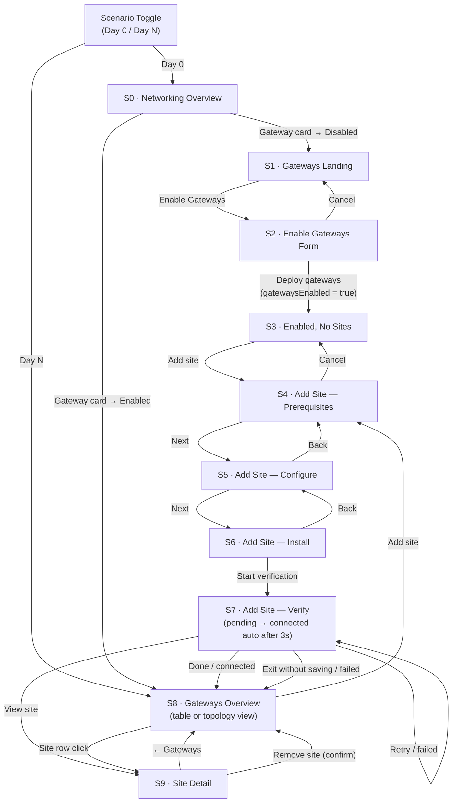

# HCP Vault Dedicated — Cluster Networking / Gateways UI Overview

This document describes the interactive prototype for the **HCP Vault Dedicated** Gateways feature, located under Cluster Networking. The prototype covers the complete Day 0 setup flow (enabling gateways, adding a site, verifying connectivity) and the Day N management view (overview table, topology diagram, site detail).

A **scenario toggle** in the top bar switches between Day 0 (gateways disabled, fresh start) and Day N (gateways enabled, 3 demo sites in various health states). A separate **version toggle** (V1 / V2) controls which design variant is rendered for S2 and S8.

---

## Screen Flow



---

## Global State

All state is held in a single `AppState` object at the root `App` component. A `navigate(updates)` helper merges partial updates, acting as a lightweight router.

| Field | Type | Day 0 Default | Purpose |
|---|---|---|---|
| `screen` | `'S0'`–`'S9'` | `'S0'` | Active screen |
| `s7State` | `'pending' \| 'connected' \| 'failed'` | `'pending'` | Verification step sub-state |
| `s8View` | `'table' \| 'topology'` | `'table'` | Gateways list view toggle (V2 only) |
| `s9Site` | `string` | `'nyc-prod'` | Which site to show in site detail |
| `gatewaysEnabled` | `boolean` | `false` | Controls S0 gateway badge and routing |
| `siteAdded` | `boolean` | `false` | Controls Add site affordance; hidden after first site in V1 |
| `version` | `'V1' \| 'V2'` | `'V2'` | Active prototype version; set by the V1/V2 switcher in AppHeader |

**Removed fields:** `modal` (S2 is a full-page form, not a modal) and `deployModel` (Docker is the only current install path; no binary tab in S6).

**Scenario presets** (`DAY0` / `DAYN`) are full `AppState` objects applied when the scenario toggle fires. Both presets default to `version: 'V2'`. Switching version preserves the current scenario.

---

## Shell Components

### `AppHeader`
Fixed top bar (48 px, `#1A1A1A` background). Contains:
- HC logo mark
- Project pill ("default-project")
- **Version switcher** — V1 / V2 toggle buttons; active version highlighted in `#FFDE5A`. Switching version preserves the current scenario state. Controls rendering differences in S2 and S8.
- **Scenario switcher** — Day 0 / Day N toggle buttons; active scenario highlighted in `#FFDE5A`
- User avatar ("AB" initials)

### `AppSideNav`
Fixed left sidebar (224 px). Contains:
- "Back to Vault Dedicated" link
- Nav group "vault-cluster" — Overview, Replication (inactive)
- Nav group "Manage" — Integrations (inactive), **Networking** (active when on any gateway screen; navigates to S0)

### `Layout`
Content wrapper div: `marginLeft: 224`, `paddingTop: 48`, `px-10 py-6`. Wraps all screen content.

---

## Screens

### S0 · Networking Overview

**Purpose:** Top-level cluster networking dashboard showing the status of all networking features.

**Breadcrumb:** cizh-org > default-project > Vault Dedicated > vault-cluster > Cluster networking

**Key UI elements:**
- Two-column `NetworkCard` grid (max 1100 px)
- Left column — Connection security: Cluster accessibility, IP Allow list, Proxy, **Gateway** (dynamic badge)
- Right column — Communication setup: HVN, Private link, Custom DNS forwarding, Custom domain
- Gateway card badge: `Enabled • 1 site` (success) when `gatewaysEnabled`, `Disabled` (neutral) otherwise

**Navigation targets:**

| Action | Destination |
|---|---|
| Gateway card edit — disabled | S1 |
| Gateway card edit — enabled | S8 |

---

### S1 · Gateways Landing

**Purpose:** Pre-enable landing page explaining the Gateways feature with an architecture diagram and setup guide.

**Breadcrumb:** ... > Cluster networking > Gateways

**Key UI elements:**
- Title "Gateways" + "Enable Gateways" primary button
- Explanatory paragraph (outbound encrypted tunnels, no inbound ports)
- `ArchDiagram` — inline SVG (643 × 262 px) illustrating: Vault Node → VPC Default Gateways → VPC Routing Table → Dataplane Gateway ↔ WireGuard Tunnel ↔ Site Gateway → Database
- `SetupStepper` — 3-step hexagon stepper: "Enable gateways" (active) → "Configure routing" → "Connect your network"

**Navigation targets:**

| Action | Destination |
|---|---|
| Enable Gateways button | S2 |
| Breadcrumb — Cluster networking | S0 |

---

### S2 · Enable Gateways Form

**Purpose:** Configuration form for deploying dataplane gateways and defining the VPC routing table before gateways go live.

**Breadcrumb:** ... > Gateways > Enable gateways

**Local state:**

| Field | Type | Initial value |
|---|---|---|
| `gatewayListOpen` | `boolean` | `false` |
| `inputMethod` | `'text' \| 'json'` | `'text'` |
| `networks` | `Network[]` | V1: `DEFAULT_NETWORK_V1` (1 row) / V2: `DEFAULT_NETWORKS` (4 rows) |
| `jsonValue` | `string` | `DEFAULT_JSON` |

Note: `tunnelLife` field removed (DD-010 — no RFC backing).

**Key UI elements:**

**Section A — Deploy dataplane gateways:**
- Collapsible list of the 4 AZs from `GATEWAY_AZS` (informational only)

**Section B — Set up gateway routing table:**
- Radio toggle: **Text fields** / **JSON editor**
- Text mode: per-network rows with name, CIDRs, zone dropdown(s), delete button. See V1/V2 differences below.
- JSON mode: dark code editor with line numbers and `<textarea>` (HCL-style syntax)

**Footer:** "Deploy gateways" (primary) · "Cancel" (secondary)

**V1 vs V2 routing table (text mode):**

| Aspect | V1 | V2 |
|---|---|---|
| Network rows | 1 row only (nyc, pre-populated) | 4 rows (nyc, nj, fl, ga) |
| "Add network" link | Hidden | Visible |
| Column count | 5 (name, CIDRs, primary zone, backup zone, delete) | 4 (name, CIDRs, gateway zone, delete) |
| Primary zone header | "Primary gateway zone" | "Gateway zone" |
| Backup zone column | Present (second AZ select, defaults to us-east-1b) | Absent |
| Container max-width | 1000 px | 800 px |

**Navigation targets:**

| Action | Destination |
|---|---|
| Deploy gateways | S3 (sets `gatewaysEnabled = true`) |
| Cancel | S1 |
| Breadcrumb — Gateways | S1 |

---

### S3 · Gateways Enabled — No Sites

**Purpose:** Confirmation screen after gateways are enabled, prompting the user to add their first site.

**Breadcrumb:** ... > Gateways

**Key UI elements:**
- Title "Gateways" + `Badge success "Enabled"`
- "Add site" primary button
- `Alert success` — "Gateways enabled — Add a site to connect your first private network."
- **Dataplane health strip** — horizontal bar with Vault logo tile, "Dataplane Gateways" label, and AZ chips each with a green "Healthy" pill. V1: 1 chip (us-east-1a); V2: 4 chips (us-east-1a/b/c/d).
- `EmptyState` — "No sites configured" with "Add site" CTA

**Navigation targets:**

| Action | Destination |
|---|---|
| Add site button / EmptyState CTA | S4 |
| Breadcrumb — Cluster networking | S0 |

---

### S4 · Add Site — Step 1: Prerequisites

**Purpose:** First step of the add-site wizard; advisory checklist confirming the operator has met all requirements. Not hard-gated — operator can proceed with unchecked items, triggering a soft warning.

**Breadcrumb:** ... > Gateways > Add site

**Key UI elements:**
- `StepIndicator current={1}` — steps: Prerequisites, Configure, Install, Verify
- 10-item advisory checklist (Linux kernel ≥ 5.8, Docker runtime, host networking, NET_ADMIN, SYS_MODULE, compute minimums, outbound HTTPS, outbound UDP 51820, public DNS, HCP service principal)
- Soft `warning` Alert inline if Next is clicked with unchecked items: "Some prerequisites are unchecked." + "Continue anyway" button
- Footer: "Cancel" · "Next →" · "Continue anyway" (conditional)

**Navigation targets:**

| Action | Destination |
|---|---|
| Next (all checked) | S5 |
| Next (items unchecked) | Shows inline warning; stays on S4 |
| Continue anyway | S5 |
| Cancel | S3 |

---

### S5 · Add Site — Step 2: Configure

**Purpose:** Second wizard step; user names the site and provides credentials and CIDRs.

**Breadcrumb:** ... > Gateways > Add site

**Local state:** `siteName`, `clientId`

**Key UI elements:**
- `StepIndicator current={2}`
- `FormField` — Site name (required)
- `FormField` — Service principal client ID (required, monospace)
- `FormField` — Service principal client secret (required, password)
- `FormField` — Network site CIDRs (textarea)
- `Alert neutral` — source IPs appear in Vault audit logs
- Footer: "← Back" · "Cancel" · "Next →"

**Navigation targets:**

| Action | Destination |
|---|---|
| Next | S6 |
| Back | S4 |

---

### S6 · Add Site — Step 3: Install Instructions

**Purpose:** Third wizard step; provides copy-paste install commands for the gateway agent.

**Breadcrumb:** ... > Gateways > Add site

**Key UI elements:**
- `StepIndicator current={3}`
- `InstallContent` component — single section "Run the gateway container" with one `docker run` `CodeBlock` (includes `--network host`, `--cap-add NET_ADMIN`, `--cap-add SYS_MODULE`, and all env vars). No tabs.
- `Alert neutral` — "Keep the agent running before proceeding to verification."
- Footer: "← Back" · "Cancel" · "Start verification →"

**Navigation targets:**

| Action | Destination |
|---|---|
| Start verification | S7 (sets `s7State = 'pending'`) |
| Back | S5 |

---

### S7 · Add Site — Step 4: Verify Connection

**Purpose:** Final wizard step; polls for gateway agent connectivity and shows result.

**Breadcrumb:** ... > Gateways > Add site

**Key UI elements:**
- `StepIndicator current={4}`
- `Card` with centred content, three conditional sub-states:

| Sub-state | Display |
|---|---|
| **`pending`** | Spinning circle animation · "Waiting for connection..." · "Simulate connection failure" link |
| **`connected`** | Green checkmark · "Connected" · "nyc-prod is active and healthy." · 2-row check box (Site gateway: Connected / Primary dataplane: Active) · "Done" + "View site →" buttons |
| **`failed`** | Left-aligned · "Connection not established" · `Alert warning` · 3 diagnostic categories · "Exit without saving" + "Retry verification" |

**Auto-advance:** A `useEffect` fires a 3-second `setTimeout` when `s7State === 'pending'`, advancing to `connected`.

**Navigation targets:**

| Action | Destination |
|---|---|
| Done (connected) | S8 (sets `gatewaysEnabled = true`) |
| View site → (connected) | S9 (sets `gatewaysEnabled = true`, `s9Site = 'nyc-prod'`) |
| Simulate failure (pending) | S7 (sets `s7State = 'failed'`) |
| Retry verification (failed) | S7 (sets `s7State = 'pending'`) |
| Exit without saving (failed) | S8 |

---

### S8 · Gateways Overview

**Purpose:** Day N management screen showing all gateway sites in table or topology view.

**Breadcrumb:** ... > Gateways

**V1 vs V2 differences:**

| Aspect | V1 | V2 |
|---|---|---|
| Table/Topology toggle | Hidden | Visible (inline segmented button) |
| Add site button | Hidden (single-site model) | Visible (always) |
| Dataplane AZ chips | **1 chip**: us-east-1a, no label | 4: us-east-1a/b/c/d, no labels |
| Table rows | 1: nyc-prod only | 3: nyc-prod, nj-dr, fl-branch |
| Expandable rows | None | nj-dr and fl-branch (degraded/offline alert rows, expanded by default) |

**Key UI elements (V2):**
- Header: "Gateways" title + `Badge success "Enabled"` + Table/Topology segmented toggle + "Add site" button
- **Dataplane health strip** — `inline-flex`, Vault logo tile · "Dataplane Gateways" label · vertical divider · AZ chips with green "Healthy" pills

**Key UI elements (V1):**
- Header: "Gateways" title + `Badge success "Enabled"` (no toggle, no Add site button)
- **Dataplane health strip** — `inline-flex`, Vault logo tile · "Dataplane Gateways" label · vertical divider · 1 chip (us-east-1a) with green "Healthy" pill

**Table columns (both versions):**

| Column | Content |
|---|---|
| Site | Site name link → S9 |
| Status | Combined health badge: Healthy / Degraded / Not connected |
| Site gateway | Connected / Not connected badge |
| Dataplane | Primary: Active + Backup: Ready or Down |
| Last seen | Relative or absolute UTC timestamp |
| Actions | Horizontal ⋯ dropdown: Remove / Gateways / Edit |

**V2 table rows (Day N):**

| Site | Status | Last seen |
|---|---|---|
| nyc-prod | Healthy | 2 min ago |
| nj-dr | Degraded (expandable → "nj-dr is degraded — Backup gateway unreachable. / Your tunnel is active but failover protection is unavailable.") | 2025-07-14 04:59 UTC |
| fl-branch | Not connected (expandable → "fl-branch has not connected — The gateway agent has not established a tunnel. / Verify the agent is running and outbound UDP 51820 is open.") | Never |

**V1 table rows (Day N):** nyc-prod only.

**Topology view (V2 only, `s8View === 'topology'`):**
- `TopologyView` component — see Sub-components section

**Navigation targets:**

| Action | Destination |
|---|---|
| Add site (V2) | S4 |
| Site name click (table) | S9 (`s9Site = <name>`) |
| Site card click (topology, V2) | S9 (`s9Site = <name>`) |
| Table/Topology dropdown (V2) | updates `s8View` only |
| Row ⋯ → Remove | opens `RemoveGatewayModal` → confirms → S1 (`gatewaysEnabled: false`) |

---

### S9 · Site Detail

**Purpose:** Full detail page for a single gateway site including configuration, health, HA pairing, and agent management.

**Breadcrumb:** ... > Gateways > {site name}

**Local state:** `showRemove`, `showInstall`

**Site-specific data** is driven by `state.s9Site`. The three prototype sites are `nyc-prod` (Healthy), `nj-dr` (Degraded), and `fl-branch` (Not connected); all others fall through to the offline presentation.

**Conditional alerts at top:**
- `nj-dr` → `Alert warning` — "Gateway unresponsive — last heard ..."
- `fl-branch` → `Alert neutral` — "No tunnel established"

**Main grid** (2 columns, max 980 px):

The S9 layout is a 2×2 grid (max-width 980 px, columns `1fr 320px`). V1 and V2 differ in right-column content:

**V1:** Row 1 Right = Gateway agent card. Row 2 Right = empty.
**V2:** Row 1 Right = Disaster recovery card (hidden for fl-branch). Row 2 Right = Gateway agent card.

**Left (Row 1) — Site gateway card:**
- `DescriptionList` — 4 items: Site name (mono), Status badge, Last seen, Network site CIDRs (mono)

**Right (Row 1, V2) — Disaster recovery card** (hidden for fl-branch):
- "Primary gateway" — us-east-1a — `success` Active
- "Backup gateway" — us-east-1b — `neutral` Ready (or `warning` Down for nj-dr)
- Footer copy: "Failover is automatic. If the primary gateway becomes unreachable, your connection will route through the backup."

**Gateway agent card** (Row 1 Right in V1, Row 2 Right in V2):
- Description, "View install instructions" button (opens `InstallSlideOver`), "View update instructions" (no-op), version chip: `Current: v1.2.1` + "New version available" (amber)

**Topology card** (Row 2 Left, all variants):

```
[Site Gateway box]  ──── Encrypted tunnel ────  [Dataplane us-east-1a  Active]
                                                 [Dataplane us-east-1b  Standby]  ← V2 only
```

- fl-branch: dashed grey line + `?` circle + "No tunnel established" label.
- nyc-prod / nj-dr: solid green line to Active; V2 adds dashed grey L-shape to Standby (rendered behind solid line).
- V1: only Active gateway box shown; Standby box hidden.

**Modals & panels:**

| Trigger | Component | Content |
|---|---|---|
| "Remove site" button | `Modal` (topBorderColor `#5C1111`) | Tear-down warning · type `remove` to confirm · Remove (critical, gated) / Cancel |
| "View install instructions" | `InstallSlideOver` (580 px right panel) | `InstallContent` (single Docker run block, no tabs) |

**Navigation targets:**

| Action | Destination |
|---|---|
| ← Gateways button | S8 |
| Remove site (confirm) | S1 (`gatewaysEnabled: false`, `siteAdded: false`) |

---

## Sub-components (defined in `src/App.tsx`)

| Component | Used in | Purpose |
|---|---|---|
| `SetupStepper` | S1 | 3-step hexagonal stepper with gradient connecting line |
| `ArchDiagram` | S1 | 643 × 262 px inline SVG — full WireGuard architecture illustration |
| `InstallContent` | S6, `InstallSlideOver` | `Tabs`-based Binary / Docker install steps with `CodeBlock`s |
| `InstallSlideOver` | S9 | Fixed-right 580 px slide-over wrapping `InstallContent`, with backdrop overlay |
| `AzGroupRow` | `TopologyView` | One AZ group row: site card stack (left) + SVG connector bridge (centre, `position: absolute`) + AZ gateway card (right, `align-items: center`). Uses `useRef` + `useEffect` for runtime DOM measurement to draw angled connector lines. |
| `TopologyView` | S8 | Full topology layout: unrouted / disconnected sites at top, then one `AzGroupRow` per AZ that has connected sites |

---

## Component Library (`src/components.tsx`)

| Component | Description |
|---|---|
| `Badge` | Status pill — variants: `success`, `warning`, `offline`, `neutral`. Uses `rounded-[3px]`. |
| `Button` | Styled button — variants: `primary`, `secondary`, `critical`, `ghost`; sizes `md` (default) and `sm` |
| `Alert` | Inline message banner — variants: `success`, `warning`, `neutral` with icon |
| `Card` | White bordered card container with optional title and header actions |
| `FormField` | Labelled input wrapper with helper text and error state |
| `RadioCard` | Large selectable card with radio semantics, title, and description |
| `CodeBlock` | Monospace code display with copy-to-clipboard button |
| `Tabs` | Horizontal tab bar — controlled, fires `onChange(id)` |
| `StepIndicator` | Horizontal step progress bar — highlights current and completed steps |
| `NetworkCard` | Summary card for a networking feature — title, description, badge, optional edit action |
| `EmptyState` | Centred empty-state panel with title, description, and optional CTA button |
| `DataplaneHealthStrip` | Horizontal bar with Vault logo, "Dataplane Gateways" label, and AZ health chips (imported but health strips in S3/S8 are rendered inline) |
| `DescriptionList` | Two-column label / value list |
| `ViewToggle` | Segmented button group for switching views (e.g. Table / Topology) |
| `Disclosure` | Collapsible section with toggle button |
| `Breadcrumb` | Horizontal breadcrumb trail; items may be plain text or clickable links |
| `Modal` | Centred overlay modal with optional top border colour, title, and footer slot |

---

## Key Data Constants

### Availability Zones

```ts
GATEWAY_AZS = ['us-east-1a', 'us-east-1b', 'us-east-1c', 'us-east-1d']
AZS          = ['us-east-1a', 'us-east-1b', 'us-east-1c', 'us-east-1d']
```

`GATEWAY_AZS` is used in S2 (zone dropdown options). `AZS` is used in `TopologyView` to build AZ groups.

### Default Networks

**`DEFAULT_NETWORKS`** — V2 pre-populated routing table rows in S2 (4 rows):

| Name | CIDRs | Zone (primary) | Backup zone |
|---|---|---|---|
| nyc | 192.168.0.0/24, 192.168.10.99/32 | us-east-1a | us-east-1b |
| nj | 10.99.0.0/24, 10.99.1.0/24 | us-east-1a | us-east-1b |
| fl | 192.34.0.0/24 | us-east-1b | us-east-1c |
| ga | 10.15.0.0/24, 10.15.1.0/24 | us-east-1b | us-east-1c |

**`DEFAULT_NETWORK_V1`** — V1 single pre-populated row:

| Name | CIDRs | Zone (primary) | Backup zone |
|---|---|---|---|
| nyc | 192.168.0.0/24, 192.168.10.99/32 | us-east-1a | us-east-1b |

The `Network` type is `{ name: string; cidrs: string; zone: string; backupZone?: string }`. The `backupZone` field is only rendered as a column in V1.

### Topology Sites (`TOPOLOGY_SITES`)

Ten sites powering the S8 topology view:

| Name | CIDRs | Health | AZ | Note |
|---|---|---|---|---|
| nyc-prod | 192.168.0.0/24, 192.168.10.99/32 | Healthy | us-east-1a | — |
| nj-dr | 10.99.0.0/24, 10.99.1.0/24 | Degraded | us-east-1a | ◆ Gateway unresponsive, last heard 2026-07-14 04:59 UTC |
| bos-dev | 10.10.0.0/24 | Healthy | us-east-1a | — |
| atl-corp | 172.16.0.0/20 | Healthy | us-east-1b | — |
| fl-branch | 192.34.0.0/24 | Healthy | us-east-1b | — |
| chi-hq | 10.20.0.0/16 | Degraded | us-east-1b | Packet loss detected on tunnel interface |
| dal-dc | 10.50.0.0/16 | Healthy | us-east-1c | — |
| la-west | 172.20.0.0/14 | Healthy | us-east-1c | — |
| sea-edge | 10.80.0.0/24 | Healthy | us-east-1d | — |
| mia-dr | 10.90.0.0/24 | Not connected | — (unrouted) | No routing configured for this site |

Sites with `az: -1` (unrouted) appear above the AZ groups with a stub connector and `?` indicator.

---

## Design Tokens

| Token | Value | Usage |
|---|---|---|
| Healthy green (text) | `#006619` | Success badge text, checkmark icon |
| Healthy green (bg) | `#CCEEDA` | Success badge / pill background |
| Degraded amber (text) | `#8A4F00` | Warning badge text, degraded connector lines |
| Critical red | `#C00005` | Error connector, critical state icons |
| Offline grey | `#999999` | Offline badge text, unrouted `?` indicator |
| Vault amber (logo) | `#9A6F00` | Vault V-chevron SVG fill |
| AZ icon amber | `#B08000` | Dataplane AZ triangle (`▽`) |
| Card border | `#E5E5E5` | All card and chip borders |
| Muted label | `#737373` | Secondary labels, CIDR text |
| Primary text | `#1A1A1A` | Body and heading text |
| Link blue | `#1060D0` | Site name links |
| Header bg | `#1A1A1A` | `AppHeader` background |

**Connector line styles in topology view:**
- Healthy: solid `#CCCCCC`, 1.5 px
- Degraded: dashed `4 3` pattern, `#B08000`, 1.5 px
- Unrouted: dashed `5 3`, `#CCCCCC`, stub only + `?` circle
