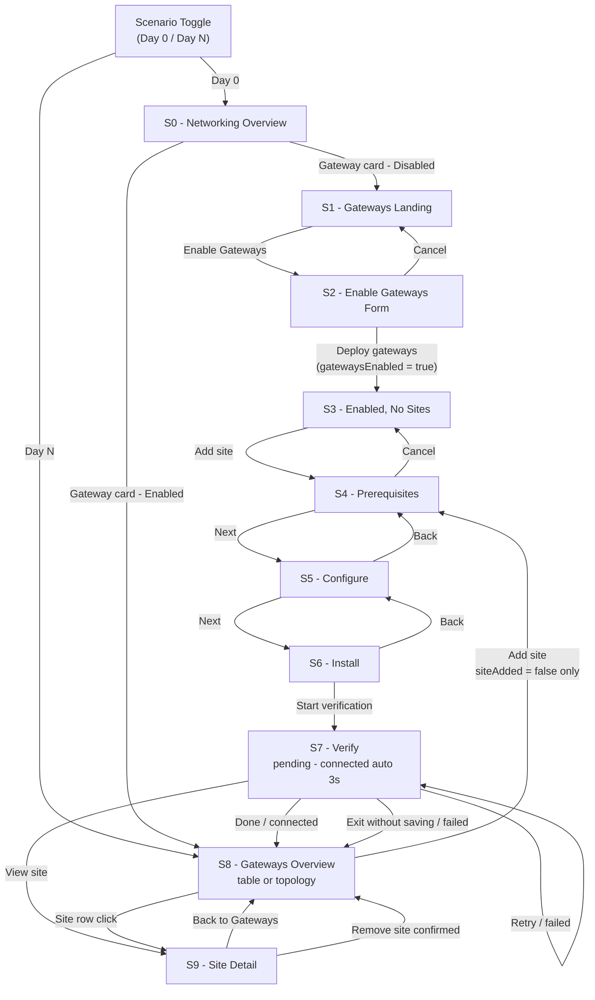

# HCP Vault Dedicated — Cluster Networking / Gateways UI Overview

**Version:** V1
**Last updated:** 2026-08

This document describes the interactive prototype for the **HCP Vault Dedicated** Gateways feature, located under Cluster Networking. The prototype covers the complete Day 0 setup flow (enabling gateways, adding a site, verifying connectivity) and the Day N management view (overview table, topology diagram, site detail).

A **scenario toggle** in the top bar switches between Day 0 (gateways disabled, fresh start) and Day N (gateways enabled, 1 demo site with healthy state and additional demo sites for degraded and not-connected states).

For detailed screen layouts and copy, see [`V1-PROTOTYPE.md`](../04.%20Wireframes/HVD%20Gateway%20Figma%20Make/V1-PROTOTYPE.md).
For design decisions, open questions, and stakeholder context, see [`V1-Gateway-Design-Spec.md`](./V1-Gateway-Design-Spec.md).

---

## V1 / V2 Split

**V1 (this document):**
- Docker-only deployment
- 1 peer (site) per gateway
- HCP-managed DR via primary/backup dataplane gateway pair
- Prerequisites checklist replaces deployment model selector in wizard Step 1

**V2 (deferred):**
- Binary deployment option — S4 becomes a deployment model selector (Binary / Docker RadioCards)
- Multiple peers per gateway — S8 becomes a full list management screen
- Customer-side site pairing for HA (open question — see Design Spec OQ1)
- Dynamic version injection in install instructions

---

## Screen Flow — V1



---

## Global State — V1

All state is held in a single `AppState` object at the root `App` component. A `navigate(updates)` helper merges partial updates, acting as a lightweight router.

| Field | Type | Day 0 Default | Purpose |
|---|---|---|---|
| `screen` | `'S0'`–`'S9'` | `'S0'` | Active screen |
| `s7State` | `'pending' \| 'connected' \| 'failed'` | `'pending'` | Verification step sub-state |
| `s8View` | `'table' \| 'topology'` | `'table'` | Gateways list view toggle |
| `s9Site` | `string` | `'nyc-prod'` | Which site to show in site detail |
| `gatewaysEnabled` | `boolean` | `false` | Controls S0 gateway badge and routing |
| `siteAdded` | `boolean` | `false` | Controls Add site affordance visibility — hidden after first site added |

**Removed from V1 (present in prior prototype):**
- `deployModel` — Binary/Docker selector is V2. Docker is the only V1 install path.
- `modal` — S2 is a full-page form, not a modal overlay.
- `tunnelLife` — Tunnel life configuration removed entirely from V1.

**Scenario presets:**

| Preset | `gatewaysEnabled` | `siteAdded` | Start screen |
|--------|-------------------|-------------|--------------|
| `DAY0` | `false` | `false` | S0 |
| `DAYN` | `true` | `true` | S8 |

---

## Shell Components

### `AppHeader`
Fixed top bar (48 px, `#1A1A1A` background). Contains:
- HC logo mark
- Project pill ("default-project")
- **Scenario switcher** — Day 0 / Day N toggle buttons; active scenario highlighted in `#FFDE5A`
- User avatar ("AB" initials)

### `AppSideNav`
Fixed left sidebar (224 px). Contains:
- "Back to Vault Dedicated" link
- Nav group "vault-cluster" — Overview, Replication (inactive)
- Nav group "Manage" — Integrations (inactive), **Networking** (active when on any gateway screen; navigates to S0)

### `Layout`
Content wrapper div: `marginLeft: 224`, `paddingTop: 48`, `px-10 py-6`. Wraps all screen content.

---

## Screens

### S0 - Networking Overview

**Purpose:** Top-level cluster networking dashboard. Entry point to the Gateways feature.

**Breadcrumb:** cizh-org > default-project > Vault Dedicated > vault-cluster > Cluster networking

**Key UI elements:**
- Two-column `NetworkCard` grid (max 1100 px)
- Left column — Connection security: Cluster accessibility, IP Allow list, Proxy, **Gateway** (dynamic badge)
- Right column — Communication setup: HVN, Private link, Custom DNS forwarding, Custom domain
- Gateway card badge: `Enabled · 1 site` (success) when `gatewaysEnabled`, `Disabled` (neutral) otherwise

**Navigation targets:**

| Action | Destination |
|---|---|
| Gateway card edit — disabled | S1 |
| Gateway card edit — enabled | S8 |

---

### S1 - Gateways Landing

**Purpose:** Pre-enable landing page. Explains the Gateways feature and sets operator expectations.

**Breadcrumb:** ... > Cluster networking > Gateways

**Key UI elements:**
- Title "Gateways" + "Enable Gateways" primary button
- Explanatory paragraph (outbound encrypted tunnels, no inbound ports required)
- `ArchDiagram` — inline SVG (643 × 262 px): Vault Node → Dataplane Gateway → Encrypted tunnel → Site Gateway → Database. No WireGuard terminology. No interface names.
- `SetupStepper` — 3-step hexagon stepper: "Enable gateways" (active) → "Configure routing" → "Connect your network"

**Navigation targets:**

| Action | Destination |
|---|---|
| Enable Gateways button | S2 |
| Breadcrumb — Cluster networking | S0 |

---

### S2 - Enable Gateways Form

**Purpose:** Full-page configuration form for deploying dataplane gateways and defining the VPC routing table before gateways go live.

**Breadcrumb:** ... > Gateways > Enable gateways

**Local state:**

| Field | Type | Initial value |
|---|---|---|
| `gatewayListOpen` | `boolean` | `false` |
| `inputMethod` | `'text' \| 'json'` | `'text'` |
| `networks` | `Network[]` | `DEFAULT_NETWORKS` (4 rows) |
| `jsonValue` | `string` | `DEFAULT_JSON` |

**Key UI elements:**

**Section A — Deploy dataplane gateways:**
- Collapsible `Disclosure` listing the 4 AZs from `GATEWAY_AZS`
- Helper text: "Dataplane gateways are deployed and managed by HCP. You cannot modify availability zone selection."

**Section B — Set up gateway routing table:**
- Radio toggle: **Text fields** / **JSON editor**
- Text mode: 4-column grid per network row — name, CIDRs, AZ zone dropdown, delete button. "Add network" appends a blank row.
- JSON mode: dark code editor with line numbers and `<textarea>` (HCL-style syntax)

**Footer:** "Deploy gateways" (primary) · "Cancel" (secondary)

**Removed:** `tunnelLife` state field and "Extend tunnel life" select.

**Navigation targets:**

| Action | Destination |
|---|---|
| Deploy gateways | S3 (sets `gatewaysEnabled = true`) |
| Cancel | S1 |
| Breadcrumb — Gateways | S1 |

---

### S3 - Gateways Enabled — No Sites

**Purpose:** Confirmation screen after gateways are enabled. Prompts operator to add their first site.

**Breadcrumb:** ... > Gateways

**Key UI elements:**
- Title "Gateways" + `Badge success "Enabled"`
- "Add site" primary button
- `Alert success` — "Gateways enabled — Dataplane gateways are active in each availability zone. Add a site to connect your first private network."
- **Dataplane health strip** — Vault logo tile, "Dataplane Gateways" label, 4 AZ chips (us-east-1a/b/c/d) each with a green "Healthy" pill
- `EmptyState` — "No sites configured" with "Add site" CTA

**Navigation targets:**

| Action | Destination |
|---|---|
| Add site button / EmptyState CTA | S4 |
| Breadcrumb — Cluster networking | S0 |

---

### S4 - Add Site — Step 1: Prerequisites

**Purpose:** First step of the add-site wizard. Advisory checklist confirming the operator's environment meets Docker deployment requirements. Not hard-gated — soft warning shown if user proceeds with unchecked items.

**V2 note:** In V2, this screen becomes a deployment model selector (Binary / Docker RadioCards). Step count remains 4.

**Breadcrumb:** ... > Gateways > Add site

**Key UI elements:**
- `StepIndicator current={1}` — steps: Prerequisites, Configure, Install, Verify
- Sub-heading: "Before you begin, confirm your environment meets these requirements."
- 10-item `Checkbox` checklist (see V1-PROTOTYPE.md for full list)
- "Learn more" links on applicable items open documentation in a new tab
- `Alert warning` (conditional) — shown when user clicks Next with unchecked items: "You have unconfirmed requirements. Proceeding may result in a failed connection at the verification step."
- Footer: "Cancel" · "Next →"

**State consumed:** checklist state is local to S4, not persisted to AppState.

**Navigation targets:**

| Action | Destination |
|---|---|
| Next | S5 (always; soft warning shown if items unchecked) |
| Cancel | S3 |

---

### S5 - Add Site — Step 2: Configure

**Purpose:** Second wizard step. Operator names the site and provides credentials and CIDRs.

**Breadcrumb:** ... > Gateways > Add site

**Local state:** `siteName`, `clientId`, `clientSecret`, `cidrs`, `selectedNetwork`

**Key UI elements:**
- `StepIndicator current={2}`
- `FormField` — Site name (required)
- `FormField` — Service principal client ID (required, monospace)
- `FormField` — Service principal client secret (required, password)
- Network selector dropdown + `FormField` textarea — Network site CIDRs. Dropdown lists named networks from S2 routing table; selecting one auto-populates the textarea. Manual entry remains available.
- `Alert neutral` — "Source IP addresses are preserved in Vault audit logs."

**Removed:** `tunnelLife` local state and "Extend tunnel life" Disclosure.

**Navigation targets:**

| Action | Destination |
|---|---|
| Next | S6 |
| Back | S4 |

---

### S6 - Add Site — Step 3: Install Instructions

**Purpose:** Third wizard step. Provides copy-paste Docker install commands for the gateway agent.

**Breadcrumb:** ... > Gateways > Add site

**V1 note:** Docker is the only install method. No tab selector is shown. Binary tab is V2.

**Key UI elements:**
- `StepIndicator current={3}`
- Two numbered `CodeBlock`s — docker pull, docker run (with `--network host`, `--cap-add NET_ADMIN`, `--cap-add SYS_MODULE`, and all 5 required env vars)
- `Alert neutral` — "Keep the agent running before proceeding to verification."
- Footer: "← Back" · "Start verification →"

**Navigation targets:**

| Action | Destination |
|---|---|
| Start verification | S7 (sets `s7State = 'pending'`) |
| Back | S5 |

---

### S7 - Add Site — Step 4: Verify Connection

**Purpose:** Final wizard step. Polls for gateway agent connectivity and shows result.

**Breadcrumb:** ... > Gateways > Add site

**Key UI elements:**
- `StepIndicator current={4}`
- `Card` with centred content, three conditional sub-states:

| Sub-state | Display |
|---|---|
| **`pending`** | Spinning animation · "Waiting for connection..." · "Simulate connection failure" facilitator link |
| **`connected`** | Green checkmark · "Connected" · "[site-name] is active and healthy" · site gateway status · primary dataplane status · "Done" + "View site →" buttons |
| **`failed`** | "Connection not established" · `Alert warning` · 3 diagnostic categories · "Exit without saving" + "Retry verification" |

**Auto-advance:** `useEffect` fires a 3-second `setTimeout` when `s7State === 'pending'`, advancing to `connected`.

**Navigation targets:**

| Action | Destination |
|---|---|
| Done (connected) | S8 (sets `gatewaysEnabled = true`, `siteAdded = true`) |
| View site (connected) | S9 (sets `gatewaysEnabled = true`, `siteAdded = true`, `s9Site = 'nyc-prod'`) |
| Simulate failure (pending) | S7 (sets `s7State = 'failed'`) |
| Retry verification (failed) | S7 (sets `s7State = 'pending'`) |
| Exit without saving (failed) | S8 |

---

### S8 - Gateways Overview

**Purpose:** Day N management screen showing gateway site status in table or topology view.

**Breadcrumb:** ... > Gateways

**Key UI elements:**
- Header: "Gateways" + `Badge success "Enabled"` + `ViewToggle` (Table / Topology) + "Add site" button *(visible only when `siteAdded = false`)*
- **Dataplane health strip** — Vault logo tile · "Dataplane Gateways" label · 4 AZ chips with green "Healthy" pills

**Table view (`s8View === 'table'`):**
- Columns: Site, Status, Site gateway, Dataplane, Last seen, Actions
- 3 demo rows (nyc-prod Healthy, nj-dr Degraded, fl-branch Not connected)
- Site names are links navigating to S9
- Alert cards below table for degraded and not-connected sites

**Topology view (`s8View === 'topology'`):**
- `TopologyView` component — site gateway cards left, SVG connectors centre, dataplane AZ cards right

**Navigation targets:**

| Action | Destination |
|---|---|
| Add site (`siteAdded = false` only) | S4 |
| Site name click (table) | S9 (`s9Site = <name>`) |
| Site card click (topology) | S9 (`s9Site = <name>`) |
| ViewToggle | updates `s8View` only |

---

### S9 - Site Detail

**Purpose:** Full detail page for a single gateway site. Shows site gateway health, dataplane gateway health (primary + backup), DR pairing, and agent management.

**Breadcrumb:** ... > Gateways > {site name}

**Local state:** `showRemove`, `showInstall`

**Key UI elements:**
- Conditional alerts at top (variant-specific)
- 2-column main grid (max 980 px):
  - Left: Site gateway card — site name, status, last seen, network site CIDRs
  - Right: 2 stacked cards — Disaster recovery card (primary + backup dataplane gateway health) + Gateway agent card
- Site topology diagram below grid — site gateway connected to primary and passive dataplane AZ nodes
- Remove site modal
- Install slide-over panel (Docker only, no tab selector)

**Removed from S9:**
- "Active gateways: X/Y" count field
- "Deployment model" field
- Paired DR site link (replaced by HCP-managed primary/backup DR card)
- "High availability" card label — renamed to "Disaster recovery"

**Navigation targets:**

| Action | Destination |
|---|---|
| ← Gateways button | S8 |
| Remove site (confirm) | S8 |

---

## Sub-components

| Component | Used in | Purpose |
|---|---|---|
| `SetupStepper` | S1 | 3-step hexagonal stepper with gradient connecting line |
| `ArchDiagram` | S1 | 643 × 262 px inline SVG — encrypted tunnel architecture. No WireGuard terminology. |
| `InstallContent` | S6, `InstallSlideOver` | Docker install steps with `CodeBlock`s. No tab selector in V1. |
| `InstallSlideOver` | S9 | Fixed-right 580 px slide-over wrapping `InstallContent`, with backdrop overlay |
| `AzGroupRow` | `TopologyView` | One AZ group row: site card stack (left) + SVG connector bridge (centre) + AZ gateway card (right). Uses `useRef` + `useEffect` for runtime DOM measurement. |
| `TopologyView` | S8 | Full topology layout: unrouted / disconnected sites at top, then one `AzGroupRow` per AZ that has connected sites |

---

## Component Library

| Component | Description |
|---|---|
| `Badge` | Status pill — variants: `success`, `warning`, `offline`, `neutral`. Uses `rounded-[3px]`. |
| `Button` | Styled button — variants: `primary`, `secondary`, `critical`, `tertiary`, `ghost`; sizes `md` (default) and `sm` |
| `Alert` | Inline message banner — variants: `success`, `warning`, `neutral` with icon |
| `Card` | White bordered card container with optional title and header actions |
| `Checkbox` | Checkbox input with label — used in S4 prerequisites checklist |
| `FormField` | Labelled input wrapper with helper text and error state |
| `CodeBlock` | Monospace code display with copy-to-clipboard button |
| `StepIndicator` | Horizontal step progress bar — configurable `labels[]` array, highlights current and completed steps |
| `NetworkCard` | Summary card for a networking feature — title, description, badge, optional edit action |
| `EmptyState` | Centred empty-state panel with title, description, and optional CTA button |
| `DataplaneHealthStrip` | Horizontal bar with Vault logo, "Dataplane Gateways" label, and AZ health chips |
| `DescriptionList` | Two-column label / value list |
| `ViewToggle` | Segmented button group for switching views (e.g. Table / Topology) |
| `Disclosure` | Collapsible section with toggle button |
| `Breadcrumb` | Horizontal breadcrumb trail; items may be plain text or clickable links |
| `Modal` | Centred overlay modal with optional top border colour, title, and footer slot |
| `RadioCard` | Large selectable card with radio semantics *(V2 only — S4 deployment model selector)* |
| `Tabs` | Horizontal tab bar *(V2 only — S6 Binary / Docker install tabs)* |

---

## Key Data Constants

### Availability Zones

```ts
GATEWAY_AZS = ['us-east-1a', 'us-east-1b', 'us-east-1c', 'us-east-1d']
AZS          = ['us-east-1a', 'us-east-1b', 'us-east-1c', 'us-east-1d']
```

`GATEWAY_AZS` is used in S2 (zone dropdown options, informational). `AZS` is used in `TopologyView` to build AZ groups.

### Default Networks (`DEFAULT_NETWORKS`)

Pre-populated routing table rows in S2. Also used to power the CIDR auto-populate dropdown in S5.

| Name | CIDRs | Zone |
|---|---|---|
| nyc | 192.168.0.0/24, 192.168.10.99/32 | us-east-1a |
| nj | 10.99.0.0/24, 10.99.1.0/24 | us-east-1a |
| fl | 192.34.0.0/24 | us-east-1b |
| ga | 10.15.0.0/24, 10.15.1.0/24 | us-east-1b |

### Demo Sites (`DEMO_SITES`)

Three sites powering the S8 Day N view and S9 variants:

| Name | CIDRs | Status | Primary AZ | Backup AZ | Note |
|---|---|---|---|---|---|
| nyc-prod | 192.168.0.0/24, 192.168.10.99/32 | Healthy | us-east-1a | us-east-1b | — |
| nj-dr | 10.99.0.0/24, 10.99.1.0/24 | Degraded | us-east-1a | us-east-1b | Backup gateway down |
| fl-branch | 192.34.0.0/24 | Not connected | us-east-1b | us-east-1c | Agent not connected |

**V1 note:** Topology view retains the 10-site dataset from `TOPOLOGY_SITES` for visual richness in the prototype. In production V1, only 1 site per gateway is supported.

### Topology Sites (`TOPOLOGY_SITES`)

Ten sites powering the S8 topology view (prototype demo data only):

| Name | CIDRs | Health | AZ | Note |
|---|---|---|---|---|
| nyc-prod | 192.168.0.0/24, 192.168.10.99/32 | Healthy | us-east-1a | — |
| nj-dr | 10.99.0.0/24, 10.99.1.0/24 | Degraded | us-east-1a | Backup gateway down |
| bos-dev | 10.10.0.0/24 | Healthy | us-east-1a | — |
| atl-corp | 172.16.0.0/20 | Healthy | us-east-1b | — |
| fl-branch | 192.34.0.0/24 | Not connected | us-east-1b | Agent not connected |
| chi-hq | 10.20.0.0/16 | Degraded | us-east-1b | Backup gateway down |
| dal-dc | 10.50.0.0/16 | Healthy | us-east-1c | — |
| la-west | 172.20.0.0/14 | Healthy | us-east-1c | — |
| sea-edge | 10.80.0.0/24 | Healthy | us-east-1d | — |
| mia-dr | 10.90.0.0/24 | Not connected | — (unrouted) | No routing configured |

Sites with no AZ (unrouted) appear above the AZ groups with a stub connector and `?` indicator.

---

## Design Tokens

| Token | Value | Usage |
|---|---|---|
| Healthy green (text) | `#006619` | Success badge text, checkmark icon |
| Healthy green (bg) | `#CCEEDA` | Success badge / pill background |
| Degraded amber (text) | `#8A4F00` | Warning badge text, degraded connector lines |
| Critical red | `#C00005` | Error connector, critical state icons |
| Offline grey | `#999999` | Offline badge text, unrouted `?` indicator |
| Vault amber (logo) | `#9A6F00` | Vault V-chevron SVG fill |
| AZ icon amber | `#B08000` | Dataplane AZ triangle (`▽`) |
| Card border | `#E5E5E5` | All card and chip borders |
| Muted label | `#737373` | Secondary labels, CIDR text |
| Primary text | `#1A1A1A` | Body and heading text |
| Link blue | `#1060D0` | Site name links |
| Header bg | `#1A1A1A` | `AppHeader` background |

**Connector line styles in topology view:**
- Healthy: solid `#CCCCCC`, 1.5 px
- Degraded: dashed `4 3` pattern, `#B08000`, 1.5 px
- Unrouted / not connected: dashed `5 3`, `#CCCCCC`, stub only + `?` circle
