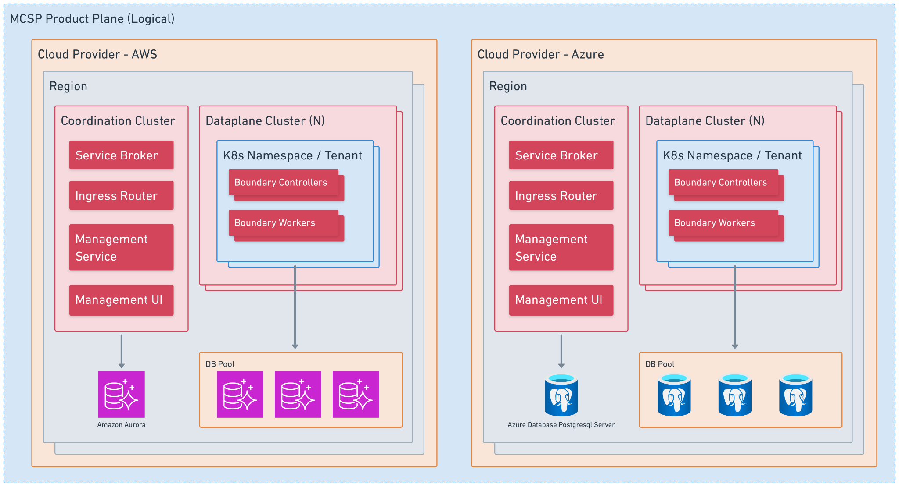
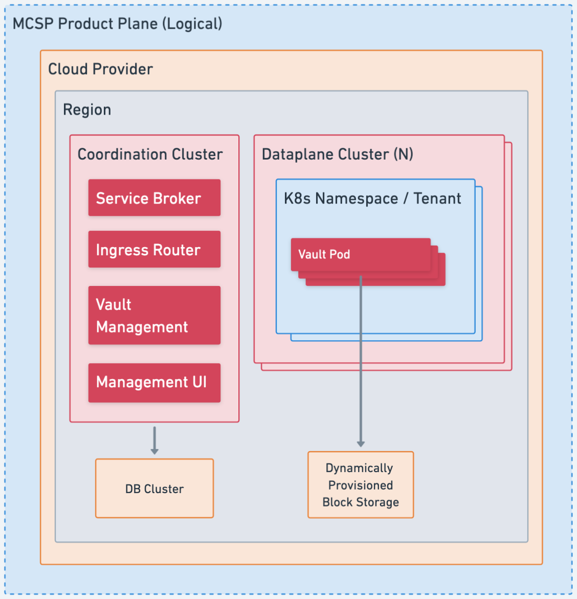
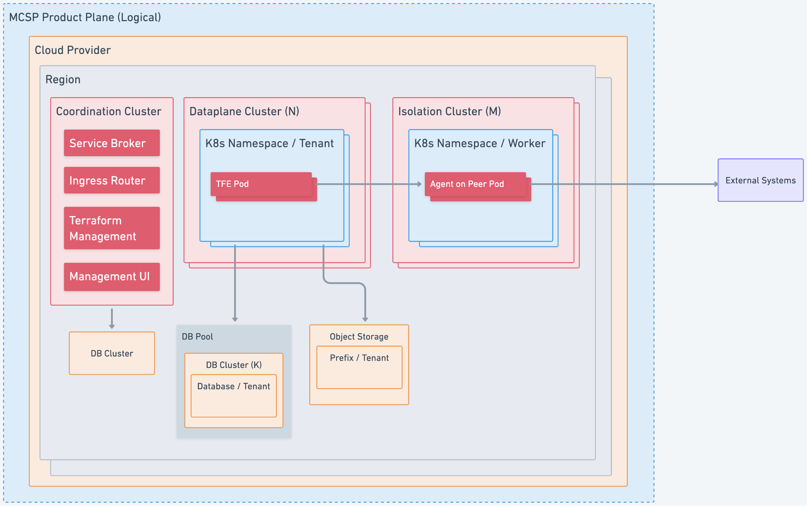

**MCSP - Runtime/Deployment**

**Summary:**

| **Created: **March 31st, 2025 **Current Version: **N/A **Target Version: **N/A **Owner: ** **Contributors:** | **Status: WIP** \| In-Review \| Approved \| Obsolete **Approvers: ** **PRD:** |
| --- | --- |

…

## Glossary

See the shared Glossary in the Meta-RFC.

## Background

As described in MCSP Discovery Meta-RFC, we are performing an analysis to discover the feasibility of using MCSP to allow us to sell, provision and manage HashiCorp products.

### Hashicorp Cloud Platform

HCP consists of a control plane and several product-specific data planes. The HCP control plane consists of a primary and a secondary AWS VPC in two different regions. Both VPCs house a HashiStack which is set up to allow failover from the primary to the secondary region to facilitate disaster recovery.

Platform and product services run on the HashiStack’s Nomad cluster, use the Consul cluster for service discovery, and Vault to handle secrets. The services’ public APIs are exposed through Traefik, which also runs as a job on the Nomad cluster. Service teams deploy their own infrastructure components, e.g. databases, buckets, queues, to the control plane account via Terraform.

Some products do not have a dedicated data plane and solely use their control plane service to provide functionality (i.e. Packer, Waypoint, Vagrant). Other products use dedicated data plane accounts (i.e. Boundary, Vault Secrets, Vault Radar) and some use per-organization accounts (i.e. Vault Dedicated, Consul Dedicated) that are automatically provisioned and assigned on demand.

Deployment of services is facilitated by GitHub actions and the deployments-api service running on the respective Nomad cluster.

### Multi-Cloud SaaS Platform

MCSP largely consists of three parts:

- A control plane that facilitates the management of accounts, subscriptions and service instances
- A standardized set of substrate services that cater to common use cases across SaaS offerings
- A framework of common infrastructure and service deployment patterns that service teams are encouraged to adopt in order to have deployments that are secure, compliant and integrated well with MCSP’s control plane and substrate services

The main interface between a product plane and the MCSP control plane is the service broker API. It is used to provision/deprovision, update, enable/disable, and get status information for a service instance. Products are registered on MCSP via a Product Registration Custom Resource Definition (CRD) and a Common Service Broker CRD.

The default runtime environment for MCSP services is OpenShift provided by Hypershift. Hypershift is available on AWS (ROSA), Azure (ARO) and IBM Cloud (ROK). The infrastructure setup is provisioned via Terraform, executed in Atlantis, and based on common modules provided by the MCSP team. Any product-specific infrastructure can be configured in the same Terraform configuration.

Service deployments to the OpenShift cluster are executed by Argo CD.

### Considerations

The main concerns we will need to address to support deployment of HashiCorp products through MCSP are the following.

#### Tenant Isolation Models

The products currently make use of different means to isolate data of different customers (organizations) from each other. This ranges from DB records indexed by the respective organization ID to dedicated AWS accounts and Azure subscriptions.

We will need to provide similar levels of tenant isolation for services running on MCSP.

#### Scalable Resource Provisioning

Some products, namely Vault Dedicated and Consul Dedicated, will provision AWS accounts and Azure subscriptions per organization as well as network and compute infrastructure per service instance. We likely do not want to translate this model to MCSP as it comes with quite some overhead, does not scale well, and does not easily translate to multiple clouds or even on-prem deployments.

We will also make sure that any infrastructure components we lean on are available across cloud providers and ideally on-premise.

Additionally, the default model for HVD requires setup of a peered network (an HVN) to enable private access to Vault. It would be good to understand how valuable that model is (as opposed to simply being the default model), as this creates an extra set of onerous dependencies and customer workflows. Most other SaaS software that companies use that may contain secret or sensitive data are accessed through public interfaces, and other mechanisms, such as simple customer-controlled IP allow-/deny-listing may be sufficient as part of a defense-in-depth strategy.

#### Reliability

HCP today expects 99.95% of availability for tier 1 workflows, with the target to bring this up to 99.99% by the end of the year. We will need to maintain this availability for services running on MCSP.

HCP today can endure an AZ failure without any interruptions and recover from region failure with some degraded performance with an RTO of 8 hours and RPO of 30 minutes. We will need to maintain these values or improve on them.

…

#### Migration Path

If we were to stand up services on MCSP and decide to proceed with making them available for purchase by customers, we should consider whether existing HCP customers would want to migrate (e.g. if they have other IBM software in use on MCSP and want to consolidate subscriptions).

## Discovery Path

This section discusses a potential path towards a prototype of our products running on MCSP to enable further discovery.

Product teams would follow the default process to set up their product plane. This process is defined in detail here. It encompasses steps to receive hyperscale accounts, set up SRE tooling and register the product with MCSP.

Once they have a product-plane set up on MCSP, they would need to deploy their own service broker and implement a provisioning process that would set up the individual service instance. The shape of a service instance would vary based on the product and would be described in more detail for the individual products in the respective Implementation sections below.

Infrastructure required for the service’s operation would be provisioned in the product plane account using Terraform.

The product plane would, by default, run an OpenShift cluster using Hypershift. The product’s main service broker would run in this cluster. Additional Hypershift clusters could be provisioned. This would e.g. be useful to scale the amount of workers available for customer workloads by sharding those across multiple clusters.

## Implementation

### Common Components

This section describes some components that will be common to all or some product planes.

#### Coordination Cluster

The Coordination Cluster is roughly the equivalent of the HCP control-plane. In addition to just generally managing the product’s service instances it is also responsible for sharding the service instances across the N dataplane OpenShift clusters.

#### Ingress Router

The ingress router is responsible for getting users and their workers/agents/gateways connected to the data-plane product UI/API.

#### Management Service/Control Plane

The management service is responsible for managing the deployed service instances. It could potentially also act as the service broker.

It will manage a database of service instances and their properties and act as the backend for the management UI.

#### Management UI

Management UI is a multi-tenant interface similar to the HCP Boundary or HCP Vault Dedicated UIs. It will give some basic information about cluster version, URLs for the data-plane product UI and links for other tutorials/enablement materials. Most importantly it will be how users perform administrative operations that cannot be done via the data-plane product UI, like configure maintenance window for cluster upgrades, generate an admin token, etc.

This UI will be authorized with MCSP IAM constructs unlike the data-plane product UI.

### Boundary

On HCP the Boundary deployment today is split into the control-plane service (cloud-boundary-service) and the data-plane service. The control-plane service makes use of Cadence workflows to manage the different clusters by invoking APIs on the data-plane service. The data-plane service creates, updates and deletes the individual clusters which are made up of individual controllers and workers. Control-plane state is stored in a single DB. Data-plane state is sharded across multiple RDS instances with each data-plane cluster using a dedicated database as its shard.

We likely could replicate a similar setup in the MCSP product-plane. A coordination cluster could contain the service broker as well as the management service and UI. Dataplanes could be sharded into Kubernetes namespace across multiple OpenShift clusters, which would allow to scale compute beyond the 500 worker limit. It could even be an option to offer a higher tier that guarantees that the Boundary cluster is deployed to a dedicated OpenShift cluster.

Source: Whimsical

Open Questions:

- What would we do about Cadence? Boundary’s control-plane service currently relies heavily on it for orchestration. Would we run a Cadence cluster in the product plane? Could we use Temporal.io, which currently only is available on AWS and GCP? Would it be feasible to migrate to use a Kubernetes controller architecture for orchestration?
- How will the clusters be licensed? Today the boundary control plane will use an intermediate signing authority to generate a HC license for each cluster. What about when we move to IBM activation keys?

Other services may also reside within the Coordination Cluster. One such envisioned service could be an intermediary metering service. This could be needed to deal with MCSP metering only claiming 99.5% availability.

### Vault

Vault (Dedicated) on HCP is run directly on EC2 or Azure VM instances in a dedicated VPC or VNet within a customer specific AWS account or Azure subscription respectively. This setup provides a simple approach to isolation of tenants and individual clusters. It also makes it fairly straightforward to follow Vault’s best practices when it comes to hardening the cluster for production.

Running Vault in OpenShift is possible as well. It does however come with some security concerns that will need to be addressed explicitly in order to guarantee that the cluster is secure.

Another concern for running Vault in a containerized environment is storage. The official Helm chart can and should be configured to use persistent storage. It would also be important to provide sufficiently fast storage to the cluster and to ensure that storage is properly bound to specific pods. As we do not have access to the host machine we will need to rely on OpenShift’s persistent volumes, those include AWS EBS, Azure Disk and IBM Cloud VPC Block

With all this being considered we would likely want to run a pool of OpenShift clusters which individual Vault clusters would get sharded across. On an individual OpenShift cluster we would run each Vault cluster in its own namespace, in order to provide the best possible isolation between tenants. The instances of individual clusters would be configured to be stateful and to mount persistent block volumes.

Source: Whimsical

### Terraform

Terraform is currently running as a multi-tenant service on HCP. It runs based on the same code that supports the on-prem product TFE.

As of now two general options for hosting Terraform on MCSP have been identified. We can either deploy a single multi-tenant service per cloud provider and region, resembling the TFC deployment model, or deploy a dedicated single-tenant service, resembling the TFE model, per service instance, subscription, or op account.

#### Multi-Tenant Deployment (TFC-like)

In this deployment model we would roughly copy the setup we use on HCP Terraform, replacing Nomad and Consul with OpenShift. (With regards to Vault see below.)

The main benefit to running in this mode would be that we already are used to operating this kind of setup in the cloud and there is a known and well-understood process for non-distruptive updates and maintenance. Shared infrastructure resources allow the operational cost to remain low for customers that do not actively use the service.

That said, we have been fighting scalability issues with HCP Terraform for years. Customers today do not gain value from this muli-tenant model, as there aren’t really any cross-organization features. It might therefore be prudent for us to look into other deployment options when we move to MCSP.

#### Single Tenant Deployment (TFE-like)

TFE is currently meant to be deployed to on-prem infrastructure of customers. It is however also a prepackaged version of Terraform that is already able to be deployed to OpenShift. We could leverage this fact to get an easy start with deploying Terraform through MCSP. The main downside is the operational complexity and potentially the cost for extraneous compute for otherwise idle or lightly used Terraform deployments; this could be mitigated somewhat by using per-tenant databases within a shared database cluster, similar to HCP Boundary’s mixed-tenancy model. However, there are a number of potential benefits:

- Reduced lock contention
- Faster indexing
- Removes the need for row-level security which is often fraught and slow
- DB cluster can allocate resources across tenants (if it's able to do this)
- Ability to do rolling upgrades and pause as needed
- Easier to keep unified cloud/on-premises codebase
- Better isolation/security story for customers
- Paid upgrade to single-tenancy DB if customers need/want
- Trying to get insight into helping customers with TFE right now is difficult because we don't exercise that muscle ourselves, so this would unify support
- We would need to provide zero-downtime upgrades and low-effort maintenance for TFE, which on-prem customers would also be able to benefit from

As such, there are real pros and cons to both models, and it should be a carefully considered choice.

Source: Whimsical

##### Open Question: How would we run Redis reliably with tenant isolation?

TFE uses Redis for caching, but also as a backing store for Sidekiq, which it uses to run asynchronous jobs. This means that Redis would need to run with persistent storage. We could either achieve this by running a dedicated Redis instance per node on the same cluster that runs TFE or deploy a Redis cluster on the cloud provider (e.g. using ElastiCache on AWS).

While Redis does support one instance to house multiple databases, this feature is not available for Redis clusters. Since Redis would be instrumental for the functionality of TFE we would likely want to run it as a cluster that is distributed across multiple AZs. Due to this we would likely need to run a dedicated Redis cluster per TFE deployment, which might not be financially viable as a hosted option. We could instead run Redis in the Ope Shift cluster, would then however need to mount persistent storage to its containers.

#### Sidekiq

One additional consideration with regards to Sidekiq is that Sidekiq makes some intentional tradeoffs between performance and the risk of jobs being lost. It explicitly mentions the risk of loosing all in-flight jobs if Kubernetes forcefully terminates a process due to it exhausting its memory allocation. We would need to consider this when we deploy Sidekiq to OpenShift.

#### Vault

Terraform currently relies on Vault for secret storage and transit encryption. On OpenShift we can rely on Kubernetes to provide access to secrets. It might hence be worthwhile for us to look for an alternative approach for transit encryption. This would reduce the operational complexity and risk for either deployment (and could provide TFE customers with the same benefits).

It should be noted that the encryption itself is fairly straightforward; what Vault is really providing is key management. However, other KMS possibilities exist, and allowing TFC/TFE to take advantage of CSP KMSes and others (such as customer HSMs) would likely be a boon for customers.

#### Isolation Cluster

HCP Terraform today runs a dedicated cluster in a separate AWS account that employs gVisor with Seccomp and AppArmor to execute Terraform runs in ephemeral sandboxed containers. This is intended to allow untrusted code (i.e. any user-provided Terraform provider) without the risk of the code accessing or interfering with other containers or the host system. On HCP Terraform, Nomad is used as a scheduler for this setup.

The Docker execution environment on MCSP is controlled by OpenShift. We will either need to find a way to create a similarly isolated environment in OpenShift or copy the setup that we use in HCP, i.e. a self-managed cluster potentially using Nomad.

OpenShift supports sandboxed containers based on Kata. Kata containers achieve increased isolation by running pods within a virtual machine instead of relying on the host kernel alone to maintain isolation with cgroups, namespaces and other traditional container isolation features. The primary mode of operation requires your worker nodes to be run on dedicated/bare-metal machines running CoreOS. These restrictions ensure that your worker node can use QEMU to start the lightweight VMs necessary to run the pods within. These virtualization requirements restrict this mode to working only with bare metal infrastructure such as AWS bare metal (i3) instances or self-managed physical servers. Due to this limitation the primary mode is likely not a good option for our architecture as it would prevent us from deploying to other cloud providers.

The second mode of operation is referred to as either the Kata remote runtime or peer pods (also see the OpenShift documentation). When running in this mode, the sandbox containers K8s operator will provision VMs in the cloud provider to execute the pods containers within. The underlying kernel is heavily optimized for quick startup times but provisioning the VMs could still take some low single digit number of minutes. Due to the long startup time of individual pods requiring VM provisioning, we would likely need to maintain a pool of ready to use pods. We would also need to calculate if the costs of running individual EC2 instances for isolation would be acceptable. The overall amount of compute would be greater but without some testing, its unclear whether its double or whether the main set of worker nodes can be scaled down due to not actually performing any of the cpu/memory intensive tasks.

Kubernetes natively supports gVisor and we may be able to ask the OpenShift team to support this to help enable us to shift our existing workload methodologies.

### Vault Radar

…

### Cloud-Native Service (Packer, Waypoint, Vagrant)

…

*Notes:*

- *Very similar setup to HCP
We could provide adapters from HCP service paradigms to MCSP*
- *Shouldn’t need dedicated data-plane cluster*
- *Single DB (and bucket) will hold all data*

### Disaster Recovery

…
