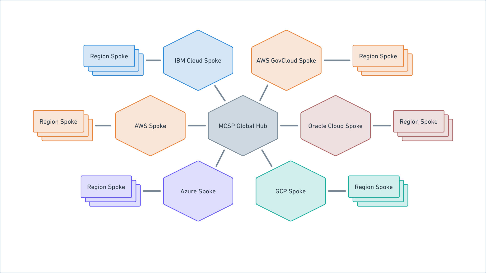

**MCSP Discovery Meta-RFC**

**Summary:** Overview of MCSP discovery learnings

| **Created: **Apr 1, 2025 **Current Version: **N/A **Target Version: **N/A **Owner: **Jim Lambert **Contributors:** Tobias Meyer, Matthew Keeler, Owen Wessling , Matthew Irish, Robert Tillery, Mike Gaffney, Luke Kysow, Jeff Mitchell | **Status: WIP** \| In-Review \| Approved \| Obsolete **Approvers: ****Jeff Mitchell****Cameron Etezadi** **PRD:** |
| --- | --- |

## Purpose

With the acquisition of HashiCorp by IBM, IBM now has (at least) two application platforms: HCP and MCSP. Each has a different architecture, different capabilities, different security stances/controls, and more; at the same time, there is a lot of overlap in terms of the high-level services they strive to provide to platform applications. This means that we may have an opportunity to shift IBM applications to HCP or HCP applications to MCSP, freeing up engineering resources to accelerate innovation and building of net-new capabilities instead of duplicating core platform service work.

In order to discover the possibilities, a team was put together (see the Owner/Contributors of this document) to perform discovery on MCSP via published technical documentation, face-to-face and video meetings with MCSP engineers and architects, and asynchronous chats and discussions.

This is a high-level document collecting learnings from the team to provide feedback and suggest paths forward for further investigation. It starts with some high-level background on MCSP’s overall architecture and structure and links to deeper dives on specific topics.

Note: this document strives to be accurate, but misunderstandings or misinterpretation of information are possible.

## Background

In comparison to IBM Cloud, MCSP is built more as an application platform/runtime rather than a CSP. Its goal is to make it simple to operationalize existing and forthcoming IBM applications for SaaS delivery, and while there are still many items on its roadmap, it already provides for the foundational needs of many applications.

Although this high level goal is similar to HCP’s, the path taken is different. HCP’s north star has been a unified UX that makes applications running on it feel consistent and integrated, but requires each application to adopt the same resource hierarchy, RBAC model, and other platform primitives; HCP has generally considered its customers to be the customers of the applications running on the platform.

In contrast, MCSP keeps a relatively tight separation between a shared UX for subscription management (and the instances of a product allowed by that subscription) and the individual product features, with adoption of platform primitives more of an opt-in model if they provide additional value to the applications; MCSP sees its customers as the applications running on it, and thus drives roadmap features based on value-add for those applications.

A further consequence of the discrepancy between customer models is the difference in roadmap ordering between the two. For instance, HCP placed a high priority on UX items like product unification (e.g. TFC/HCP TF) while MCSP focused on items like compliance certifications, flexible identity models, and multi-cloud functionality but has little capability to surface product UXes.

## Glossary

- **ARO** - OpenShift on Azure
- **HashiStack** - Nomad, Consul and Vault
- **HCP** - Hashicorp Cloud Platform
- **Hypershift** - Hosted Control Plane on ROSA, ARO or ROKS
  - This is also called **HCP**, but will be called Hypershift here to prevent confusion with the Hashicorp Cloud Platform
- **MCSP** - Multi-Cloud SaaS Platform
- **ROKS** - OpenShift on IBM Cloud
- **ROSA** - OpenShift on AWS
- **Service Broker **- Program implementing the Open Service Broker API spec to manage the (de)provisioning of service instances.

## Architecture

MCSP uses a hub and spoke architecture that looks roughly like the following:

Source: Whimsical

*Note: Oracle Cloud and GCP support is planned/in-progress but not available yet.*

### Global Hub

The Global Hub hosts all global services. These include things like the SRE Console, third party integrations such as PagerDuty and global SRE/Operator Identity in the form of IBM Security Verify (ISV).

### Cloud Spokes

Each supported Cloud has the MCSP Control plane deployed to it in a primary region.

#### Control Plane

The MCSP Control Plane is a managed OpenShift cluster with the following deployed within the cluster:

- **MCSP Data Plane Controller** (AKA Cloud Rock Controller): This is responsible for orchestrating deployment of the MCSP Data Plane clusters within all the supported regions.
- **Bastion Host**: Enables remote access into the cluster.
- **ArgoCD Controller: **Used for CI deployments into the environment.
- **SRE Tooling:**
  - **Grafana: **Metrics, Traces and Log querying capabilities
  - **Prometheus: **Telemetry time series storage.
    - **Alert Manager**
    - **Thanos**
  - **Turbonomics: **Provides performance optimization recommendations around container sizing/scaling. Not available within the IBM Cloud Spoke.
  - **Instana: **Use for application observability use cases.
  - **Loki**: Used for log storage.

### Region Spokes

Each Region spoke contains an MCSP Data Plane and potentially many MCSP Product Planes.

#### MCSP Data Plane

The MCSP Data Plane orchestrates MCSP Product Plane cluster creations and is where MCSP core services reside. The following are deployed within a data plane cluster:

- **IAM Services**: These are most similar to the HCP IAM/IDP services.
- **Metering Service: **This has the same purpose as the HCP Metering service.
- **Subscription Management Service: **Subscriptions are a construct which correlates an IBM account with having purchased/provisioned a product.
- **SaaS Management Console: **https://console.saas.ibm.com/ is used by customers to manage all the MCSP based service instances they are subscribed to. Additionally, it provides a status page for MCSP based services.
- **Product Registration Operator: **Product registration CRDs are used to let MCSP know about your offering. They include things like part numbers, billing attributes, Hyperscaler Marketplace URLs and much more.
- **Common Service Broker (CSB): **Think of this like a service broker router: when the user wants to create a service instance in some region it first goes to the CSB which then determines which Service Broker in a MCSP Product Plane where the request should go.
- **SRE Tooling: **Same services as in the MCSP Control Plane.

The availability of MCSP data plane services is currently either 99.5% or 99.9% depending on the service. Some example implications:

- Can’t use MCSP IAM for product plane service instances.
- May need to store/forward audit events from product instances

#### MCSP Product Plane

The MCSP Product Planes are where the products services actually run. The Product teams have their own cloud accounts within which managed OpenShift clusters are provisioned, running as worker nodes. There is flexibility on these deployments in terms of the number of nodes, whether they autoscale, and so on; the Runtime/Deployment RFC contains significantly more information on this.

## Technology Information

### OpenShift

The OpenShift Kubernetes clusters in all planes are managed by RedHat. MCSP's current recommended deployment model utilizes what they call Hypershift or Hosted Control Planes (HCP). In this mode of operation, the Kubernetes control plane components such as the API server and etcd are hosted in RedHat infrastructure with the worker nodes created in our own cloud accounts.

#### Features/Limitations

- **Scaling**: The recommended maximum number of worker nodes in an individual MCSP Hypershift cluster is 500. These limits will necessitate a multi-product plane approach for HVD/TFE. Boundary could probably fit within the limits for now, but if we see 4x growth within the us-east region then we would need to migrate to a multi-cluster approach. See Appendix A: HCP Product EC2 Usage for details about current usage.
- **Network Isolation: **The latest versions of OpenShift utilize the OVN-Kubernetes CNI plugin to apply NetworkPolicy resources. NetworkPolicy resources are used to provide rules governing how workloads can communicate with each other.
- **Workload Isolation: **OpenShift Sandbox Containers can be used to isolate untrusted or privileged workloads from each other. Usage of this feature is similar to HCP Terraform's Nomad isolation cluster whose purpose is to isolate Terraform runs from each other.

### Runtime/Deployment

This information is contained in a separate RFC: MCSP - Runtime/Deployment.

### Scoping/Resource Model

This information is contained in a separate RFC: ​MCSP - Scoping/Resource Model.

### IAM

This information is contained in a separate RFC: MCSP IAM.

### Frontend/Portal

This information is contained in a separate RFC: MCSP - UI Integration

### Billing/Metering

This information is contained in a separate RFC: MCSP Billing/Metering

### Event/Pub-Sub

Both HCP and MCSP eventing platforms have nascent, early-development capabilities here.

#### HCP

HCP Event Platform has a small, new team of engineers presently working to refine RFCs to describe their system. They are currently working without a formal PRD, but are using scenarios from the InfraGraph PRD and project to guide initial functionality, and to make reasonable guesses for generalized eventing behavior. They state a goal of providing for cross-product (business level) eventing, such that HashiCorp products can better communicate between one another, and create compelling data flows across products, not just within an individual offering. Other than InfraGraph’s need for data from Packer and Terraform, though, no other cross-product flows have been explicitly described (no PRD).

On 3/31, the DataFlow team was redirected to assist with InfraGraph directly based on a possibly misunderstood assertion of the state of the current MCSP effort.

#### MCSP

MCSP’s eventing is in an even earlier stage than HCP’s.  IBMer Murray Beaton reports only just joining the team around March 20/21st, and has yet to point us to any Requirements or Architectural documents.  He reports the project’s status is “real early”. Shikha confirmed this status on 3/31, indicating the project was only 3 weeks old.

As of early May, the primary contact for the project is Yi Zheng, who has authored the feature spec for the MCSP Event Platform, project name “Nexus”, plans. That spec does describe a system that will allow for arbitrary MCSP services to intercommunicate via event publication and subscription, so it should meet our general business needs as HashiCorp products migrate towards MCSP.  If needed, thin proxy services could also be used to bridge eventing services offered in MCSP with services hosted outside of MCSP, as well.  However, the scheduling for the Pub/Sub service is “... will start Q3 [2025]”

The above timeframe was reconfirmed 6/12/25, though Yi reports “[The IBM] dev team is all hands on deck for FedRamp recently.”.

## Controls

HCP interest is primarily in the following audits:

- SOC2
- PCI
- FedRAMP

In particular, note that SOC1 is NOT of interest, as it applies only to entities generating financial disclosure documents (so even our billing / financial related features are not a fit).

MCSP Cloud Spokes support a FedRAMP environment, which would significantly help applications to meet those requirements. SOC2 and PCI are similarly partially implemented / met by the MCSP environments. ISO audits are rolled into the IBM internal (MSAC) controls.

MCSP FedRAMP Readiness may not be as advanced as we’ve been led to believe*. While MCSP discusses the availability of a FedRAMP Cloud Spoke, individual components are largely described as not FedRAMP Ready. This may be out of date information, but the readiness summarized here suggests that most MCSP components are not FedRAMP compliant. Mark Castle reports that “all components bar telemetry are in the current ATO submission” so there may be better progress than indicated in the documentation. However, Matt Keeler identified and confirmed with the MCSP team that the Hypershift clusters aren't yet ready for FedRAMP. The current estimate is that RH Hypershift clusters will be ready in the July timeframe. That timeframe would be unlikely to block us or force us to use the older ROSA Classic mode of operation, but is also clearly indicative of components being in-flight with regard to FedRAMP assessments and certification.  All of the MCSP Onboarding documentation pursuant to FedRAMP is marked as “Coming soon!”, and looks to have been updated in February 2025.

There is a good summary of MCSP vs Service responsibilities described in that same location. Not surprisingly, while MCSP handles significant controls for the platform and framework, most controls still have service exposure. The implementing service team is still responsible for them, so we will need to expressly review the controls for each product we bring onto MCSP.

There is also a list of the various “Tools” that are available / used in the different Cloud environments here.  Note that AWS, Azure, IBM Cloud, and FedRAMP cloud environments are tracked and presented across the array of available services / tools.

* In fact, from presentations and claims from some IBMers checked against actual product documentation and deeper technical discussions, overpromising and unreliable narratives seems like enough of an issue that we need to be wary. Additionally, in some but not most cases, documentation sometimes seems aspirational, and at times it has seemed like asking a question is an impetus to update docs.

# Appendix A: HCP Product EC2 Usage

- HCP Boundary currently runs 127 EC2 instances in its dataplane Nomad cluster.
- HCP Vault Dedicated dataplanes use 4119 EC2 instances.
  - AWS us-west-2: 1741
  - AWS us-east-1: 1061
  - AWS eu-central-1: 311
  - AWS eu-west-1: 214
  - AWS us-east-2: 167
  - Azure westus2: 166
  - AWS eu-west-2: 132
  - Azure eastus: 127
  - AWS ap-southeast-1: 110
  - AWS ap-southeast-2: 90
- HCP TF: 523 EC2 instances used. Almost all are backing Nomad or ECS clusters.
